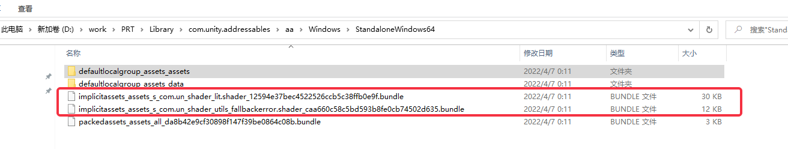

# Addresable重复依赖下的自动打包

大蛇丸(旷野)

Posted on :2022-6-10 15:44

Pageviews :96

*This content expresses personal opinions and does not represent the views or opinions of NetEase Games. Intended for internal sharing and communication only. Do not disseminate in any form, or risk being held liable.

This article is only open to the following users, please protect content confidentiality

Viewing permission：UnityEngine、Unity技术培训、UnityTeam、UnrealEngine、互娱正式-公开、互娱实习生-公开、互娱外包-公开、运营中心-公开、张天羽、大蛇丸(旷野)、Kote(骆奕州)

**作者：引擎研究组 - 杨呈**；原KM地址：[Addresable重复依赖下的自动打包_KM (netease.com)](https://km.netease.com/article/413970)

### 问题描述

在打包时为了避免重复依赖，一般需要先运行以来分析，之后点击修复为Implicit
Assets 生成单独group，然后build 打包。因为Analyze Dependency会执行一个完整的构建过程。那么会产生大量的重复操作。

如若产生重复依赖，生成bundle会多次打包asset到多个bundle中

依赖分析流程如下：

build bundle流程如下：

本文的目的是在尽量少的改动下，减少重复操作，提高打包效率.

### 解决步骤

新建一个BuildScriptDupPackedMode继承自BuildScriptPackedMode。
将build bundle的Tasks分为2个部分。

那么整个流程就变为
依赖分析-------构造ImplicitGroup--------Build Bundle
以下是task0和task1的截图:

### 结论及改进

因为去除了Impilict Asset，而使得bundle大小减少。

### Bug修复

bug1:

解决方案：取消Slim Write Results
