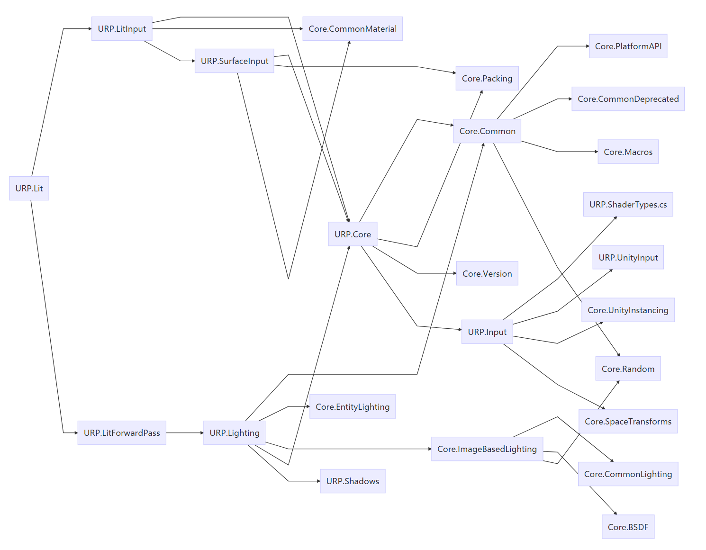

# URP Shader结构

大蛇丸(旷野)

Posted on :2022-3-14 16:37

Pageviews :439

*This content expresses personal opinions and does not represent the views or opinions of NetEase Games. Intended for internal sharing and communication only. Do not disseminate in any form, or risk being held liable.

This article is only open to the following users, please protect content confidentiality

Viewing permission：UnityEngine、Unity技术培训、UnityTeam、UnrealEngine、互娱正式-公开、互娱实习生-公开、互娱外包-公开、运营中心-公开、张天羽、大蛇丸(旷野)、Kote(骆奕州)

**作者：引擎研究组 - 高骏**；原KM地址：[URP Shader结构_KM (netease.com)](https://km.netease.com/article/311809)

 

简单预览一下每个文件的include关系，每个文件的函数功能

 

## 1Core.Common

- Variable Convention
- Define half based on Platform
- Real_IS_Half #define real half #define real4 half4 balbal
- Shader Model. Metal is 4.5
- Language Header API/platform
- GLES2 undefined function
- WAVE_INTRINSICS API
- Bit OP
- INTRINSIC helper
- Cubemap helper
- Math hlper
  - Nan & Inf check helper
  - Fast Tri
  - Get Sign
  - RemapHalfTexelCoordTo01
  - Smoothstep 01
  - power
- Texture Utl
  - Compute Texture LOD
  - Get MipCount. No Metal support
- LatLongCooridinate and direction conversion
- Depth encoding/decoding
- Space transformation
- Terrain/Brush heightmap encoding/decoding
- Misc

## 2Core.Macro

- Pi
- Constant
- Function Template gles似乎不支持uint，通用函数尝试使用此模板

## 3Core.Random

- JenkinsHash
- GenerateHashedRandomFloat
- InterleavedGradientNoise

## 4Core.Packing

- Normal packing misc
- HDR packing
- Quaternion
- INT

## 5Core.Version

- Shader Library version

## 6URP.ShaderTypes.cs

- Automated Generated variables
- LightData
- Shadowdata

## 7URP.Input

- Constant Buffer
  - GI Lighting parameter
  - Additional Light Data
- Matrix Shorthand Macro (Defines macro first then include additional files)
  - UNITY_MATRIX_M
  - UNITY_MATRIX_I_M...

## 8URP.UnityInput

- Steoreo Matrix
- Unity Built-in Shader Variable
  - Time
  - _WorldSpaceCameraPos
  - _ProjectionParams
  - _ScreenParams
  - _ZBufferParams
  - unity_OrthoParams
  - unity_CameraWorldClipPlances[6]
  - unity_CameraProjection
  - unity_WorldToCamera
  - unity_CameraToWorld
  - CBUFFER_START(UnityPerDraw)
    - unity_ObjectToWorld
    - unity_WorldToObject
    - unity_LODFade
    - unity_WrodlTransformParams
    - unity_LightData
    - unity_LightIndices[2]
    - unity_ProbesOcclusion
    - unity_SpecCube0_HDR
    - unity_LightmapST
    - unity_DynamicLightmapST
    - unity_SH
      - unity_SHAr
      - ...
      - unity_SHBb
      - unity_SHC
  - glstate_matrix_transpose_modelview0
  - glstate_lightmodel_ambient
  - unity_AmbientSky
  - unity_AmbientEquator
  - unity_AmbientGround
  - unity_IndirectSpecColor
  - unity_FogParams
  - unity_FogColor
  - glstate_matrix_projection
  - unity_MatrixV
  - unity_MatrixInvV
  - unity_MatrixVP
  - unity_StereoScaleOffset
  - unity_StereoEyeIndex
  - unity_ShadowColor
  - unity_SpecCube0
  - unity_Lightmap
  - unity_LightmapInd
  - unity_ShadowMask
  - _PrevViewProjMatrix
  - _ViewProjMatrix
  - _NonJitteredViewProjMatrix
  - _ViewMatrix
  - _ProjMatrix
  - _InvViewProjMatrix
  - _InvViewMatrix
  - _InvProjMatrix
  - _InvProjParam
  - _ScreenSize
  - _FrustumPlanes[6]

## 9Core.UnityInstancing

- unity_InstanceID
- unity_BaseInstanceID
- unity_InstanceCount
- void UnitySetupInstanceID(uint inputInstanceID)

## 10Core.SpaceTransforms

- Matrix Helper
- Need Define UNITY_MATRIX_M and other matrix variable first which is done in urp input

## 11Core.CommonMaterial

- PerceptualRoughness
- Anisotropy Helper
- ClearCoat
- Diffuse
- Fresnel
- Blend normal
- Triplanner

## 12URP.SurfaceInput

- BaseMap
- BumpMap
- EmissionMap
- SurfaceData
- SampleAlbedo
- SampleNormal
- SampleEmission

## 13URP.LitForwardPass

- Attributes
- Varyings
- InitializeInputData(Varyings input, half3 normalTS, out InputData inputData)
- LitPassVertex
- LitPassFragment

## 14URP.Lighting

- Light Helpers
- Attenuation Functions
- Light Abstraction
  - GetMainLight()
  - GetMainLight(float4 shadowCoord)
  - GetAdditionalPerObjectLight()
  - GetPerObjectLightIndexOffset()
  - GetAdditionalLight()
  - GetAdditionalLightsCount()
- BRDF Functions
- GI
  - SH
  - Lightmap
- UniversalFragmentPBR
- UniversalFragmentBlinnPhong

## 15Core.EntityLighting

- SH
- SampleProbeVolume
- SampleProbeOcclusion
- RGBM
- SampleLightmap

## 16Core.ImageBasedLighting

- PerceptualRoughnessToMipmapLevel
- Anisotropic image based lighting
- Importance sampling BSDF functions
- Pre-integration

## 17URP.Shadows

- _ScreenSpaceShadowmapTexture
- _MainLightShadowmapTexture
- _AdditionalLightsShadowmapTexture
- CSM
- SampleShadowmapFiltered
- SampleShadowmap
- ComputeCascadeIndex
- TransformWorldToShadowCoord
- MainLightRealtimeShadow
- AdditionalLightRealtimeShadow
- GetShadowCoord
- ApplyShadowBias

## 18Core.CommonLighting

- Helper functions
- Attenuation functions
- IES Helper
- Lighting functions

## 19Core.BSDF

- Fresnel term
- Specular BRDF
- Diffuse BRDF
- Iridescence
- Fabric
- Hair

 