# **Unity C#代码热更新方案**

> 在移动项目开发中，代码热更是一直是一个技术人员都在讨论的事情，国内的很多公司都在项目立项时就会将热更作为一个必要的功能，多数也都是使用的一些lua的开发语言进行热更新，但是在本地化的一年多工作中，所接触到日方项目基本都是使用C#进行开发，在做完第一个项目时，基于遇到的一些问题，我决定去探索一下如何使用C#进行热更新，在网上翻阅了一些资料后，偶然间找到了一个关于C#热更新的一个方案，经过一个项目的实际开发，已经基本排除掉了一些难题以及对一些功能上进行改进，以及对应该插件的封装及代码框架生成，希望能分享给需要的同事。

## **应用背景**  

  在本地化项目开发过程中，当我做完一个项目时，我发现做本地化项目并没有想象中那么容易，在代码这块，有时做一个功能修改了好几处代码，但是由于没有完全理清一些内部的逻辑，导致大多数情况下代码正常，但是可能在某个极隐蔽的情况下会触发bug，有时候就是防不胜防，如果这个bug潜伏的够久，想修复时却发现自己的代码和日方的代码已经混在一起了，自己也想不起哪些是自己加的，只能靠回忆已及和原版做对比，有时改了前半部分导致后面部分出现了问题，再改后半部分导致整段代码都发生了变化，改的越多往往出错的机会也就越大。如果大部分的代码修改都是基于函数内容替换的，那是否有方式能在不改动日方代码的情况下去实现这个目的呢，将日方的原版以及自己的修改在共存而又不相互影响的情况下实现新的需求，基于之前对代码反射的的一些研究和实践，在网上搜索了几个方案，并进行了尝试，最后找到了一个基于ILRuntime的热更方案，经过了一些修改以及扩充基本已经是能满足目前大部分需求的。

## **测试实例**

  先来看下我demo中的例子，直接打开场景SampleScene是没有热更时的代码和状态

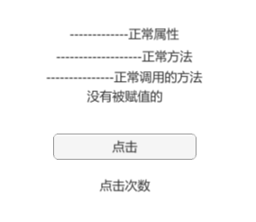

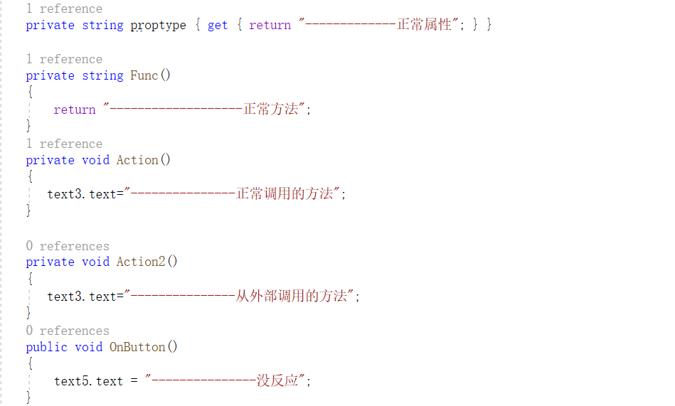

从HotLoader场景进入可以看到执行的热更之后的状态以及在热更之后的代码

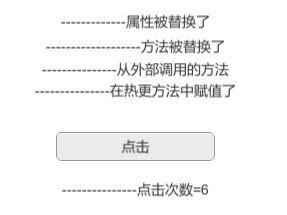

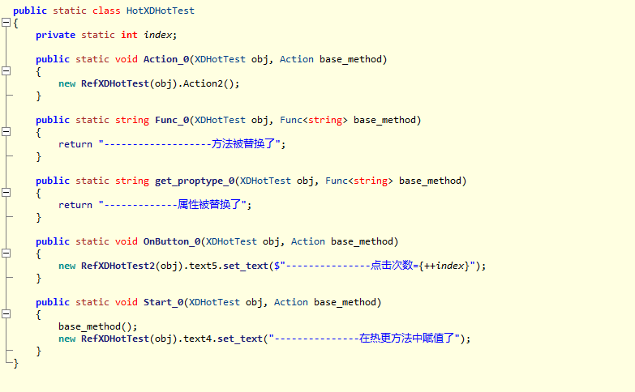

 SamlpleScene和HotLoader的区别就在于预加载加载了StreamingAsset下面的Data/dydata文件，代码可以参考XDHotLoader.cs，改变了SampleScene中执行的代码内容，在实际应用中，该文件可以放在网络位置上，再从网上下载到终端。

## **应用过程**

   首先先介绍下系统的工作原理，导入XD和XIL文件夹，在第一次编译完成后会在XIL/Auto文件夹下生成一部分代码，包括CLRBinding，委托函数注册（ILRegType），以及注入函数（GenDelegateBridge），生成完成会进行第二次编译，编译完成后，将DelegateBridge注册到/Library/ScriptAssemblies/Assembly-CSharp.dll并对其中的函数进行注入，在菜单栏<XIL>下面保有这些操作，但目前已经改成自动化执行，在主项目内容发生更改时，只需删除旧得Auto文件夹即可重新生成。这部分内容基本已经处理完成并使用配置文件auto.ini进行处理，一些由于编译环境不同而产生的错误函数，主要时由于生成时时编辑器环境下，有部分对象在Editor的宏下面，在正式环境中则没有，或者是部分UnityDll下相同的类型在不同平台的字段和类型在可见性上有区别，在原项目编译完成后会直接进行相应的生成工作，二次编译完成会注入到dll中，此时第一步工作也就完成了。 

   通过比较源码和反编译之后的Dll，可以看到只要给__Hotfix_Func赋值就可以完全执行一段新的逻辑。

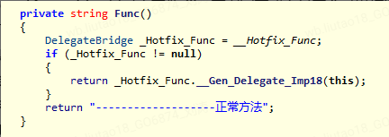

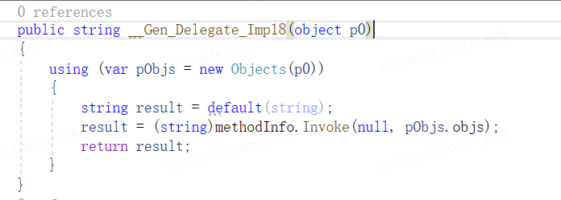

​    接下来说下分离出的热更工程如何配置，本身热更工程也是一个正规的C#类库工程，目标是输出一个Dll，建立后添加Unity的相应类库以及/Library/ScriptAssemblies目录中其他dll，在书写方式上是完全可以按照正常的C#工程一样，对于Assembly-CSharp中的代码是可以直接使用，其他Dll的代码则需要进行CLRBindings才能使用，对于自身内部的对象定义，调用完全没有任何限制的，但是调用主工程中的dll时由于实现上时通过反射的，使用模板类型方式时需要需要注意必须使用在主工程中出现过的泛型，否则会由于IL2CPP特性没有生成相应代码而导致出现AOT，比如在主工程中有A<T>的方法，仅出现过A<Int>,那么在热更dll中将只能调用A<Int>,不能使用A<bool>。在将热更函数中的委托传给主工程中使用时，如将一个热更函数传递给主项目中的SetCallback之类时，这部分函数需要进行委托函数的跨域转换，需调用RegisterFunction等函数，大部分函数模板在之前编译时也会自动生成，对于没有事先定义的，目前也已经经过处理，会在运行时自动注册，所以也不需要在意这部分的工作内容。

   在早期的版本中如何替换目标工程中函数需要手动书写，对于主工程内的私有对象，虽然可以通过反射的方式进行调用，既不能验证函数名是否正确，参数是否匹配，在调用时等同于书写字符串的方式，对于用惯了IDE进行开发的人来说却是时不小的挑战，而且难以保证函数调用的准确性，在版本迭代时容易发生函数或者类型不匹配的情况。比如下方的代码。

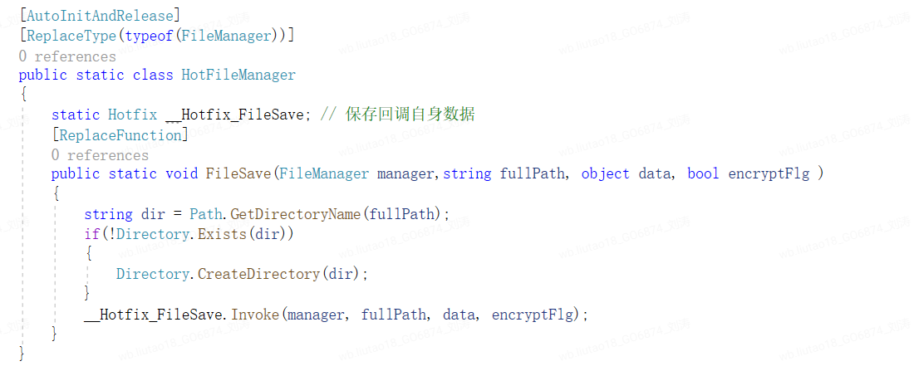

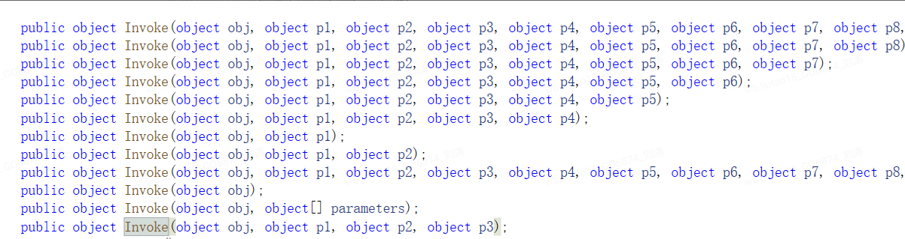

 介于本地化项目的特殊性，在版本更替时由于这部分定义无法在感知主项目的函数或类型的变化，以及在查看原加载代码时发现，原始的替换方式会通过反射遍历整个DLL的所有类型以及函数，为了提高加载效率我将入口定义一个类中，直接通过一个外部配置文件来取代原先的序列化的方式，然后适应版本更新时发生的任何变化，尽可能不让源项目的修改对热更工程产生二次影响，我通过一个XML文件进行相应的配置，包括重写哪个函数以及如何跨域调用，我设计每次都可以根据当前代码自动化生成函数名，参数来确保这些定义的准确性，同时每条记录会生成一个单独的文件，可以很自然分割每个cs的内容，避免出现较大的类，十分有利于代码的审查以及重构。同时在源码发生变化时，也能在生成时有效的反馈出来，避免之后迭代中由于源码改变后发生函数无法替换的问题。这么做也基本的包装了ILRuntime的内容，可以使其他开发者仅通过简单的配置，而不要对两个DLL之间的桥接代码（ILRuntime）有任何了解即可进行开发。

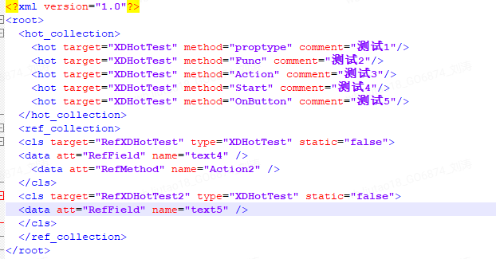

 在编辑好以上xml后可以通过主菜单《本地化》/《热更代码生成》相应的代码模板，在Generate/HotMoudles.cs是根据hot_collection节点生成的，这个是热更dll的入口定义，目前已经不需要开发人员在意，Generate/RefClasses.cs是根据ref_collection,可以通过直接包装一个原工程中对象，对该对象的私有内容进行访问，避免了反射可能会造成的一些开发中造成的麻烦。xdrf是函数的映射表，最终会和编译后的热更dll一个打包编译成一个文件。

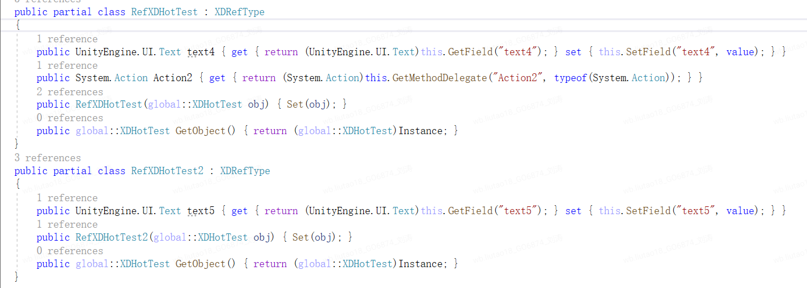

开发人员需要实现的逻辑是在Methods目录下面，该目录下的cs文件也是通过hot_collection节点生成，根据类型和函数名称组合命名，相同的函数会从0开始递增，即使对同一函数进行多次的处理，依然可以按照单一的功能不和其他融合，标题会插入xml中的注释部分，注释内容前置--可以取消该段代码，所有的逻辑都将在在这些cs文件中完成。

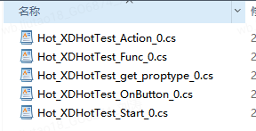

## **后续版本合并**

​    最近也是再做合并新版本方面的工作，顺便就记录了一些版本迭代上的流程，再替换完主工程的代码后，重新执行下代码生成，可以看到由于一些方法名称发生了变化或者有些类被按照功能分离成几个子类后，导致的代码无法生成。

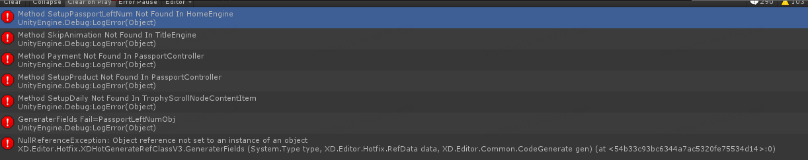

  修改hotref.xml之后使代码可以成功生成，同时也可以加上一些log加深对这些改动的印象。

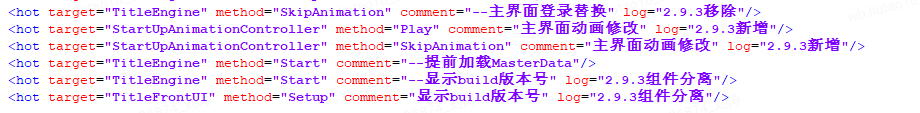

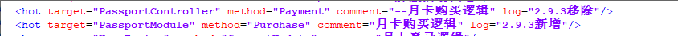

   在生成完之后可以看到有部分函数虽然名称没有变动，但是参数发生变化，只需将参数补全解决完编译错误后即可完成新版本的迭代，如果做的内容是对原有逻辑的补充，那么就不必在意日方的逻辑是否有变化，如果是完全替换了，那边可以直接使用版本工具查看该段代码的修改内容做出相应修改即可。

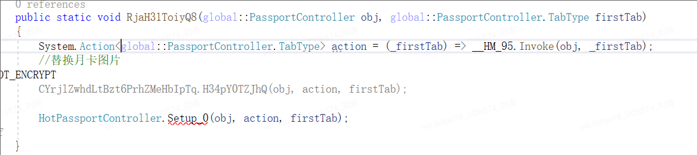

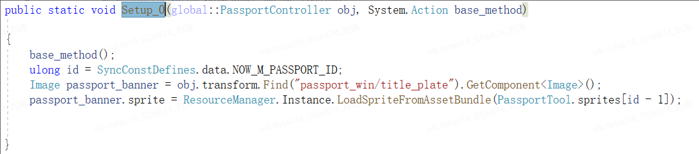

## **总结**

​    我在正式应用中获得一下一些好处，最主要的还是可以灵活的对代码进行修改，在在线上环境出现错误时可以及时修复问题，避免重新打包后商店审核等因素造成的不必要的用户流失。在开发阶段每次在修改完代码后，仅需要编译一个200K的dll，相比于在Unity主项目中编译一个超过10M的dll要快很多，节省了大量代码重新编译后的等待时间，在编辑器下直接加载dll进行调试，调试通过后就可直接发布到网络位置，再用手机进行验证,可以大幅提升修复问题的速度，在主项目中查看调式代码时，如果原版代码被自己或者其他同事修改后可能就看不清原始的逻辑了，这时就只能借助比照工具，对理解原始逻辑会造成一定的影响，但采用代码分离的方式进行开发，则可以节省掉这部分麻烦。在热更工程使用自动生成的代码框架，每个替换的函数直接生成一个cs文件，仅处理一项事务，可以做全盘的逻辑替换，也可以做一些原逻辑的补充或者是条件限制，有助于代码的模块化，对于代码规范化也能起到一定的作用，一个完整的项目仅使用了200个cs就完成了所有功能的开发，功能最复杂的也不会超过300行。将本地化组自己的代码集中写在一个新的工程中，集中化管理也是十分有利于复查。   

​    目前在我的项目使用中发生没有硬件兼容性的问题，性能上如果不过多的生成对象也不会有太大影响，值得注意的是要防止AOT的产生，不使用主项目中未曾出现过的泛型结构和方法，如List<T>和Func<T>等,由于IL2Cpp是根据主项目中存在的内容编译出相应的泛化类型，所以通过反射创建的泛化类型在IL2CPP中是不存在的，只有T为基础类型是会出现，为C#类型时则不会有出现。另一个问题一个热更的临时对象实例化后不能跨域进入C#的域中，如执行C#函数中设置回调后才使用改实例会出现不可以预期的错误，原则上也只需满足声明后及时使用该对象即可避免该问题。在部署的时候目前仍然还需要一些人为工作，但是这些也是需要持续优化的。

   该项目框架可以在项目初期接入，并完全应用于之后的本地化开发流程，对于已经进展一定阶段的项目或即将完成的，也可以用于制作线上补丁。

   demo中有完整的代码以及测试用的场景，希望能对大家有所帮助，欢迎大家给我提供一些宝贵意见，谢谢。