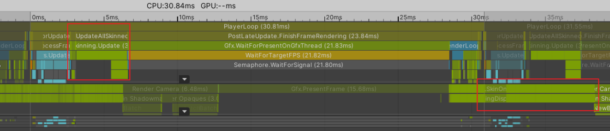

在unity2019.4中，unity本身支持三种Skinning的实现，CPUSkinning是一种，其中GPUSkinning又分为StreamOut和ComputeShader。接下来或首先分析一下Skinning的执行流程，再分析内存使用情况，最后讨论一种优化内存的方法。

# Skinning的执行流程

这里直接贴一张图，这是概念上的执行时序图，其中不管是CPUSkin还是GPUSkin都会在MainThread的更新中跑一段骨架更新的逻辑。然后Skinning的计算发生在渲染线程每一帧的开始处，这里想要强调一下，如果你的游戏当前是GPUStall的，或是开始VSync的情况，这基本上是绝大多数游戏的情况了，Cull逻辑和Skinning会同时进行，也就是说如果你进行CPUSkinning的话， 这两部分会对CPU的资源进行一个争夺。GPUSkinning不会争夺，是因为GPUSkinning这部分的损耗在GPU端。

# Skinning内存占用分析

首先先把数据流图摆出来，作为Skinning计算的输入，需要原始T-POSE的顶点数据，以及当前动画产生的骨骼数据，但是可以发现T-POSE数据， 在CPU端和GPU端都有一份，这里面在做CPUSkinning和GPUSkinning来说是多余的，但是可能有别的用处，比如CPU端的数据可以用来进行ReadWrite，如果没有额外的使用，这个是可以优化的。

# CPUSkinning内存优化

我所在的项目使用的是CPUSkinning，所以主要找了两个优化点
1.删掉掉GPU端冗余的T-PoseData数据
2.CPU端的T-Pose数据用Half精度来保存，在蒙皮计算时先从half转到float，结算结果再转float->half。