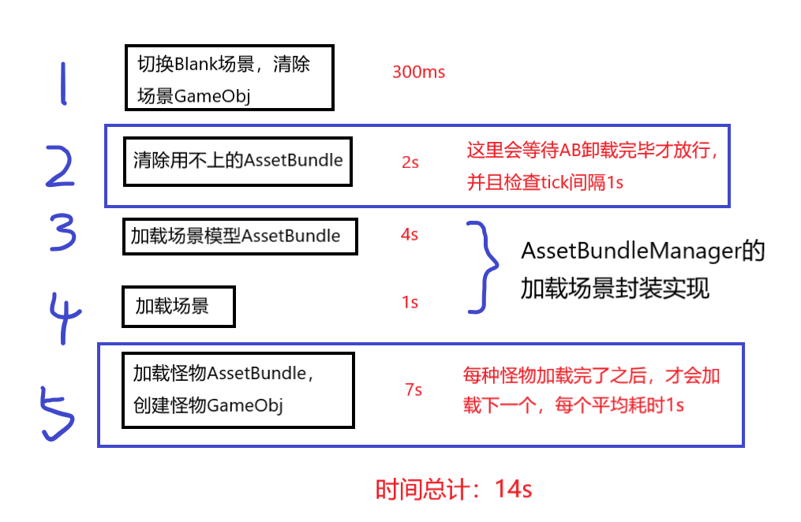
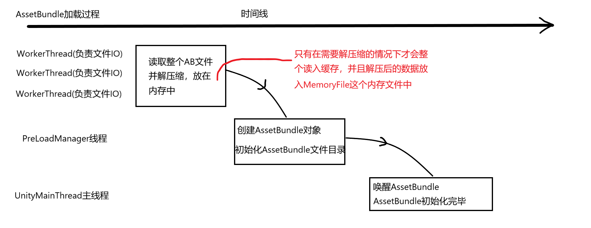
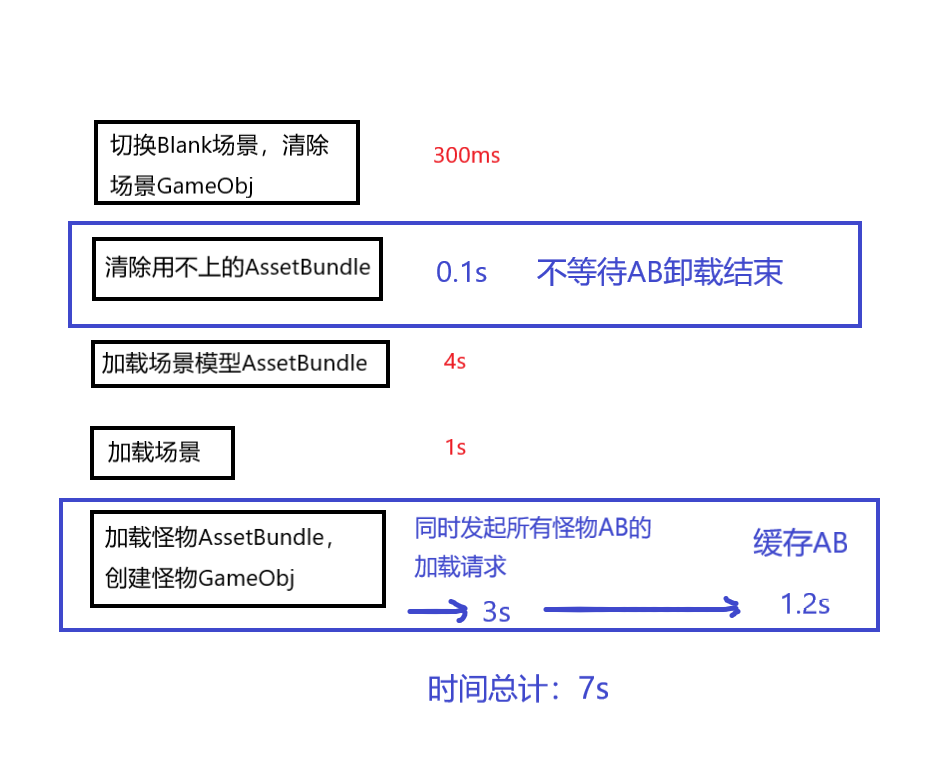

# Unity 场景加载速度优化

> 在Unity 2019.4及以后的版本中AB的加载都是多线程模式，AB加载的任务应尽量同时发起，减少加载时间。

## 1问题表现

项目反馈在低配机上，场景加载需要时间比较长，需要15s左右，然而通过Unity的Profiler发现Unity的主线程大部分时间都处于空闲状态。通过添加日志观察整个加载过程的耗时，信息如下

如图是一个标准的Unity切换场景流程

1.第一步和第二步是项目自己的封装，先切换到空场景，清除不需要的GameObject对象，以及卸载AB，保持内存。
2.第三步和第四步是AssetBundleManager的加载场景实现，先加载AB，再初始化场景，这里是没有什么优化空间的。
3.第五步属于游戏部分的逻辑，也是最容出问题的部分。

## 2场景的异步加载过程

上图中的三四步就是AssetBundleManager对场景异步加载的封装实现，通过分析三四步可以了解怎么优化第五步。场景的加载过程分为了三个部分AB加载，Asset的创建，场景GameObject的创建，这三个步骤是依次依赖的关系。

### AssetBundle的多线程加载

在AB的加载过程是由三个线程协同的，Worker，PreloadManager，以及MainThread。
1.每一个AB的文件IO部分都是由一个worker线程单独进行的，如果AB包需要解压缩，那么线程会把整个AB都读入缓存中并进行解压缩，否则只会读取文件头的部分。
2.PreLoadManager负责处理处理异步创建的过程，具体创建了AB对象，并且初始化AB里面的文件目录，但此时这个AB对象还不是全局可见的。
3.MainThread会调用AB对象的AwakeFromLoad函数，进入全局可见状态，整个AB的异步加载过程结束。

### 场景Asset加载

这部分的逻辑是由PreloadManager来执行，这里会从AB对象中读取并Texture以及Shader的数据，这里的读取IO过程可能是从内存读取也可能是从操作系统的IO读取，Unity分别封装为MemoryFile和SystemFile，具体是哪一种取决于是否需要解压缩。

### 场景GameObject创建

这部分需要等待所有的Asset加载完毕，在主线程当中执行。

## 3优化方案和效果

回到项目的实现方案来看：
1.在第二步中，AB的卸载项目有做成异步的，没必要等待AB卸载完毕。
2.在第五步中，每个怪物加载完毕才进行下一种怪物的loading，实际上就是把可以并行化的AB加载全部串行了。应该一口气把LoadAB的请求全都发给引擎，同时对于大内存的手机类型，比如小米Mix2的内存有5G，可以考虑多缓存一些AB提升速度。

最后从15s优化到了7s

## 4扩展阅读

关于AssetBundle的正确使用姿势，可以看一下，unity官方的介绍。
https://learn.unity.com/tutorial/assets-resources-and-assetbundles?uv=2017.3