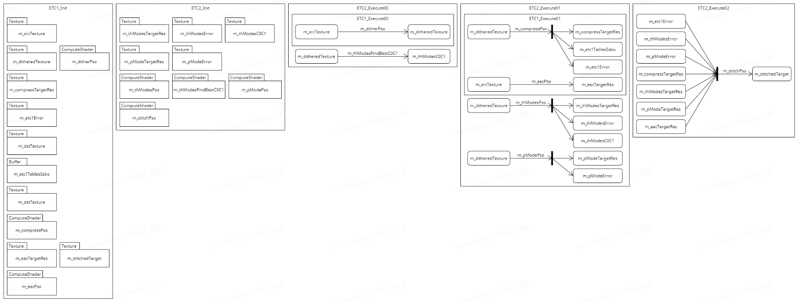

# **[Unity]关于热更图集方案的一些探索**

> Unity项目中使用UGUI时，会大量使用图集（SpriteAtlas）来做优化： · 使用同一图集的Image有利于合批渲染。 · 将非规则尺寸的Sprite整合到规则尺寸的图集后，设置为压缩纹理，有利于减小包体和带宽。 但是项目上线后，如果有个Sprite发生改变，就需要更新整个图集。当图集分页多，下载一个大体积的Patch很影响用户体验。 于是，我们尝试寻找一些可行方案来优化这个问题。

## 0x00 背景介绍

Unity项目中使用UGUI时，会大量使用图集（SpriteAtlas）来做优化：

- 使用同一图集的Image有利于合批渲染。
- 将非规则尺寸的Sprite整合到规则尺寸的图集后，设置为压缩纹理，有利于减小包体和带宽。但是项目上线后，如果有个Sprite发生改变，就需要更新整个图集。当图集分页多时，下载一个大体积的Patch很影响用户体验。


于是，我们尝试寻找一些可行方案来优化这个问题。

## 0x01 二进制差分更新

最直观的方案就是能否减小Patch体积？之前在KM看到[这篇文章](https://km.netease.com/article/489426)，提到通过修改AssetBundle中的资源块来减少Patch。受此启发，我们尝试对图集单独打包，然后用二进制差分算法来做Diff和Patch。

测试图集如下，修改了一个头像的色调：


二进制差分算法，经过分析和比较，选择了[HDiffPatch](https://github.com/sisong/HDiffPatch)。测试结果如下图：

| 压缩方式     | 旧图集大小     | 新图集大小     | Diff大小       |
| ------------ | -------------- | -------------- | -------------- |
| Uncompressed | 8,092,944 字节 | 8,092,944 字节 | 7,228 字节     |
| LZ4          | 5,222,505 字节 | 5,222,599 字节 | 20,970 字节    |
| LZMA         | 4,658,700 字节 | 4,659,530 字节 | 4,655,039 字节 |

可见，二进制比较的结果确实跟文件的压缩格式有关。对于不压缩或块压缩的AssetBundle比较高效，对于LZMA这种全局压缩格式就比较无效。

如果新增Sprite，导致图集变化，二进制差分是否有效呢？我们再做个测试。

旧图集，有2页：


增加两个Sprite：


新图集，有3页，可以看到Sprite分布已经发生变化：


图集打包和Patch的大小：

| 文件    | 大小                     |
| ------- | ------------------------ |
| old     | 1.29 MB (1,360,162 字节) |
| new     | 1.51 MB (1,584,470 字节) |
| diff    | 922 KB (944,515 字节)    |
| patched | 1.51 MB (1,584,470 字节) |

可见，添加两张128KB的Sprite后，产生的diff文件大小为922KB。从Patch之后的AssetBundle里读取图集，结果是正确的。

## 0x02 动态合成图集

理想情况下，我们希望每个UI预设只引用一个图集，使用一个Batch完成渲染。现实情况下，往往因为资源共用，一个UI预设会引用多个图集，打断合批。那么，我们是否可以在运行时将每个UI预设引用的Sprite动态合成一个图集？这样做有两个好处：

- 

  每个预设只引用一个图集，有利于合批渲染。

- 

  热更图集变成了热更Sprite。

运行时合成图集，核心是处理Sprite的排列。其实，很多对战手游都使用了这个方案。因为开局后，角色头像和技能的图标才能确定下来。借由他们的分享，我们找到[UnityRuntimeSpriteSheetsGenerator](https://github.com/DaVikingCode/UnityRuntimeSpriteSheetsGenerator)来实现这个功能。

```text
The RectanglePacking algorithm is a port of the AS3 version made by Ville Koskela. 
```

测试结果如下：

|                | DrawCall数量 |
| -------------- | ------------ |
| 不使用图集     | 30           |
| 提前生成图集   | 15           |
| 运行时生成图集 | 5            |

运行时生成的图集，尺寸设置为2048，有两个分页，所以产生两个DrawCall。另外几个是字体产生的DrawCall，可见优化效果明显。但是，这里还有几个问题需要解决。

问题1：它是通过直接读写纹理数据来合并图集。

```cs
texture.SetPixels32(rect.x, rect.y, rect.width, rect.height, textures[index].GetPixels32());
```

虽然Unity也提供了[Texture2D.PackTextures](https://docs.unity3d.com/2020.3/Documentation/ScriptReference/Texture2D.PackTextures.html)来合并图集，然而它也是需要纹理可读，并且不便于控制图集的压缩格式。

```javascript
public Rect[] PackTextures(Texture2D[] textures, int padding, int maximumAtlasSize, bool makeNoLongerReadable);
```

实际项目中，为了减少内存占用，我们通常都会把纹理的isReadable设为false。查询文档，发现使用[Graphics.CopyTexture](https://docs.unity3d.com/2020.3/Documentation/ScriptReference/Graphics.CopyTexture.html)就可以高效地在GPU内部拷贝按块压缩的纹理。

```cs
Texture2D atlas = new Texture2D(atlasSize, atlasSize, TextureFormat.ASTC_4x4, false);
for (int j = 0; j < packer.rectangleCount; j++)
{
  Graphics.CopyTexture(sprites[index], 0, 0, 0, 0, rect.width, rect.height, atlas, 0, 0, rect.x, rect.y);
}
```

问题2：合并后的图集有瑕疵。

如下图所示，合并图集后，Sprite边缘出现了彩色细线。


打开FrameDebugger可以看到，合并图集长这样：


可见，原因是new Texture2D()的操作并不会将图集纹理的Alpha通道初始化为0，双线性采样后就在Sprite边缘产生了不透明的像素。因为ASTC格式是对像素做块压缩后顺序排列，所以也不能直接将TextureData清0：

```cs
Texture2D texture = new Texture2D(textureSize, textureSize, TextureFormat.ASTC_4x4, false);
var bytes = texture.GetRawTextureData();
Array.Clear(bytes, 0, bytes.Length); // 无效
texture.LoadRawTextureData(bytes);
texture.Apply(false, true);
```

我们可以预先创建一张全黑纹理，并设置为ASTC格式。运行时加载这张纹理，在其上合并图集。


此时看到合并图集的透明度正确了。


问题3：因为ASTC是按块压缩，合并图集时需要考虑数据对齐。

如果Sprite尺寸不是块尺寸的倍数，Graphics.CopyTexture就无法正确的拷贝纹理数据。

比如，ASTC_4x4就需要Sprite的尺寸是4的倍数，ASTC_8x8就需要Sprite的尺寸是8的倍数。

虽然我们也可以在导入Sprite时强制修改图片尺寸，填充透明像素，但是这就会浪费图集空间，制作UI预设时也需要调整Image的显示范围和点击范围。

另外，为了避免双线性采样到边界外的像素，生成图集时通常需要在Sprite之间插入1~2个像素。此时即便Sprite尺寸正确，拷贝纹理也会导致无法对齐。


## 0x03 运行时压缩RT - ETC2（UE5）

如果直接将Sprite渲染到RenderTexture上，再将RenderTexture用作图集纹理，似乎就可以避开压缩块的对齐问题。

我们甚至可以使用ComputeShader来读写纹理，省去渲染开销。

```text
#pragma kernel CSMain

Texture2D<half4> inputTexture; // Sprite Texture
RWTexture2D<half4> outputTexture; // Atlas Texture

cbuffer CBuffer
{
    uint4 inputSize; // xy:inputSize; zw:offset
    uint2 outputSize;
};

[numthreads(8,8,1)]
void CSMain (uint3 id : SV_DispatchThreadID)
{
    if (all(id.xy < inputSize.xy))
    {
        int2 inputCoord = id.xy;
        half4 pixel = inputTexture[inputCoord];

        int2 outputCoord = id.xy + inputSize.zw;
        outputTexture[outputCoord] = pixel;
    }
}
```

流程如下图：


结果看起来没啥问题：


但是，因为RenderTexture无法设置压缩格式，生成的图集就是ARGB32格式的未压缩纹理，会严重增加内存和带宽的开销。

理论上，基于块的压缩算法，是可以在ComputeShader中实现的。

想起之前看到，UnrealEngine可以对[VirtualTexture](https://docs.unrealengine.com/4.26/en-US/RenderingAndGraphics/VirtualTexturing/Reference/)进行运行时压缩。


它的压缩逻辑主要在VirtualTextureCompress.usf和ETCCompressionCommon.ush里，基本上可以直接拿到Unity里使用。

> // Compute Shader float3 BlockBaseColor[16]; ReadBlockRGB(RenderTexture0, MyPointClampSampler, SampleUV, TexelUVSize, BlockBaseColor); float BlockA[16]; ReadBlockAlpha(RenderTexture0, MyPointClampSampler, SampleUV, TexelUVSize, BlockA); Result[ThreadId.xy] = CompressBlock_ETC2_RGBA(BlockBaseColor, BlockA);

处理流程如下图：


但是运行效果不太好，应该是UE的优化算法损失了质量。


## 0x04 运行时压缩RT - ETC2（Betsy）

虽然UE的ETC2压缩效果不佳，但是证明了思路可行。是否还有更好的算法呢？

经过一番搜索，找到了[Betsy GPU Compressor](https://github.com/darksylinc/betsy/tree/master)。

```text
The Godot Game Engine has been funding work on a GPU-based texture compressor to deal with the issue that importing textures to this leading open-source game engine can often be painfully slow.

Betsy is the open-source project being worked on for the Godot Engine. Betsy implements BC6, ETC1, ETC2, and EAC algorithms among others using GLSL compute shaders. This compressor is implemented as GLSL compute shaders so the work can be offloaded to the graphics processor either via OpenGL or Vulkan usage as well.
```

Betsy虽然使用GPU压缩纹理，但在设计上并不是用于运行时，所以更注重质量。算法的复杂度和开销都远高于UE版本。它一共实现了三种算法来压缩RGB通道，选出最佳结果后再与EAC压缩的Alpha通道组合。

- ETC1 original modes (RGB444 4x2, RGB444 2x4, RGB565 4x2, RGB565 2x4)
- T and H modes (processed in two-step compute shaders)
- P mode

以TH模式为例，压缩一张1024x1024的纹理，需要计算256x256块。其中第一个Pass要执行7,864,320个线程，第二个Pass要执行62,914,560个线程。

整体流程如下图：



结果也是比较接近CPU压缩的算法。


如果需要在运行时压缩，可以只保留一种算法来优化性能和内存。

## 0x05 运行时压缩RT - ASTC

考虑到灵活的压缩精度，我们更倾向使用ASTC，还好也有人做了先行尝试：

[real time ASTC texture compression by computer shader](https://github.com/niepp/astc_encoder)

这个算法基于Arm的ASTC Encoder做了大量简化以满足运行时的性能要求，同时保证精度不会受到太大影响，但是只支持ASTC_4x4和ASTC_6x6。

- 基于性能开销考虑，不做partitions搜索 
- 只用Block4x4、6x6 
- 权重网格用4x4的大小 
- 对于Block4x4就没有权重网格插值误差了 
- 只进行权重weights的量化范围的搜索 
- 忽略dual plane，color endpoint modes的搜索

压缩流程也是与之前相似，但是要注意压缩RT和压缩纹理的尺寸需要为ASTC压缩块的整数倍（向上取整），否则CopyTexture时会出现内存无法对齐的错误。


效果对比：


但是，当前大多数手机GPU中，ComputeShader与VertexShader是共用一个硬件处理队列。调用ComputeShader就需要等前面的渲染帧执行完毕，并且阻挡后续帧的渲染，这在用户体验上会造成明显的卡顿。随着手机软硬件的更新，当引擎支持Async Compute时，GPU压缩纹理才可能用于实时渲染。


## 0x06 总结

为了减少图集Patch的体积，我们尝试了几种方案。有的方案是直面问题，有的方案是改变问题。最终选取哪个方案，可以根据实际情况来灵活选择。