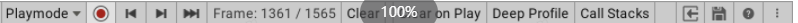
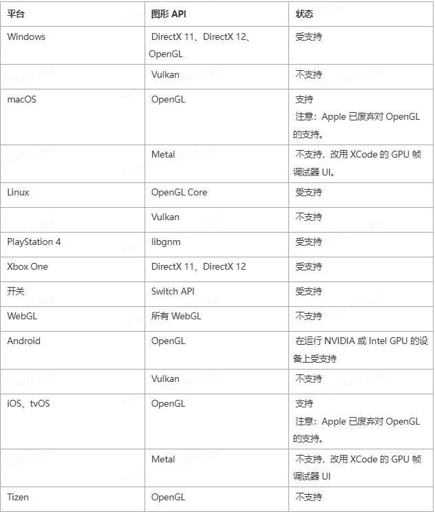

> Unity性能分析器（Unity profiler）是一种可以用来获取游戏运行时性能信息的工具。在使用Unity开发游戏的过程中，借助Profiler来分析CPU、GPU及内存使用状况是至关重要的。

##  **Unity 性能分析器**

> Unity性能分析器（Unity profiler）是一种可以用来获取**游戏运行时性能信息**的工具。性能分析器可对以下三种工作场景进行设备的数据采集：
>
> 1. 通过**无线方式**连接到PC的设备，它们通常是已连接到网络中的设备（例如：手机、平板、另一台PC等）
> 2. 通过USB等**有线方式**连接到PC的设备
> 3. 直接在**Unity编辑器**内运行游戏
>
>  性能分析器可以收集并显示有关应用程序各个方面的性能数据（例如：CPU、内存、帧率等），并通过图表的形式进行展示，因此可以直观的查看游戏在各个时刻的性能状态。

##  **工具的介绍与使用**

###  **打开 Unity profiler 视窗**

 可以使用以下两种方式打开Unity profiler：

> **菜单栏打开：**在Unity编辑器界面菜单栏依次选择**Window** **>** **Analysis** **>** **Profiler**打开
>
>  **快捷键打开：**Windows（Ctrl+7）、macOS（Command+7）

 上图为打开后的Unity profiler窗口的视窗界面，将其简单分为4个不同的区域，分别用数字①、②、③、④代替，它们的含义如下：

 ① **性能分析模块区域**：在profiler中支持性能分析的模块列表，使用此区域顶部的菜单（Profiler- Modules）可在该区域内添加和删除模块。

>  ***** 分析模块中具体的指标数据支持**点击关闭**和**自定义顺序排列**，这些操作都会实时的同步到区域③（帧图表区域）中

 ②**性能分析器控件**：能够控制Unity profiler的绝大部分内容，具体的控件功能如下所示：

- **Playmode**：使用此控件可设置对哪个设备进行性能分析，默认对当前打开的编辑器运行的游戏进行分析；

- **圆点控件**：控制Unity profiler采集性能参数的开启和暂停；

- **左右箭头控件**：在不同的帧数据之间进行回退和前进操作；

- **Frame**：统计Unity profiler已记录的所有帧数和当前所处帧数情况，当鼠标选中区域③（帧图表区域）中的某一帧时，此处会显示当前选中的是哪一帧的画面；

- **Clear**：清屏帧图表区域；

- **Clear on Play**：启用此设置后，当下次在窗口中单击采集数据或连接到新目标设备时，将会删除当前分析器窗口中所有的数据；

- **Deep Profile**: 该功能主要用于更精准的跟踪各个数据（可查看函数的具体消耗和GC情况，包括调用栈信息等），但同时会消耗更多的性能资源；

- **Call Stacks**：启用此控件功能后，将记录用于内存分配的调用堆栈信息；

- **打开控件**：读取本地已保存的数据，将保存的分析器数据加载到分析器窗口；

- **保存控件**：保存当前已记录的数据，通过[Profiler.logFile ](https://docs.unity3d.com/2019.3/Documentation/ScriptReference/Profiling.Profiler-logFile.html)API 保存已经写出到文件的数据；

- Context Menu

  : 此选项中包含3个功能选项（ColorBindMode、Show Stat for "Current Frame"、Preference），它们的含义分别是：

  - ColorBindMode：此设置可使帧图表区域在图形显示中使用更高的对比度颜色；
  - Show Stat for "Current Frame"：记录过程中一直显示当前帧的对应的图表上的数据
  - Preference：Preferences菜单，用以设置分析器的其他功能，比如实时记录帧数的数量设置等

 ③ **帧图表****区域**：此区域包含性能分析器中每个指标的图表信息。鼠标左键可以选择不同时刻的帧画面信息。选择后会出现一条竖线，竖线和各个性能指标相交点的值即为这一时刻的性能参数。

 ④ **模块详细信息面板**：此区域中显示的信息将由用户选中的模块（在性能分析器模块区域中选择）决定。例如上图中选择的是 CPU Usage 模块，则此区域包含了详细的时间轴图像和Hierarchy视图内容。

>  ***** 窗口默认显示最新的**300**帧性能数据，可以在 Preferences 窗口（File > Preferences）中增加实时记录的帧数（最多**2000**帧，**但由此对性能分析器本身会带来比较大的开销和内存占用**）

###  **常用分析模块**

####  **渲染分析模块（Rendering Profiler）**

 **渲染分析模块**能够在游戏运行的过程中显示渲染的统计信息。如上图所示，左侧模块中共有4个指标（分别是Batches、SetPass Calls、Triangles、Vertices），点击这些指标的**色块**可以显示或关闭在右侧帧图表区域中各自信息的显示和隐藏。

####  渲染指标

 渲染模块中各指标的含义如下：

- **SetPass Calls**（渲染状态切换次数）：SetPass Calls是Unity中的一个概念，它代表游戏中某个对象的材质、 shader pass、贴图等数据发生**改变次数**的数值，它在描述渲染性能开销上比Batching会**更有说服力；**

> ***** SetPass Calls 是在 Unity5.x版本中引入的概念，比如说场景中有 100 个 GameObject，它们拥有完全一样的材质（Material），这 100 个物体很可能会被Unity的Batching机制结合成一个Batch。所以用“Batchs”来描述Unity的渲染性能是不太合适的，它只能反映出场景中需要批处理物体的数量。
>
>  那么可否用“Draw calls”来描述呢？答案同样是不适合。每一个“Draw calls”是CPU发送给GPU的一个渲染请求，请求中包括渲染对象所有的顶点参数、三角面、索引值、图元个数等，这个请求并不会占用过多的消耗，真正消耗渲染资源的是在GPU得到请求指令后，把指令发送给对应物体的 Shader, 让Shader 读取指令并通知相应的渲染通道（Pass）进行渲染操作。
>
>  假设场景中仅有1个GameObject，但希望它能显示很酷炫的效果，它的材质上会带有许多特定的Shader。为了实现相应的效果，Shader里或许会包含很多的Pass,每当GPU即将去运行一个Pass之前，就会产生一个“SetPass call”，因此在描述渲染性能开销上，“SetPass calls” 更加有说服力。
>
>  ***** SetPass Calls中的Pass不等于shader中的Pass，它其实是**RenderPassData:**
>
>  RenderPassData是Unity底层包装的一组数据，包括材质、贴图、passflag等多个数据，其中passflag才是shader中的pass
>
>  这里面的数据只要有一个不同，就会产生一个新的SetPass Call

- **Draw Calls**（绘制调用次数）：Unity中CPU每次通知GPU发出一个glDrawElements（OpenGl中的图元渲染函数)或者 DrawIndexedPrimitive（DirectX中的顶点绘制方法）的过程称为一次Draw call；
- **Batched Draw Calls**（批量绘制调用次数）：是 Unity 内置的 Draw Call Batching 技术，Batched 其实是Draw Call的另外一种称呼，不同的点是一次batch可理解为是把之前需要多个draw call时预处理的数据先统一打包好，再通过一次draw call交由GPU处理；

> 一般来说，引擎每对一个物体进行一次 DrawCall，就会产生一个 Batch，这个 Batch 里包含着该物体所有的网格和顶点数据，当渲染另一个相同的物体时，引擎会直接调用 Batch 里的信息，将相关顶点数据直接送到 GPU， 从而让渲染过程更加高效，即 Batching技术是将所有材质相近的物体进行合并渲染。对于含有多个不同 Shader 和 Material 的物体，渲染的过程比较耗时，因为会产生多个 Batches。每次对物体的材质或者贴图进行修改，都会影响 Batches 里数据集的构成。因此，如果场景中有大量材质不同的物体，会很明显的影响到 GPU 的渲染效率。
>
>  有关 Batches 优化相关的方案：
>
>  虽然 Unity 引擎自带 Draw Call Batching 技术，我们也可以通过手动的方式合并材质接近的物体；
>
>  尽量不要修改 Batches 里物体的 Scale， 因为这样会生成新的 Batch。
>
>  为了提升 GPU 的渲染 效率，应当尽可能的在一个物体上使用较少的材质，减少 Batches 过多的开销。
>
>  对于场景中不会运动的物体，考虑设置 Static 属性，Static 声明的物体会自动进行内部批处理优化。

- **Tris**（三角面数）：摄像机视野（field of view）内渲染的三角面总数量；
- **Verts**（顶点数）：摄像机视野（field of view）内渲染的顶点数；

>  **关于 Tris 和 Verts：**
>
>  Camera 的渲染性能受到 Draw calls 的影响。之前说过，对一个物体进行渲染，会生成相应的 Draw Call，而处理一个Draw Call的时间是由它里面Tris和Verts数目决定。所以尽可能的合并物体会在很大程度上提高游戏性能。举个很简单例子，比如场景一中有1000个不同的物体，每个物体都有10个Tris; 场景二中有10个不同的物体，每个物体有1000个Tris。 在渲染处理中，场景一中会产生1000个 Draw Calls，它的渲染时间明显比场景二慢。
>
>  在Unity中，Tris 和 Verts 并不仅仅是视锥中的梯形内的 Tris 和 Verts数量，而是 Camera 中 field of view 所有取值下的 tris 和 verts，换句话说，哪怕你在当前 game 视图中看不到这个 cube， 如果当你把 field of view 调大到179 过程中都看不到这个 cube，stats 面板才不会统计，GPU 才不会渲染，否则都会渲染，而且 unity 不会把模型拆分，这个模型哪怕只有 1 个顶点需要渲染， Unity 也会把整个模型都渲染出来。（参考自Mess的《Unity Camera组件部分参数详解》）
>
>  新建一个空的场景，里面没有添加任何物体，为什么 status 面板上显示有 1.7k Tris 以及 5.0k Verts 。这是因为空的场景自带默认的天空盒、Windows—>Lighting打开 Ligh下的 Scene 面板，把 Skybox 里的材质设为空。删掉它，就会发现 Tris 和 Verts 都会变为0了。

- Batches

  (Dynamic Batching/Static Batching/GPU Instancing)

  - **Dynamic Batching**（动态合批）：

 		动态合并在满足以下条件时时自动完成：

1. 模型总顶点数小于 900
2. 不包含镜像 transform 改变，不改变 Scale
3. 如果使用动态 lightmap 需要指定正确
4. 不使用多 Pass 的 Shader

​		 由于需要在合并时通过 CPU 计算转为世界坐标，这项技术只在 CPU 消耗比 DrawCall 消耗“便宜”的场景下使用才值得，相当于以提高CPU算力为代价降低Draw Call的消耗。这个“便宜”的衡量标准会根据平台的差异而不同，例如苹果平台上Draw Call本身的消耗就比较“便宜”，就不应该使用这项技术。这个功能可以在 Editor–> Project Setting –>Player 中进行设置打开与关闭。

- - **Static Batching**（静态合批）：

 场景中不能移动的物件可以使用静态合并，它不受顶点数的限制，可以大幅较少 DrawCall。 但为了将元素合并到一个大模型中，这项技术需要额外的内存。主要的内存消耗在于共享多边形会在内存中重复创建。因此有时候需要牺牲渲染效率来避免静态合并，来保证内存够小。例如在茂密的树林中使用这项技术会导致大量的内存消耗。

- - **GPU Instancing**（GPU实例化）：

 使用 GPU 实例化可使用少量**Draw Calls**一次绘制（或渲染）同一网格的多个副本。它对于绘制诸如建筑物、树木和草地之类的在场景中重复出现的对象非常有用。GPU 实例化在每次绘制调用时仅渲染相同的网格，但允许每个实例可以具有不同的参数（例如，颜色或比例）以增加变化并减少外观上的重复。GPU 实例化可以降低每个场景使用的绘制调用数量。可以显著提高项目的渲染性能。要对材质启用 GPU 实例化 (GPU Instancing)，请在 Project 窗口中选择材质，然后在 Inspector 中勾选 Enable Instancing 复选框。

材质检视面板(Inspector)窗口中显示的Enable Instancing复选框

上述指标的协同配合就反馈了一款游戏在运行时的渲染性能

####  **CPU占用分析模块（****CPU Usage Profiler****）**

 CPU占用分析模块可实时跟踪游戏中主线程的用时情况，这些耗时被为9个指标在右侧的帧图表区域中进行展示：

 此时底部的详细信息面板将显示游戏在选定帧内花费的时间的细分信息。可以将时间数据显示为时间轴（Timeline）或层级表（Hierarchy）【默认设置为Timeline】。要更改显示视图，请使用详细信息面板中的左上角下拉选单。三个可用视图为：

  

####  **Live 设置**

 当开始在运行模式 (Playmode) 或 Editor 中记录新数据时，**Live设置**（在每个视图中都可用）可在模块详细信息面板中显示有关当前帧或选定帧的信息。为了启用此设置，请单击模块详细信息下拉选择菜单旁的 **Live** 按钮，默认情况下此设置为禁用状态。

>  **注意：**重绘 Profiler 窗口时，此设置会增加EditorLoop的性能开销。

####  **Show Full Scripting Method Names 设置**

 在每个视图中可以选择 **More Items** 菜单启用 **Show Full Scripting Method Names**设置，该设置会显示所有脚本方法的完整名称，下图中A为未启用Show Full Scripting Method Names 设置时的表现，B为启用Show Full Scripting Method Names设置的表现。

####  **Timeline 视图**

 **Timeline** 视图是CPU Usage Profiler模块的默认视图。该视图显示了游戏运行中所花费的时间情况以及时间的相互关联情况。与 **Hierarchy** 视图不同，Timeline视图沿同一时间轴在各自子部分中显示所有线程的性能分析数据。**Hierarchy** 视图一次只会显示一个线程（默认为主线程）的性能分析数据。此外，这些视图仅显示样本的持续时间，而 Timeline 视图会显示每个样本发生的时间。

 使用 Timeline 视图可以查看不同线程在并行执行过程中的相互关联情况。在此处可以了解对不同线程（例如[作业系统](https://docs.unity3d.com/cn/2019.4/Manual/JobSystem.html)的工作线程）的使用程度、线程上工作的排队方式以及任何线程是处于空闲状态（Idle样本）还是在等待另一线程或作业完成（Wait for x样本）。

####  **放大和缩小时间轴区域**

 要放大时间轴的区域请使用鼠标上的滚轮，或按住**Alt**键的同时按住鼠标右键进行拖动。也可以使用水平滚动条的两端来放大。按下键盘上的**A**键可重置缩放。

 每当在线程底部看到白色箭头时，都可以单击该箭头来展开线程以便显示所有行，或者再次单击以便仅显示顶部的行。也可以拖动分隔线程的行以重新调整可看到的行数。双击该行可将线程部分的高度设置为调用栈的最大深度。要平移视图，请按鼠标中键，或按住**Alt**键（在 macOS上为 **Command** 键），然后按鼠标左键。要折叠和展开线程组，请单击视图最左侧的线程名旁的折叠箭头。

 要查看某一项对 CPU 图表的贡献，请在下方面板中选择这一项。性能分析器会突出显示该项的信息，并使图表的其余部分变暗。要取消选择该项，请单击视图中的其他位置。按 **F** 键可以聚焦所选的当前样本，如未选择任何项，则会显示默认的缩放水平。

####  **Hierarchy 和 Raw Hierarchy 视图**

 **Hierarchy** 视图列出了已进行性能分析的所有样本，并按共享的调用栈和ProfilerMarker层级视图将样本分组。**Raw Hierarchy** 视图不会将样本一起分组，因此非常适合在粒度级别上查看样本。也可以使用 **Thread** 下拉选单来选择特定线程，例如在这些视图中选择主线程 (Main Thread) 或渲染线程 (Render Thread)。

 默认情况下，在这些视图中，所有 EditorOnly 样本都是折叠状态。EditorOnly 样本是在Player Loop中仅由于“仅 Editor”安全性检查而发生的样本。样本折叠后，它们的 GC.Alloc 值不会影响所属样本的 GC.Alloc 值。要显示这些样本，请选择详细信息面板右上角的 **More Items** 菜单 (⋮)，然后禁用 **Collapse EditorOnly Samples** 设置。

 这两个视图都会在 Hierarchy 中每行旁边显示有关每一项的详细信息，如下所示：

>  要进一步了解应用程序在何处调用和使用了接受性能分析的函数，请选择模块详细信息面板右上角的 **Details** 下拉选单，然后选择 **Show Related Objects** 或 **Show Calls** 视图。

####  **Show Related Objects 面板**

 **Show Related Objects** 视图显示一个 UnityEngine.Objects 列表；此列表中的对象使用 Begin() 重载，而且与性能分析器样本关联。Unity 报告的某些样本内置了这些关联性，例如，已链接到执行渲染的摄像机游戏对象的 Camera.Render 样本。如果在 Editor 中进行性能分析，Unity 将通过这些对象的实例 ID 来报告这些对象，并在 Profiler 窗口中将它们解析为名称。对构建的播放器进行性能分析或从磁盘加载捕获的数据时，这些名称不会显示，并且性能分析器将这些名称显示为 N/A。

 单击这些对象之一时，Unity 尝试通过 Scene 层级视图来查找此对象，然后对此对象进行 ping 操作。因为此关联性使用实例 ID，所以只有在 Editor 中对应用程序进行性能分析并且该对象仍然存在的情况下，ping 操作才有效。

 对于 GC.Alloc 样本，此视图会显示 N/A 项的列表；在此层级视图级别发生的每个分配都有一个对应的项，并且会在 GC.Alloc 列中列出此分配的大小。如果在已启用 **Call Stacks** 设置的情况下对应用程序进行性能分析，则在此视图中选择 GC.Alloc 样本时，Profiler 窗口将显示选定的所分配脚本对象的调用栈（即使未启用 Deep Profiling 设置）。

####  **Show Calls 面板**

####  **GPU占用分析（GPU Usage Profiler）**

 模块支持的平台：

>  在 Windows 上，仅当采用 Direct3D 9 和 Direct3D 11 API 时，Unity才支持在Editor中的Playmode性能分析。这种情况下便于快速分析，但性能分析器受运行 Unity Editor 的开销所影响，可能会使性能分析结果不够准确。

 GPU Usage Profiler 模块的图表有几个不同的类别，可用于显示 GPU 的时间使用情况。

> 要更改图表中类别的顺序，可以在图表的图例中拖放这些类别。还可以单击某个类别的有色图例以切换是否显示

选择 GPU Usage 模块时，下面的详细信息面板将显示应用程序在选定帧内花费的时间的细分信息。可以将时间数据显示为层级表（默认设置为 Hierarchy）。要更改表视图，请使用详细信息面板中左上方的下拉菜单。

 如下表所示是所有可用的视图：

 从层级视图中选择一项即可在右侧面板中查看该项的的具体情况。表视图包含以下列：

####  **内存占用分析（Memory Profiler）**

 Memory Profiler 模块中会显示一些代表应用程序中分配的总内存的计数器。可以使用 Memory 模块来查看信息，例如已加载对象的数量以及每个类别占用的总内存。还可以查看每个性能分析器帧的 GC 分配数。

####  **全局光照分析（Global Illumination Profiler）**

 在 Editor 中对应用程序进行性能分析时，Memory 模块中的信息指示 Editor 中的内存使用量。这些数字通常大于在发布平台上运行时的数字，因为运行 Unity Editor 会使用占用内存的特定对象，而 Editor 窗口本身会使用额外的内存。另外，性能分析器会显示其使用的内存，因为 Unity 无法将其与运行模式播放器使用的内存完全分开。

 Memory 模块分为六个图表，这些图表显示有关应用程序在哪些方面花费了内存的详细信息。可以更改图表中类别的顺序；为此，请在图表的图例中拖放这些类别。还可以单击某个类别的有色图例以切换是否显示。

  

 位于 Profiler 窗口底部的模块详细信息面板中有两个视图：__Simple__ 和 **Detailed**。要更改视图，请从模块详细信息面板左上角的下拉列表中选择相应的视图。

####  **Simple 视图**

 Simple 视图显示每个帧在整个 Unity 中的实时内存使用量的概况。

 Unity 保留了可供分配的内存池，从而避免过于频繁向操作系统索取内存。此部分显示为保留量以及使用量。

####  **连接测试**

####  **移动设备连接**

 要在移动设备上进行测试，在打包时需将**Development Build**和**Autoconnect Profiler**勾选，这样打出的包就可以进行连接测试。

####  **有线连接**

####  **连接Android设备调试**

 方式一：使用Unity Profiler调试，通过Unity打出包并直接在移动设备上运行

1. Android设备设置：手机开启开发者模式和USB调试，Android设备用USB数据线连接PC
2. Building Settings设置：

- 切换至 Android 平台
- Build System 选择 Internal
- Building Setting 勾选 Development Build，Autoconnect Profiler，Script Debugging
- 点击 Building & Run 等待打包完成，完成后在Android设备上点击授权信息，让游戏在Android设备上运行

1. Unity Profiler采集：

 打包完成后unity会自动打开Profiler窗口，若Android设备上程序已经运行但没有自动打开Profiler窗口，则手动进行打开。

- 在Profiler窗口中点击Editor，选择AndroidPlayer(ADB..) 选择要调试的**Android设备**，点击**Record**开始性能测试

 方式二：使用cmd命令的方式分析游戏包体

1. 设备开启开发者模式和USB调试，并通过USB数据线连接PC
2. 在PC中打开cmd命令行工具，CD到SDK的adb.exe的目录，然后输入adb forward tcp:34999 localabstract:Unity-包名（例如adb forward tcp:34999 localabstract:Unity-test001.product）
3. 打开Profiler窗口，选择AndroidPlayer(ADB@127.0.0.1:34999)，选择**Record**开始性能测试

>  
>
>  如果在测试的发现连接不上设备，可能的原因：
>
>  1 防火墙屏蔽了连接的端口
>
>  2 打包时没有勾选Enable Internal Profile
>
>  参考链接：https://blog.csdn.net/zgl159040290/article/details/54312708
>
>  https://blog.csdn.net/wlqchengzhangji/article/details/109705291

####  **连接IOS设备调试**

 操作步骤和Android设备基本一致，区域在于选择调试设备时选择IOS设备，相关操作为：

> 1.  将IOS设备连接至PC，并信任此电脑
> 2.  打开Unity Editor，切换平台到iOS平台
> 3.  打开Unity Profiler窗口
> 4.  通过Active Profiler下拉列表中的IOS设备名称(iPhone标识)选项来进行连接
>
>  当Active Profiler下拉列表没有IOS相关选项,此时可以参照以下网址解决：
>
>  http://answers.unity3d.com/questions/51478/unity-pro-profiler-cant-find-my-iphone.html
>
>  http://answers.unity3d.com/questions/340373/wth-profiler-not-working-with-ios.html

### **局域网连接**

- 确认设备与PC同处于同一局域网下
- 查看移动设备当前网络IP地址
- 打开Unity profiler窗口，选择Active Profiler下拉列表中的Enter IP选项，输入移动设备IP进行连接

  

###  **实际应用场景中的不足**

 尽管Unity profiler能够满足90%以上的测试内容，但其在自动化测试场景仍稍显不足，由于Unity并不完全开放，第三方用户很难采用Unity profiler进行完全自动化的性能数据采集及分析工作。

###  **拓展阅读**

- Profiler 窗口入门 https://docs.unity3d.com/cn/2019.4/Manual/ProfilerWindow.html
- Unity 用户手册：https://docs.unity3d.com/cn/2019.4/Manual/

  