## **教程：Unity手游优化指南**

> Unity游戏优化基础教程

翻译自《Optimize Your Mobile Game Performance EBook - V6 - May 2021》Unity电子书

优化 iOS 和 Android 应用程序是支撑整个开发周期的重要过程。随着移动硬件的不断发展，移动游戏的优化及其美术、游戏设计、音频和变现策略在塑造玩家体验方面发挥着关键作用。iOS 和 Android 都有数十亿的活跃用户群。经过高度优化的移动游戏更有可能通过特定平台商店的认证。为了最大限度提高发布时及发布后获得成功的机会，必须始终朝以下目标迈进：打造最流畅的沉浸式体验，并使其在最广泛的手持设备上表现出色。 本指南汇集了 Unity 软件工程师专家团队的知识和建议。Unity 的加速解决方案游戏团队与整个行业的开发者建立了合作伙伴关系，帮助推出尽可能出色的游戏。请按照本指南概述的步骤操作，让移动游戏获得最佳性能，同时降低功耗。 请注意，本指南讨论的许多优化可能会引入额外的复杂性，进而导致额外的维护和潜在的错误。在实施下述最佳做法时，需要平衡性能收益与时间和劳动力成本。

## 一、简介

优化 iOS 和 Android 应用程序是支撑整个开发周期的重要过程。随着移动硬件的不断发展，移动游戏的优化及其美术、游戏设计、音频和变现策略在塑造玩家体验方面发挥着关键作用。 iOS 和 Android 都有数十亿的活跃用户群。经过高度优化的移动游戏更有可能通过特定平台商店的认证。为了最大限度提高发布时及发布后获得成功的机会，必须始终朝以下目标迈进：打造最流畅的沉浸式体验，并使其在最广泛的手持设备上表现出色。 本指南汇集了 Unity 软件工程师专家团队的知识和建议。Unity 的加速解决方案游戏团队与整个行业的开发者建立了合作伙伴关系，帮助推出尽可能出色的游戏。请按照本指南概述的步骤操作，让移动游戏获得最佳性能，同时降低功耗。

请注意，本指南讨论的许多优化可能会引入额外的复杂性，进而导致额外的维护和潜在的错误。在实施下述最佳做法时，需要平衡性能收益与时间和劳动力成本。 Unity 团队祝您顺利完成优化！


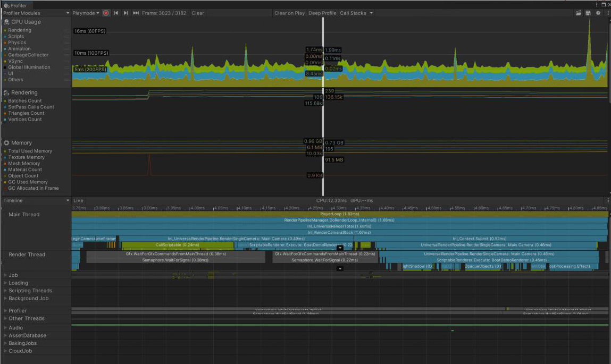

## 二、性能分析

Unity Profiler 可帮助检测运行时出现任何延迟或冻结的原因，或帮助了解特定帧（时间点）发生了什么。默认启用 CPU 和内存跟踪。如果对游戏有特定需求（例如，大量使用物理系统或基于音乐的游戏玩法），可以监控其他性能分析器模块，如渲染器、音频、物理系统等。

 

通过选中 Development Build 和 Autoconnect Profiler 来针对设备构建应用程序，或手动连接以加快应用程序启动速度。 选择要分析的目标。Record 按钮会跟踪应用程序运行几秒钟（ 默认为 300 帧）。如果需要捕获更长时间， 请转到 Unity > Preferences > Analysis > Profiler > Frame Count 增大该值（最高可调整到 2000）。这意味着 Unity 编辑器必须执行更多的 CPU 工作、占用更多内存，但根据特定场景，这可能会很有用。

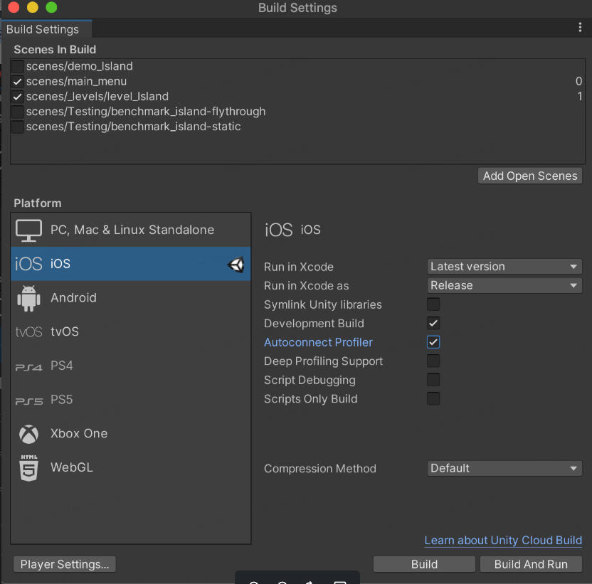

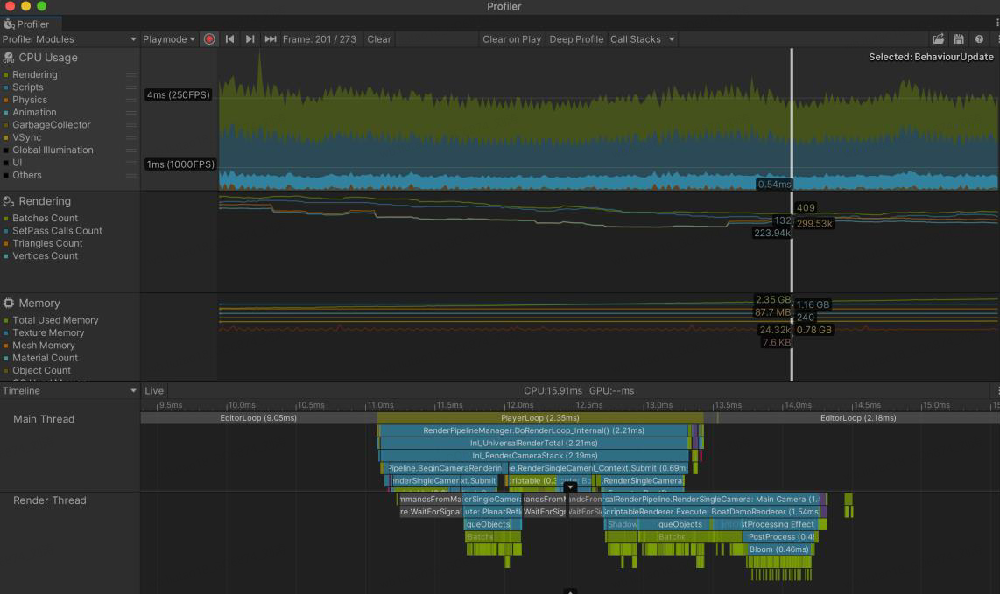

​												使用 Timeline 视图确定应用程序受 CPU 限制还是受 GPU 限制

这是一种基于 instrumentation 的性能分析器，它分析显式包装在 ProfileMarkers 中的代码时序（例如 Monobehaviour 的 Start 或 Update 方法，或特定的 API 调用）。此外，当使用深度性能分析设置时，Unity 可以分析脚本代码中每个函数调用的开始和结束，以准确告诉您应用程序的哪一部分导致运行速度变慢（但这会带来额外的开销）。 在对游戏进行性能分析时，我们建议您涵盖游戏的尖峰和平均帧开销。了解和优化每一帧执行的高开销操作，对运行帧率低于目标帧率的应用程序更有用。在寻找尖峰时，首先探索高开销操作（例如，物理系统、AI、动画）和垃圾收集。

 

在窗口中单击来分析特定帧。然后，使用 Timeline 或 Hierarchy 视图 ：

- **Hierarchy** 显示分组到一起的 ProfileMarkers 的层次结构。这让您可以基于时间成本（以毫秒为单位，Time ms 和 Self ms）对样本进行排序。您还可以计算该帧中函数的调用次数和托管堆内存 (GC Alloc)。
- **Timeline** 显示特定帧时间的可视化明细。这让您可以直观了解活动之间以及跨不同线程的关系。使用它可以确定应用程序受 CPU 限制还是受 GPU 限制。

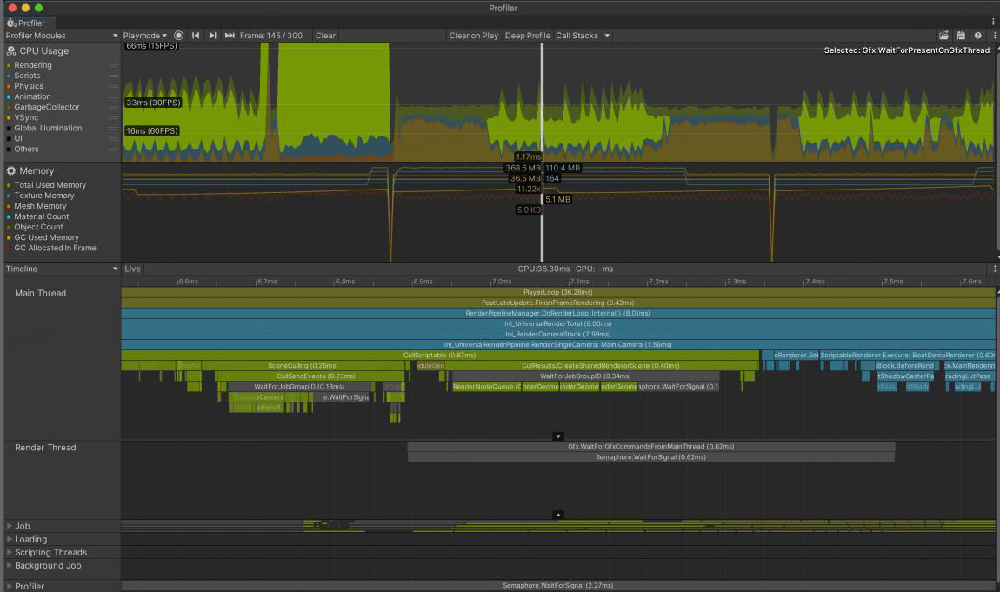

​												Hierarchy 视图可按时间成本对 ProfileMarkers 进行排序

有关 Unity Profiler 的完整概述，请单击此处。对于刚刚接触性能分析的人士，也可以观看 Unity 性能分析简介。 在优化项目中的任何内容之前，请先保存 Profiler .data 文件。然后实施更改，并比较修改前后保存的 .data。按照“分析、优化和比较”的方式来提高性能。反复进行这一过程。

#### 及早并经常进行性能分析

Unity Profiler 可提供关于应用程序的性能信息，但如果您不使用它，它也帮不了您。请在开发早期对项目进行性能分析，而不仅仅是在即将发布时。一旦出现问题或尖峰，立即展开调查。为项目开发一个“性能签名 (performance signature)”，将能够更轻松地发现新问题。

#### 不要盲目优化

不要猜测或假设是什么拖累了游戏性能。使用 Unity Profiler 和特定平台的工具找出导致延迟的具体原因。 此外，并非本指南中介绍的所有优化都适用于您的应用程序。在别的项目中具有良好效果的措施可能对您的项目不起作用。找出真正的瓶颈，然后集中精力解决问题。

#### 在目标设备上进行性能分析

虽然在编辑器中进行性能分析可以非常粗略地了解游戏中不同系统的相对性能，但什么也比不上在真机上进行性能分析。尽可能在目标设备上对开发构建版本进行性能分析。记住，请针对计划支持的最低规格的设备进行性能分析和优化。

仅仅依靠 Unity Profiler 无法了解引擎的每一个部分。幸运的是，iOS 和 Android 都包含可帮助您测试性能的原生工具 ：

- 在 iOS 上，可以使用 Xcode 和 Instruments。
- 在 Android 上，可以使用 Android Studio 和 Android Profiler。

某些硬件还可以利用其他性能分析工具（例如 Arm Mobile Studio、Intel VTune 和 Snapdragon Profiler）。有关更多信息，请参阅对使用 Unity 创建的应用程序进行性能分析。

#### 使用 Profile Analyzer

通过该工具，可以聚合多个 Profiler 数据帧，然后找到感兴趣的帧。想在对项目做出更改后查看 Profiler 有何变化？ Compare 视图允许您加载和比较两个数据集，这对于测试更改结果是否有所改进至关重要。可通过 Unity Package Manager 获取 Profile Analyzer。

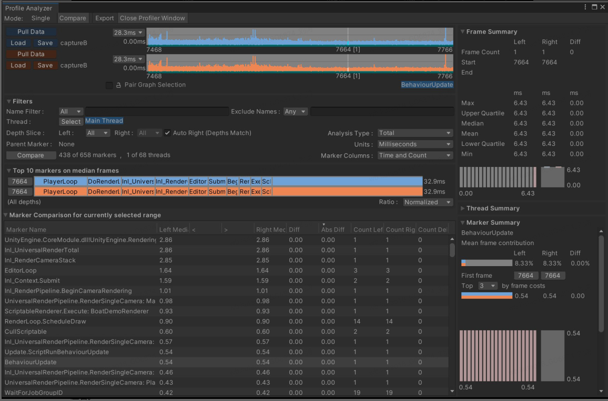

​									需要更深入地了解帧和标记数据？ Profile Analyzer 可弥补现有 Profiler 之不足

####  满足每帧的特定时间预算要求

根据每秒目标帧数 (fps)，每一帧都有时间预算。理想情况下，以 30 fps 运行的应用程序允许每帧用时约 33.33 ms (1000 ms/30 fps)。如果目标为 60 fps，则每帧用时上限为 16.66 ms。

但是，对于移动设备，不能始终使用这么长时间，否则设备会过热，操作系统会对 CPU 和 GPU 进行热节流。我们建议只使用约 65% 的可用时间，以便在帧之间留出冷却时间。目标为 30 fps 时，典型的帧预算为每帧约 22 ms，60 fps 时为 11 ms 左右。

设备可以在短时间内超出该标准（例如，过场动画或加载序列），但不能长时间超标。

#### 确定应用程序受GPU 限制 (GPU-bound) 还是受 CPU 限制 (CPU-bound)

Profiler 可以告诉您 ：罪魁祸首是 CPU 耗时超出了分配的帧预算，还是在于 GPU。

- 如果看到 **Gfx.WaitForCommands** 标记，说明渲染线程已准备就绪，但可能正在等待主线程上的某个瓶颈。
- 如果经常遇到 **Gfx.WaitForPresent**，说明主线程已准备就绪，但正在等待 GPU 渲染帧。

#### 考虑设备温度

大多数移动设备不像台式机那样具有主动冷却功能。物理热量水平会直接影响性能。 如果设备运行得很热，即使没有导致问题，Profiler 也可能报告性能不佳。请在短时间内进行性能分析，以保持设备凉爽和模拟真实世界的情况，从而应对性能分析产生的开销。

#### 在最低规格设备上进行测试

市面上有各种各样的 iOS 和 Android 设备。请在希望应用程序支持的最低规格的设备上测试项目。

## 三、内存

Unity 为用户生成的代码和脚本采用了自动内存管理。小块数据（如值类型的局部变量）分配在栈上。大块数据和长期存储分配在托管堆上。 垃圾收集器 (GC) 会定期识别并释放未使用的堆内存。虽然这是自动运行的，但检查堆中所有对象的过程可能导致游戏卡顿或运行缓慢。 优化内存使用量意味着注意何时分配和解除分配堆内存，并尽可能减小垃圾收集的影响。有关更多信息，请参阅了解托管堆。

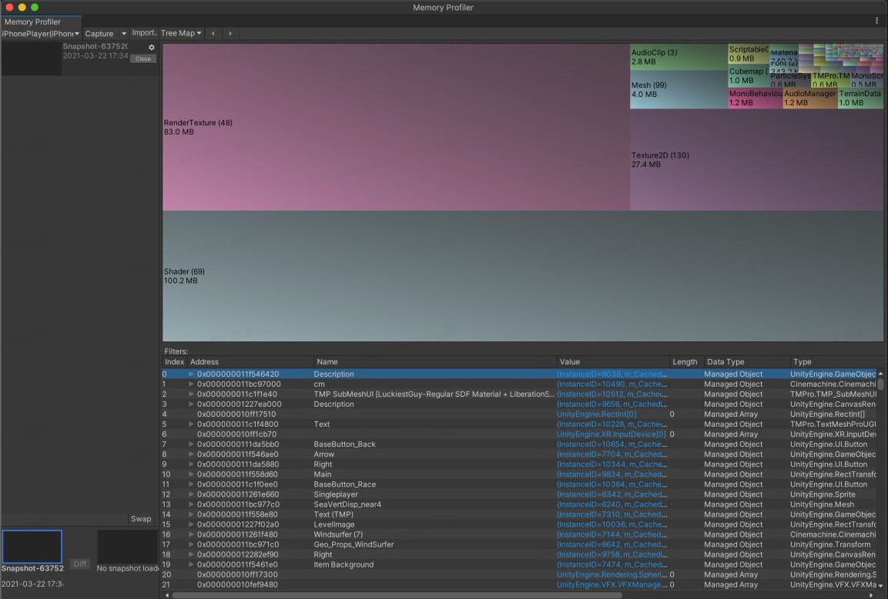

​													在内存性能分析器中捕获、检查和比较快照

#### 使用内存性能分析器

这个独立的附加组件（在 Package Manager 中作为实验性包或预览包提供）可以拍摄托管堆内存的快照，帮助发现碎片、内存泄漏等问题。 在 Tree Map 视图中单击，可跟踪持有内存的原生对象的变量。在这里，可以识别常见的内存使用问题，例如纹理过大或资源重复。 观看如何使用 Unity 中的内存性能分析器来改善内存使用量。还可以查看官方的内存性能分析器文档。

#### 减少垃圾收集 (GC) 的影响

Unity 使用 Boehm-Demers-Weiser 垃圾收集器，它会停止运行程序代码，并且仅在其完成所有工作后才恢复正常执行。 要注意某些不必要的堆分配，这可能会导致 GC 尖峰值：

- **字符串 ：**在 C# 中，字符串是引用类型，而不是值类型。减少不必要的字符串创建或操作。避免解析基于字符串的数据文件，例如 JSON 和 XML ；改用 ScriptableObject 或 MessagePack、Protobuf 等格式存储数据。如果需要在运行时构建字符串，请使用 StringBuilder 类。
- **Unity 函数调用 ：**请注意，某些函数会创建堆分配。缓存数组引用，不要在循环中分配数组。此外，请使用某些避免产生垃圾的函数 ；例如，使用 GameObject.CompareTag 而不是手动将字符串与 GameObject.tag 进行比较 （返回新字符串会产生垃圾）。
- **装箱 ：**避免传递值类型变量来代替引用类型变量。这会创建临时对象，以及随之而来的潜在垃圾，例如，int i = 123; object o = i 会将值类型隐式转换为类型对象。
- **协程 ：**虽然 yield 不会产生垃圾，但创建新的 WaitForSeconds 对象会。缓存并重用 WaitForSeconds 对象，而不要在 yield 行中创建它。
- **LINQ 和正则表达式 ：**它们幕后都会进行装箱，从而产生垃圾。如果性能很重要，请避免使用 LINQ 和正则表达式。如有可能，定时收集垃圾 如果确定垃圾收集冻结不会影响游戏中的某个特定点，则可以使用 System.GC.Collect 触发垃圾收集。 有关在哪些地方可以通过这样做而受益的示例，请参阅了解自动内存管理。 使用增量式垃圾收集器拆分GC 工作负载 增量式垃圾收集使用多个短得多的程序执行中断，而不是单次长时间的中断，将工作负载分布到多个帧上。如果垃圾收集影响了性能，可以尝试启用该选项，看看它能否显著减少 GC 尖峰问题。使用 Profile Analyzer 验证对应用程序的改善。

#### 如有可能，定时收集垃圾

如果确定垃圾收集冻结不会影响游戏中的某个特定点，则可以使用 System.GC.Collect 触发垃圾收集。 有关在哪些地方可以通过这样做而受益的示例，请参阅了解自动内存管理。

#### 使用增量式垃圾收集器拆分GC 工作负载

增量式垃圾收集使用多个短得多的程序执行中断，而不是单次长时间的中断，将工作负载分布到多个帧上。如果垃圾收集影响了性能，可以尝试启用该选项，看看它能否显著减少 GC 尖峰问题。使用 Profile Analyzer 验证对应用程序的改善。

 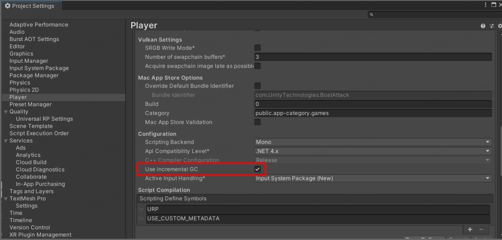

​														使用增量式垃圾收集器减少 GC 峰值

## 四、自适应性能

通过 Unity 和 Samsung 的自适应性能，可以监测设备的散热和功率状态，确保您能准备好去适当地做出反应。当用户玩了很长一段时间后，您可以动态减少细节级别 (LOD)偏差，帮助游戏继续流畅运行。自适应性能允许开发者以可控的方式提高性能，同时保持图形保真度。 虽然可以使用自适应性能 API 来微调应用程序，但该包也提供自动模式。在这些模式下，自适应性能根据几个关键指标来确定游戏设置 ：

- 基于前几帧的所需帧率
- 设备温度水平
- 设备临近触发热事件
- 设备限制（CPU 或 GPU）

这四个指标决定了设备的状态，自适应性能将对调整后的设置进行微调，以减少瓶颈。这是通过提供一个整数值（称为索引器）来描述设备的状态来完成的。

 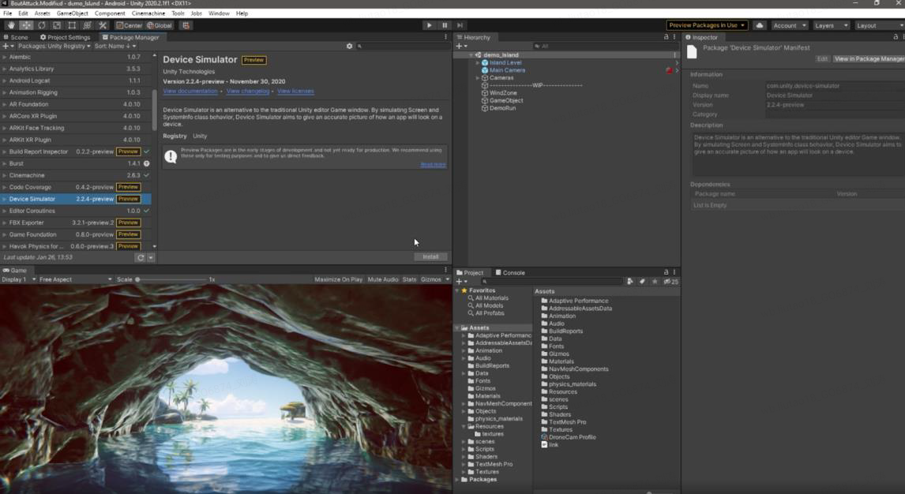

​												请注意，自适应性能仅适用于 Samsung 设备

要了解有关自适应性能的更多信息， 请查看我们在 Package Manager 中提供的示例（选择 Package Manager > Adaptive Performance > Samples）。每个示例都与特定的缩放器交互，因此可以了解不同的缩放器对游戏有何影响。

#### 编程和代码架构

Unity PlayerLoop 包含与游戏引擎核心交互的函数。这种树状结构包括许多处理初始化和每帧更新的系统。所有脚本都将依赖该 PlayerLoop 来创建游戏玩法。

在进行性能分析时，可以看到项目的所有用户代码都位于 PlayerLoop 下（编辑器组件位于 EditorLoop 下）。


## 五、编程和代码框架

Unity PlayerLoop 包含与游戏引擎核心交互的函数。这种树状结构包括许多处理初始化和每帧更新的系统。所有脚本都将依赖该 PlayerLoop 来创建游戏玩法。

在进行性能分析时，可以看到项目的所有用户代码都位于 PlayerLoop 下（编辑器组件位于 EditorLoop 下）。

 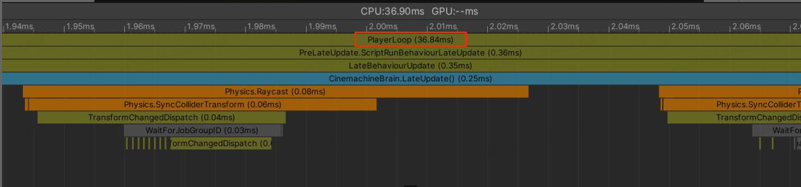

自定义脚本、设置和图形会显著影响每一帧的计算和在屏幕上渲染的时间

 

可以按照以下提示和技巧优化脚本

#### 了解Unity Playerloop

确保了解 Unity 的帧循环的执行顺序。每个 Unity 脚本都将按预定顺序运行多个事件函数。您应该了解 Awake、Start、Update 及其他创建脚本生命周期的函数之间的区别。

有关事件函数的具体执行顺序，请参阅脚本生命周期流程图。

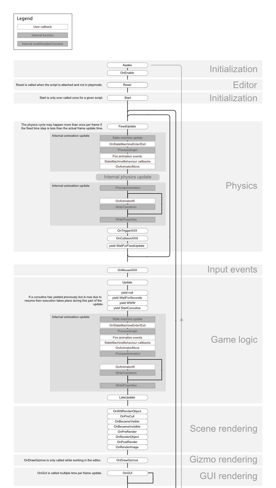

#### 尽可能减少每帧运行的代码

考虑代码是否必须每一帧都运行。将不必要的逻辑移出 Update、 LateUpdate 和 FixedUpdate。可在这些事件函数中方便地放置必须每帧更新的代码，但应提取出任何不需要以这种频率更新的逻辑。尽可能只在情况发生改变时才执行逻辑。

如果确实 需要使用 Update，可以考虑每 n 帧运行一次代码。这是一种应用时间切片 （将繁重的工作负载分布到多个帧的常用技术）的方法。在下面的示例中，我们每三帧运行一次 ExampleExpensiveFunction：

```C#
private int interval = 3; 
void Update() 
｛ 
    if (Time.frameCount % interval == 0)
     ｛ 
        ExampleExpensiveFunction();
      ｝ 
 ｝
```

#### 避免在 Start/Awake 中处理复杂逻辑

加载第一个场景时，将为每个对象调用以下函数 ：

- Awake
- OnEnable
- Start

在应用程序渲染其第一帧之前，避免在这些函数中处理代价高昂的逻辑。否则，可能会增加不必要的加载时间。

#### 避免空Unity 事件

即使是空的 MonoBehaviour 也需要资源，因此应删除空的 Update 或 LateUpdate 方法。

如果使用这些方法进行测试，请使用预处理器指令 ：

```objectivec
#if UNITY_EDITOR
void Update()
｛ 
    ｝ 
#endif
```

这样，您可以在编辑器中随意使用 Update 进行测试，而不会在构建版本中遗留不必要的开销。

#### 删除调试日志语句

日志语句（尤其是在 Update、LateUpdate 或 FixedUpdate 中）可能会降低性能。在进行构建之前，请禁用日志语句。

为了更轻松地执行该操作，可以考虑配合预处理指令创建一个 Conditional 属性。例如，创建如下所示的自定义类 ：

```pgsql
public static class Logging
｛ 
    [System.Diagnostics.Conditional(“ENABLE_LOG”)] 
    static public void Log(object message) 
    ｛ 
        UnityEngine.Debug.Log(message);
      ｝ 
  ｝
```

​			

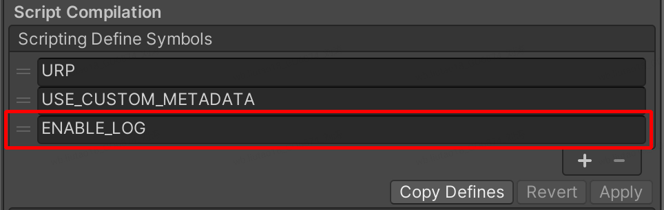

​												添加自定义预处理器指令可对脚本进行分区

 使用自定义类生成日志消息。如果在 Player Settings 中禁用 ENABLE_LOG 预处理器，您的所有 Log 语句都会立即消失。

#### 使用哈希值而不是字符串参数

Unity 不使用字符串名称对 Animator、Material 和 Shader 属性进行内部寻址。为了加快速度，所有属性名称都经过哈希处理为属性 ID，实际上是这些 ID 用于寻址属性。

每当在 Animator、Material 或 Shader 上使用 Set 或 Get 方法时，请使用整数值方法而非字符串值方法。字符串方法只执行字符串哈希处理，然后将经过哈希处理的 ID 转发给整数值方法。

对于 Animator 属性名称，使用 Animator.StringToHash，对于 Material 和 Shader 属性名称，使用 Shader.PropertyToID。

#### 选择正确的数据结构

随着每一帧迭代成千上万次，所选择的数据结构可能存在累积效应会导致高效或低效。是否使用 List、Array 或 Dictionary 来处理集合会更合理？在 C# 中，请以 MSDN 数据结构指南作为常规指南来选择正确的数据结构。

#### 避免在运行时添加组件

在运行时调用 AddComponent 需要一些开销。每当在运行时添加组件时，Unity 都必须检查是否有重复项或是否需要其他组件。 对设置好所需组建的预制件进行实例化，通常性能表现更优异。

#### 缓存游戏对象和组件

**GameObject.Find、GameObject.GetComponent 和 Camera.main**（ 在 2020.2之前的版本中）可能开销较大，应避免在 Update 方法中调用它们。而应在 Start 中调用它们，并且缓存相应结果。

例如，下面演示低效使用重复的 GetComponent 调用 ：

```
void Update()
｛ 
    Renderer myRenderer = GetComponent<Renderer>(); 
    ExampleFunction(myRenderer); 
  ｝
```

如果函数结果已缓存，就可以仅调用 GetComponent 一次。缓存的结果可以在 Update 中重用，无需再调用 GetComponent。

```csharp
private Renderer myRenderer;
void Start()
｛
     myRenderer = GetComponent<Renderer>(); 
    ｝ 
void Update() 
｛ 
    ExampleFunction(myRenderer); 
   ｝
```

#### 使用对象池

Instantiate 和 Destroy 可能生成垃圾和垃圾收集 (GC) 尖峰，通常是一个缓慢的过程。请不要频繁初始化和销毁游戏对象（例如，从枪射出子弹），而应使用预分配的对象池，这样可以重用和回收。

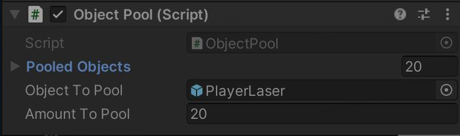

​										在本示例中，ObjectPool 创建 20 个 PlayerLaser 实例以供重用

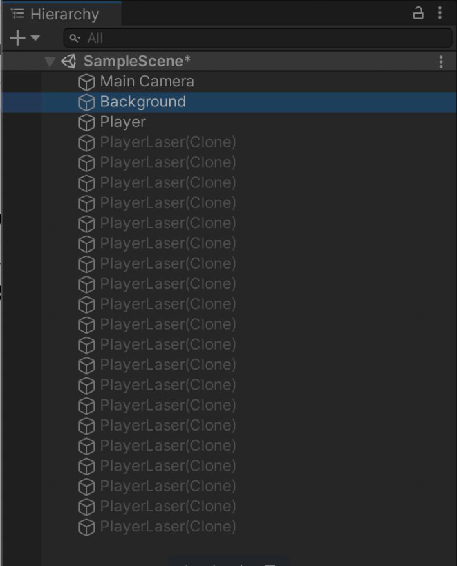

​										PlayerLaser 对象的池处于不活动状态，已准备好可以发射

在 CPU 尖峰不那么明显的时候，在游戏中某个点（如在菜单屏幕出现时）创建可重用的实例。通过集合跟踪对象“池”。在游戏过程中，只是在需要时启用下一个可用实例，禁用对象而不是销毁对象，然后将其返回池。

这样可减少项目中托管分配的数量，可以防止垃圾收集问题。

#### 使用ScriptableObject

在 ScriptableObject 中而不是 MonoBehaviour 中存储不变的值或设置。ScriptableObject 这种资源只需设置一次就可以在项目中一直使用。它不能直接附加到游戏对象。

在 ScriptableObject 中创建字段来存储值或设置，然后在 Monobehaviour 中引用该 ScriptableObject。

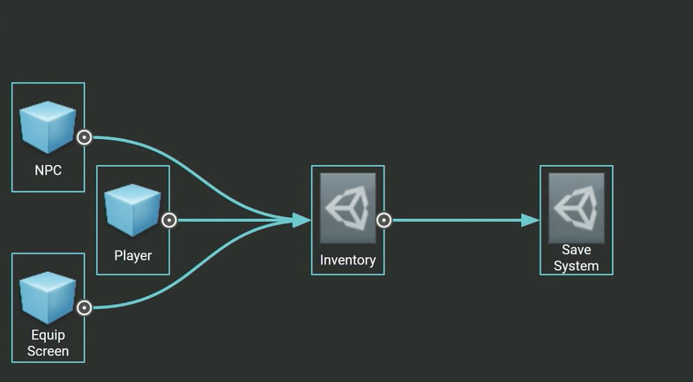

在此示例中，名为 Inventory 的 ScriptableObject 为各种游戏对象保存设置

 

使用 ScriptableObject 的这些字段可以防止每次使用该 Monobehaviour 实例化对象时出现不必要的数据重复。

## 六、项目设置

有一些项目设置会影响移动端性能。

#### 降低或禁用Accelerometer Frequency

Unity 每秒对移动端的加速度计进行几次池操作。如果在应用程序中不会使用，请将其禁用，或者降低其频率，从而提升性能。

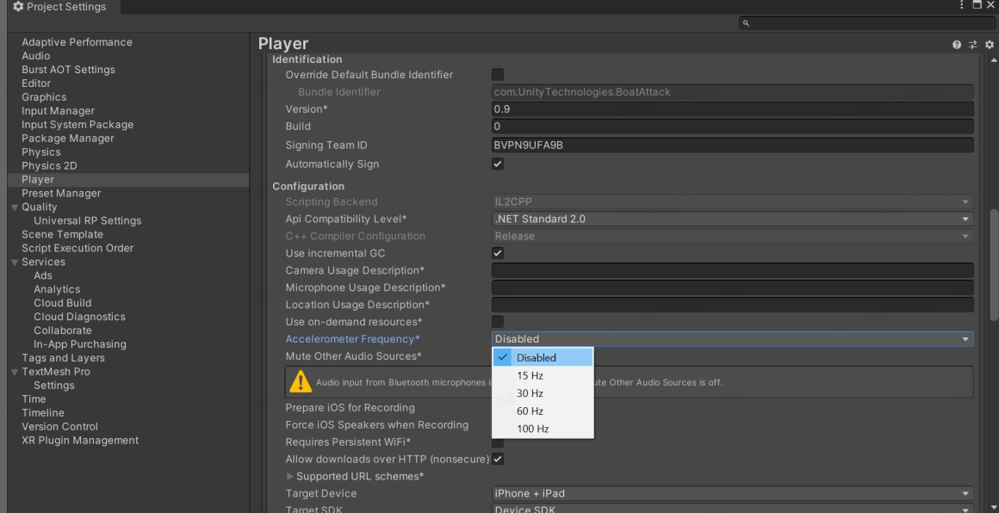

如果在移动游戏中不会使用 Accelerometer Frequency，请务必将其禁用

#### 禁用不必要的 Player 或Quality 设置

在 Player 设置中，对不支持的平台禁用 Auto Graphics API，以便防止生成过多着色器变体。如果应用程序不支持，对较旧的 CPU 禁用 Target Architectures。 在 Quality 设置中，禁用不需要的质量级别。

#### 禁用不必要的物理设置

如果游戏不使用物理设置，请取消选中 Auto Simulation 和 Auto Sync Transforms。否则它们会降低应用程序运行速度，却并无任何可见的好处。

#### 选择正确的帧率

移动端项目必须在帧率和电池续航时间以及热节流之间获得平衡。不需要将设备限值推向 60 fps，可以折衷以 30 fps 运行。Unity 默认移动端为 30 fps。

您也可以通过 Application.targetFrameRate 在运行时动态调整帧率。例如，您甚至可以将缓慢或相对静止的场景降至 30 fps 以下，而将玩游戏时的 fps 设置保留为较高值。

#### 避免使用过多层级

拆分层级！在层级视图中如果游戏对象不需要嵌套，请简化父子化。较少的层级关系将受益于多线程刷新场景中的变换 (Transform)。复杂层级关系会发生不必要的变换 (Transform) 计算以及更多垃圾收集开销。

#### 变换一次，而非两次

另外，移动变换 (Transform) 时，使用 Transform.SetPositionAndRotation 可以一次就同时更新位置和旋转。这样可以避免两次修改变换（Transform）的开销。

如果需要在运行时初始化游戏对象，一项简单的优化是在初始化过程中父子化和重新定位 ：

GameObject.Instantiate(prefab, parent);

GameObject.Instantiate(prefab, parent, position, rotation);

#### 假设Vsync 已启用

移动平台不渲染半帧。即使在编辑器中禁用 Vsync (Project Settings > Quality)， Vsync 在硬件级别也处于启用状态。如果 GPU 无法足够快地刷新，将保持当前帧，从而有效降低每秒帧数。

##  七、资源

资源管线可以大幅影响应用程序的性能。经验丰富的技术美术师可以帮助您的团队定义和增强资源格式、规范以及导入设置。 不要依赖于默认设置。使用平台特定的覆盖选项卡可以优化纹理和网格几何体等资源。如果设置不正确，则可能造成较大的编译版本大小、较长的构建时间，以及较差的内存使用量。可以考虑使用预设功能来帮助为特定项目自定义基准设置，以确保最优设置。

#### 正确导入纹理

纹理会占用大部分内存，因此，导入设置非常重要。通常，请遵循以下指导原则 ：

- **减小 Max Size ：使用能生成视觉上可接受的结果的最低设置。这种非破坏性方式，可以快速降低纹理内存。**
- **使用 2 的幂 (POT) ：Unity 要求移动端纹理压缩格式** （PVRCT 或 ETC）采用 POT 纹理尺寸。
- **制作纹理图集 ：**将多个纹理放置到单个纹理中，可以减少绘制调用和加快渲染速度。使用 Unity 精灵图集 或第三方 Texture Packer 可以制作纹理图集。
- **关闭 Read／Write Enabled 选项 ：**如果启用，此选项在 CPU 和 GPU 可寻址内存中都会创建副本，纹理会占用双倍内存。大多数情况下，应保持此选项为禁用状态。如果要在运行时生成纹理，请通过 Texture2D.Apply 强制执行，并且传入设置为 true 的 makeNoLongerReadable。
- **禁用不必要的 Mip Map ：**对于在屏幕上大小保持不变的纹理（如 2D 精灵和 UI 图形），Mip Map 不是必需的，对于与摄像机的距离会变化的 3D 模型，请保留 Mip Map为启用状态。

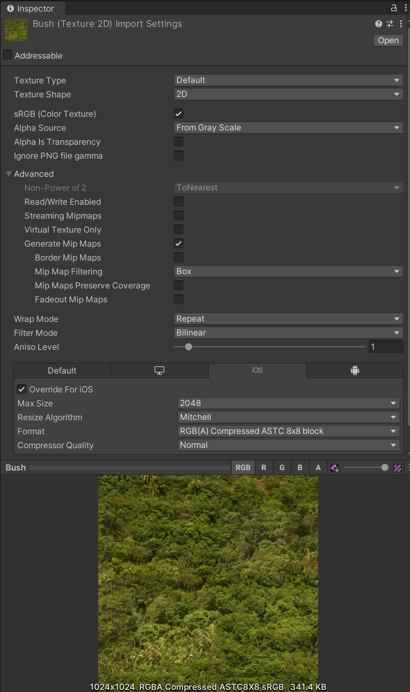

正确的纹理导入设置有助于优化版本大小

#### 压缩纹理

考虑以下使用相同模型和纹理的两个实例。左侧的设置几乎使用右侧设置八倍的内存量，但并没有改善视觉质量。

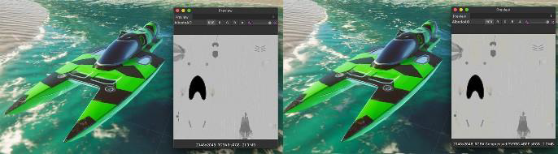

未压缩的纹理需要更多内存

 

对 iOS 和 Android 都使用自适应可伸缩纹理压缩 (ATSC)。绝大多数开发目标最低规格设备游戏都支持 ATSC 压缩。

唯一的例外是 ：

- 适用于面向 A7 设备或更低规格的 iOS 游戏（例如 iPhone 5、5S 等）— 使用 PVRTC
- 适用于面向 2016 之前的设备的 Android 游戏 — 使用 ETC2（Ericsson 纹理压缩）

如果压缩格式（如 PVRTC 和 ETC）的质量不够高，并且目标平台不完全支持 ASTC，请尝试采用 16 位纹理而不是 32 位纹理。

**自注：无脑ASTC**

#### 调整网格导入设置

与纹理很像，如果导入时不小心，网格可能占用过多内存。要尽可能减少网格占用的内存，请执行以下操作 ：

- **压缩网格 ：**高性能压缩可以减少占用磁盘空间（但不会影响运行时的内存）。请注意，网格量化可能造成不准确，因此应试验不同的压缩级别，从而找到适合模型的压缩级别。
- **禁用 Read／Write ：**如果启用此选项，内存中会有重复网格，网格的一个副本在系统内存中，另一个在 GPU 内存中。大多数情况下，应将其禁用（在 Unity 2019.2 以及更早版本中，此选项默认为选中状态）。
- **禁用骨骼和 BlendShape ：**如果网格不需要骨架或 BlendShape 动画，请尽可能禁用这些选项。
- **尽可能禁用法线和切线 ：**如果确信网格的材质不需要法线或切线，请取消选中这些选项，以节省更多内存。

 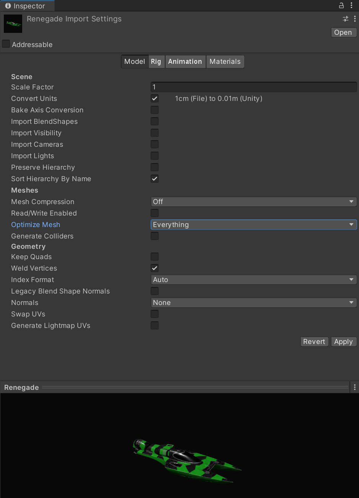

​												检查网格导入设置

 

#### 检查多边形数量

分辨率越高的模型，需要的内存使用量越大，并且可能占用更长的 GPU 时间。您的背景几何体是否需要五十万个多边形？考虑减少所选 DCC 包中的模型。删除摄像机的视角看不到的多边形。使用纹理和法线贴图而不是高密度网格来实现精细的细节。

#### 使用AssetPostprocessor 自动执行导入设置

利用 AssetPostprocessor 可以在导入资源时运行脚本。这样，您可以在导入模型、纹理、音频等之前和 / 或之后对设置进行自定义。

#### 使用可寻址资源系统（Addressable）

可寻址资源系统提高一种简化的方法来管理内容，按“地址”或别名加载资源包。这种统一的系统从本地路径或远程内容分发网络 (CDN) 执行异步加载。

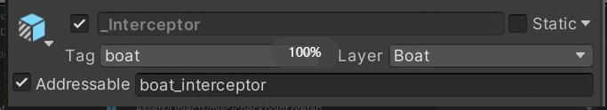

如果将非代码资源（模型、纹理、预制件、音频，甚至整个场景）拆分为资源包，则可以将它们分为可下载内容 (DLC)。 然后，使用 Addressables 为移动端应用程序创建较小的初始构建版本。云端资源分发可承载您的游戏内容并随着玩家的游戏进展将内容分发至玩家。

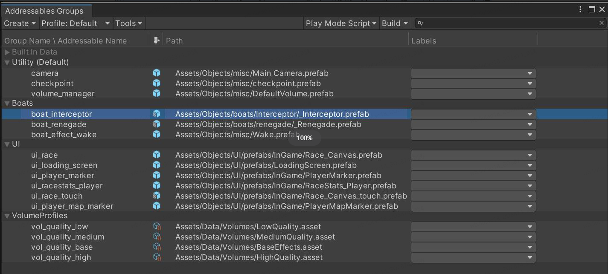

使用可寻址资源系统按“地址”加载资源

 

 

## 八、图形和GPU优化

每一帧，Unity 都需要确定必须渲染哪些对象，然后创建绘制调用。绘制调用是调用图形 API 来绘制对象（如三角形），而批处理是要一起执行的一组绘制调用。

随着项目变得更加复杂，您需要用管线来优化 GPU 的工作负载。通用渲染管线 (URP) 目前使用单通道前向渲染器将高质量图形传输给移动平台（未来版本中将提供延迟渲染功能）。来自游戏主机和 PC 的、基于物理的光照和材质也可以缩放为适合手机或平板电脑。

以下指导原则可以帮助您提高图形处理速度。

#### 批处理执行绘制调用

将要绘制的对象组合为批次，可以尽可能减少在批次中绘制每个对象所需的状态更改。这种方式通过减少渲染对象的 CPU 开销，可以改善性能。Unity 可以使用以下几种方法将多个对象组合为较少的批次 ：

- **动态批处理 ：**对于小网格，Unity 在 CPU 上分组和转换顶点，然后一次性绘制它们。注意 ：只在有足够低复杂度网格（少于 900 个顶点属性和不超过 300 个顶点）时使用这一方法。动态批处理程序不会对更大的网格进行批处理，如果启用会浪费 CPU 时间在每一帧都去查找要批处理的小网格。
- **静态批处理 ：**对于不移动的几何体，Unity 可以减少所有共享相同材质的网格的绘制调用。它比动态批处理更有效，但使用更多内存。
- **GPU Instancing ：如果有大量相同的对象，这种方法通过图像硬件对它们进行更有效地批处理。**
- **SRP 批处理 ：**在 Advanced 下面的 Universal Render Pipeline Asset 中启用 SRP Batcher。这样可以大幅提高 CPU 渲染速度，具体取决于场景。

 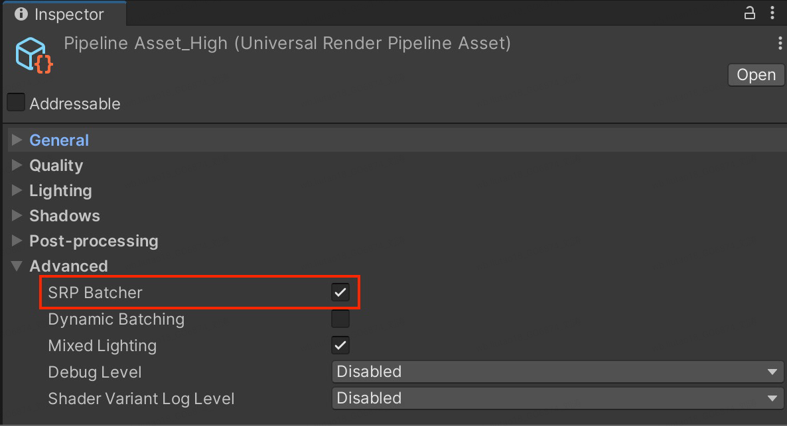

​												组织游戏对象，以便利用这些批处理方法

#### 使用帧调试器 (Frame Debugger)

帧调试器介绍每一帧是如何通过各绘制调用构建的。这是非常重要的工具，可以解决着色器属性问题，帮助您分析游戏渲染方式。

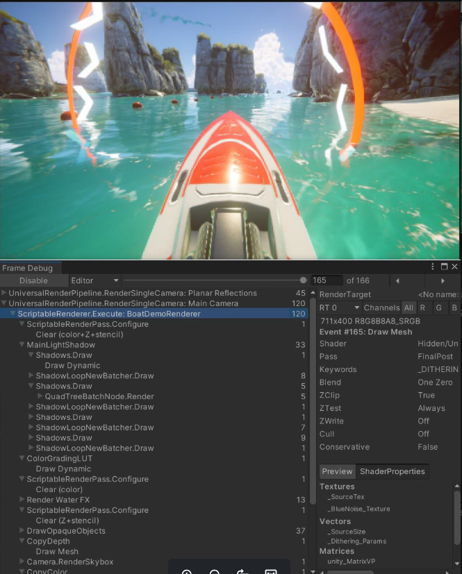

​													帧调试器将每一帧分到不同的步骤中

**自注：使用Frame Debugger可以查看合批失败的原因**

#### 避免使用过多动态光线

与旧版前向渲染器相比，URP 可以减少绘制调用的数量。避免向移动端应用程序添加过多动态光线。考虑采用其他方式，如对动态网格使用自定义着色器效果和光照探针，以及对静态网格使用烘焙光照。

#### 禁用阴影

阴影投射可按 MeshRenderer 和光线禁用。尽可能禁用阴影可以减少绘制调用。 您也可以通过向简单网格应用模糊纹理或在角色下面应用四边形来创建伪阴影。另外，可以使用自定义着色器创建模糊阴影。

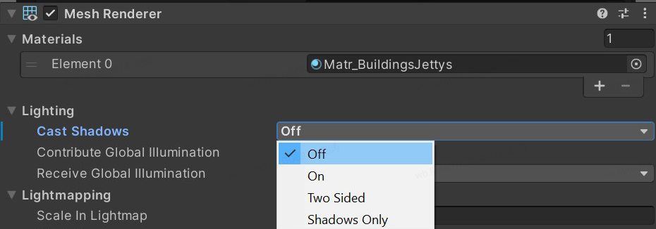

#### 将光照烘焙到光照贴图中

使用全局光照 (GI) 向静态几何体添加动态光照。使用 Contribute GI 标记对象，以便您可以将高质量的光照存储为光照贴图的形式。 这样，烘焙阴影和光照的渲染不会影响运行时性能。渐进式 CPU 和 GPU 光照贴图可以加快全局光照的烘焙。 

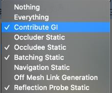

​															启用 Contribute GI

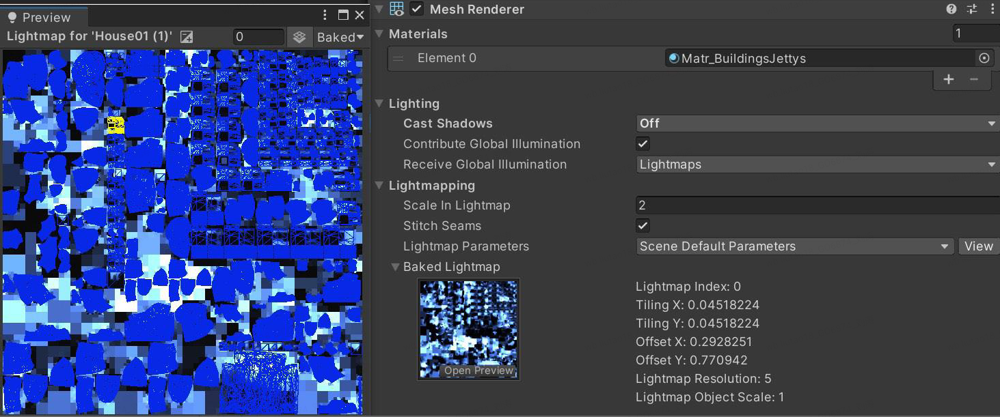

​			 调整 Lightmapping Settings (Windows > Rendering > Lighting Settings) 和 Lightmap 大小，从而限制内存使用量

**使用光源层**

对于多光源的复杂场景，将对象分层，然后限定每个光源对特定剔除遮罩 (culling mask) 的影响。

 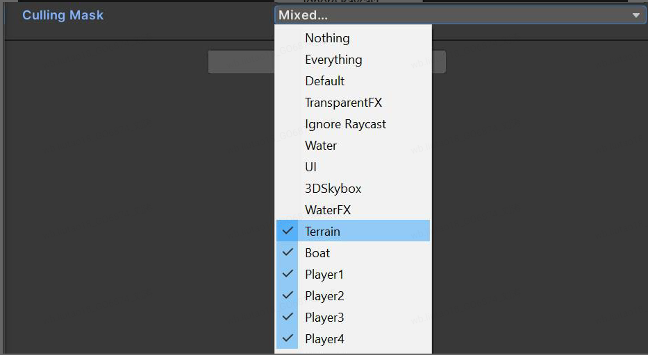

层可以限制光源对特定剔除遮罩的影响

#### 对移动对象使用光照探针

光照探针存储场景中的空白空间的烘焙光照信息并且提供高质量的光照（直接和间接）。它们使用球谐函数，这种函数的计算速度比动态光照快很多。

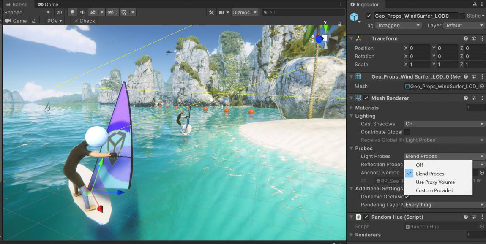

光照探针照亮背景中的动态对象

 

#### 使用细节级别 (LOD)

随着对象移向远处，细节级别可以将它们切换为使用更简单的网格，以及更简单的材质和着色器，从而帮助提高 GPU 性能。

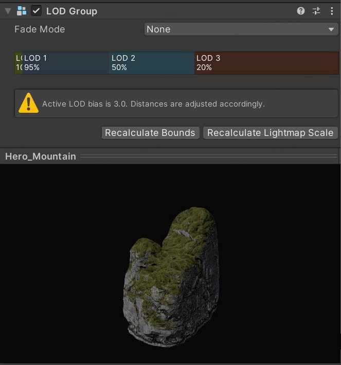

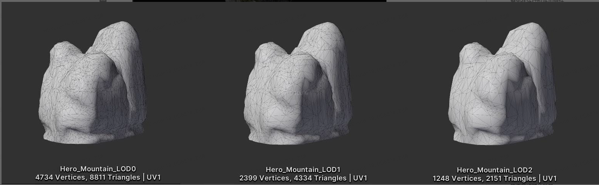

#### 使用遮挡剔除来移除隐藏的对象

隐藏在其他对象之后的对象仍然可能渲染和使用资源。使用遮挡剔除可以将它们丢弃。摄像机之外的视锥体剔除 (frustum culling) 是自动执行的，遮挡剔除 (occlusion culling) 是则要经过烘焙过程。只需将对象标记为静态遮挡物或被遮挡物，然后通过 Window > Rendering > Occlusion Culling 对话框进行烘焙。尽管不是所有场景都适合，剔除在很多情况下都能改善性能。

**自注：遮挡剔除失效是项目常出现的性能问题，注意打包时是否烘焙culling数据，以及打包时是否将遮挡剔除数据打入包内**

#### 避免使用移动端原生分辨率

手机和平板电脑越来越高级，新生代设备往往采用极高的分辨率。 使用 Screen.SetResolution(width, height, false) 可降低输出分辨率，提升一定的性能。配置多个分辨率，在质量和速度之间找到最佳平衡。

#### 限制摄像机的使用

每个摄像机都会产生开销，无论它是否在做有意义的工作。只在有必要渲染时才使用摄像机组件。在低端移动平台，每个摄像机最多可以使用 1 ms CPU 时间。

#### 保持着色器简单

通用渲染管线包含几个轻量级光照和无光照着色器，它们已针对移动平台进行了优化。让着色器变体的数量尽可能保持较少的状态，这样可以大幅减少运行时内存使用量。如果默认 URP 着色器不满足需要，可以使用 Shader Graph 自定义材质的外观。

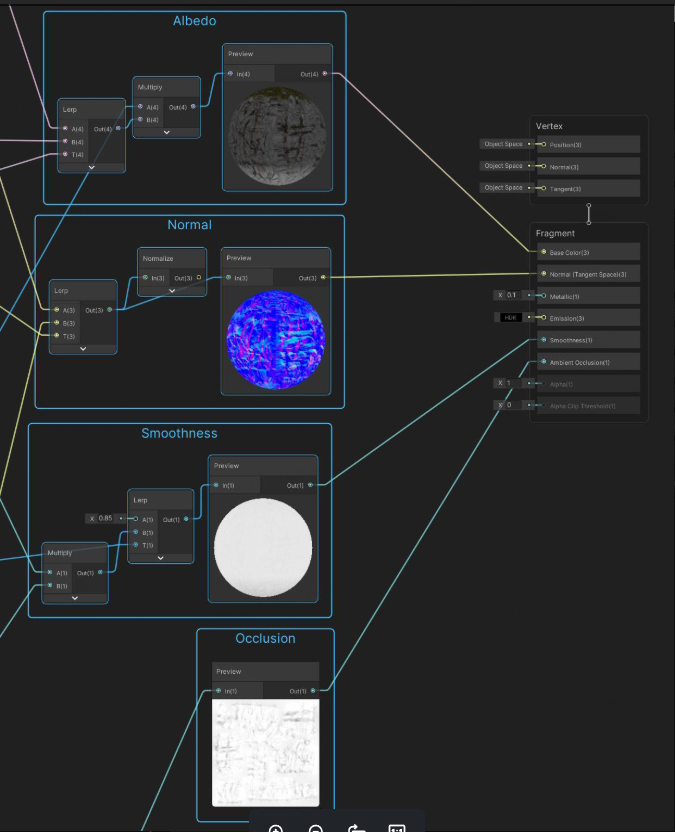

#### 尽可能减少过度绘制和Alpha 混合

避免绘制不必要的透明或半透明图像。这种方式导致的过度绘制和 Alpha 混合会极大影响移动平台。不要重叠几乎看不到的图像或效果。可以使用 RenderDoc 图形调试器检查过度绘制。

#### 限制后处理效果

全屏幕后处理效果（如发光）会极大降低性能。请在游戏的美术设计中谨慎使用这些效果。

 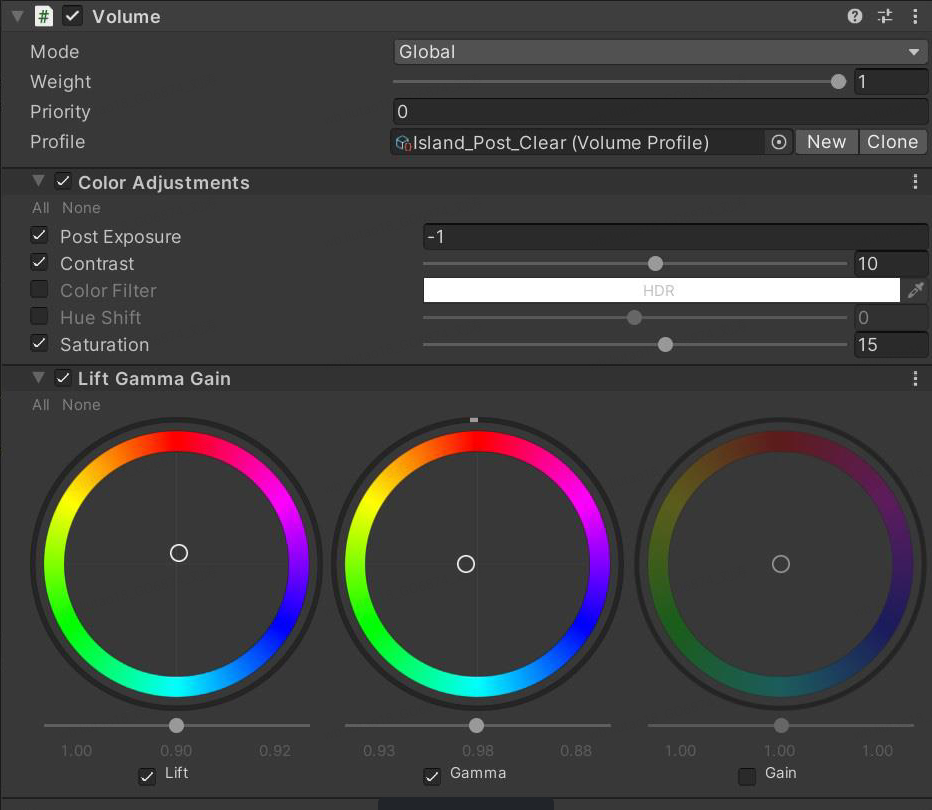

#### 小心使用 Renderer.material

在脚本中访问 Renderer.material 会复制材质并返回对新副本的引用。这会破坏任何已包含该材质的现有批次。如果要访问批次中对象的材质，请改用 Renderer.sharedMaterial。

#### 优化 SkinnedMeshRenderer

蒙皮网格的渲染开销很大。确保每一个使用 SkinnedMeshRenderer 的对象都是需要它的。如果游戏对象只在某些时候需要动画，请使用 BakeMesh 函数将蒙皮网格冻结在静态姿势中，并在运行时切换为简单的 MeshRenderer。

#### 尽可能减少反射探针

反射探针可以创建逼真的反射，但在批处理中，它的开销巨大。使用低分辨率立方体贴图、剔除遮罩和纹理压缩可以改善运行时性能。

## 九、UI界面

Unity UI (UGUI) 常常是性能问题的来源。Canvas 组件生成和更新 UI 组件的网格并向 GPU 发出绘制调用。它的运行开销很大，因此，在使用 UGUI 时，请注意以下因素。

#### 划分canvas

如果是包含成千上万个元素的大型画布，更新单个 UI 元素就必须更新整个画布，这可能会造成 CPU 尖峰。 利用 UGUI 的功能可以支持多个画布。根据 UI 元素的更新频率要求，划分这些元素。将静态 UI 元素保留在单独的画布上，将同时更新的动态元素保留在较小的子画布上。 确保每个画布中的 UI 元素都有相同的 Z 值、材质和纹理。

#### 隐藏不可见的UI 元素

可能有些 UI 元素（如仅当角色收到伤害时才出现的生命值血条）只偶尔在游戏中出现。如果不可见的 UI 元素是活动的，它仍然可能使用绘制调用。显式禁用所有不可见的 UI 组件，在需要时再重新启用。 如果只需要关闭画布的可见性，请禁用 Canvas 组件而不是游戏对象。这样就不必重新构建网格和顶点。

#### 限制GraphicRaycaster 和禁用Raycast Target

输入事件（如屏上触摸或单击）需要 GraphicRaycaster 组件。它只是循环处理屏幕上的每个输入点，检查它是否在 UI 的 RectTransform 之内。 从层级视图的顶层画布中移除默认的 GraphicRaycaster。只向需要交互的各元素（按钮、滚动矩形等）添加 GraphicRaycaster。

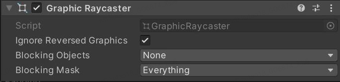

另外，在所有不需要 Raycast Target 的 UI 文本和图像上将其禁用。如果是包含很多元素的复杂 UI，所有这些小更改都可以减少不必要的计算。

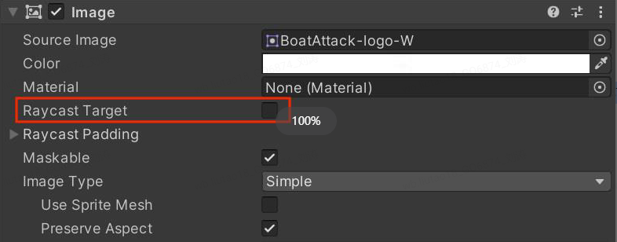

#### 避免使用布局组

布局组的更新很低效，应少量使用。如果内容是动态的，应完全避免不用，而是使用锚点进行比例布局。或者，创建自定义代码，在 Layout Group 组件设置 UI 之后，将该组件禁用。 如果动态元素确实需要使用布局组（水平、垂直、网格），应避免嵌套它们，从而改善性能。

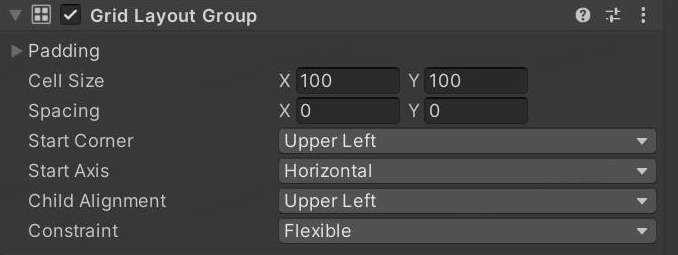

#### 避免使用大型列表和网格视图

大型列表和网格视图开销很大。如果需要创建大型列表或网格视图（如包含成百上千项目的物品栏屏幕），可以考虑重复使用较小的 UI 元素池，而不是为每个项目都创建 UI 元素。

#### 避免大量使用重叠元素

对大量 UI 元素（如卡牌游戏中堆叠的卡牌）分层会造成过度绘制。自定义代码在运行时将分层元素合并到更少的元素和批次中。

#### 使用多种分辨率和宽高比

现在，移动设备使用的分辨率和屏幕大小极为不同，创建不同的 UI 版本可以按设备提供最佳体验。

使用设备模拟器可以预览 UI 在各种受支持的设备上的呈现。您也可以在 XCode 和 Android Studio 中创建虚拟设备。

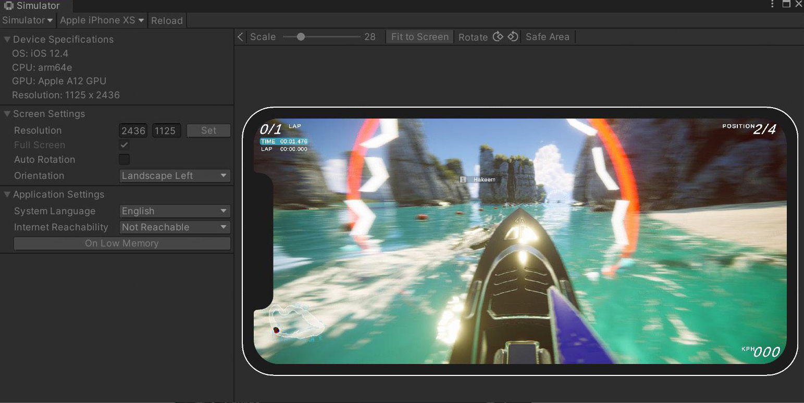

#### 使用全屏UI 时，隐藏其他全部内容

如果暂停屏幕或者启动屏幕遮住场景中的其他全部内容，则禁用摄像机对 3D 场景的渲染。同样，禁用隐藏在顶层画布之后的所有背景画布元素。 由于不需要以 60 fps 的帧率进行更新，可以考虑在全屏 UI 过程中降低 Application.targetFrameRate。

#### 将摄像机分配给世界空间画布和摄像机空间画布

将 Event 或 Render Camera 字段留空会使 Unity 填充 Camera.main，这会导致不必要的开销。 尽可能使画布 RenderMode 采用 Screen Space - **Overlay**，这样就不需要摄像机。

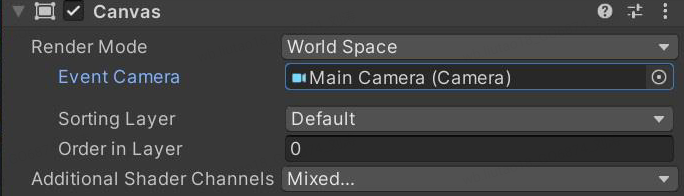

## 十、音频

尽管音频通常不会造成性能瓶颈，还是可以进行优化以节省内存。

#### 尽量使用单声道声音剪辑

如果要使用 3D 空间音频， 请以单声道 (single channel) 的形式创作声音剪辑，或者启用 Force To Mono 设置。在运行时定位使用的多声道声音会扁平化为单声道源，因此会增加 CPU 开销和浪费内存。

#### 尽可能使用原始未压缩WAV 文件作为源资源

如果使用任何压缩格式（如 MP3 或 Vorbis），Unity 会将其解压并在构建时重新压缩。这样会导致两个有损通道，从而降低最终质量。

#### 压缩剪辑并降低压缩比特率

通过压缩减小剪辑的大小和内存使用量 ：

- 对大多数声音使用 Vorbis（或者对不循环的声音使用 MP3）。
- 对常用的短声音使用 ADPCM（如脚步声、枪声）。相比于未压缩的 PCM，这样可以减小文件大小，在播放时又可以很快解码。

移动设备上的音效最高为 22,050 Hz。使用较低设置通常对最终质量影响很小，当然，请使用您自己的耳朵来判断。

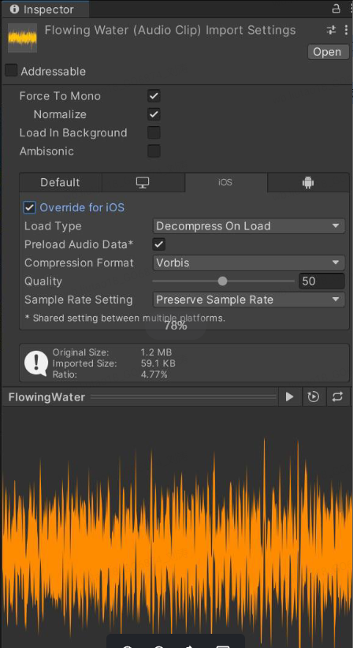

#### 选择正确的加载类型

每个剪辑大小的设置都不同。

- **小剪辑 (< 200 kb)** 应采用 Decompress on Load。将声音解压缩为原始 16 位 PCM 音频数据，会导致 CPU 开销和内存占用，因此，这仅适用于短声音。
- **中等剪辑 (>= 200 kb) 应保持为 Compressed in Memory。**
- **大文件（背景音乐）**应设置为 Streaming。否则，整个资源会一次性加载到内存中。

#### 从内存中卸载静音的音频源 (AudioSources)

实现静音按钮时，不要只是将音量设置为 0。可以销毁 **AudioSource 组件**，从而将其从内存中卸载，这样，播放器不需要过于频繁地切换开关。

 

## 十一、动画

Unity 的 Mecanim 动画系统相当复杂。尽可能限制在移动设备上使用下面的设置。

#### 使用通用还是人形骨架

默认情况下，Unity 通过通用骨架导入动画模型，但在动画化角色时，开发人员常常切换为人形骨架。 人形骨架每一帧（即使未使用）都计算反向动力学和动画重定向，占用的 CPU 时间比等效的通用骨架多 30-50%。如果不需要这些特定人形骨架功能，请使用通用骨架。

#### 避免过多使用 Animator

Animator 主要用于人形角色，但也常用于动画化单个值（如 UI 元素的 Alpha 通道）。避免过多使用 Animator，尤其是与 UI 元素结合使用。只要可能，对移动设备使用旧版 Animation 组件。 考虑创建补间函数或者使用第三方库来实现简单动画（如 DOTween）。

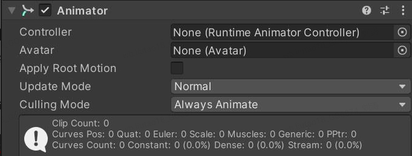

## 十二、物理

Unity 的内置物理系统 (Nvidia PhysX) 在移动设备上开销较大。下面的提示可以帮助您每秒减少更多帧。

#### 优化设置

在 PlayerSettings 中，尽可能选中 Prebake Collision Meshes。

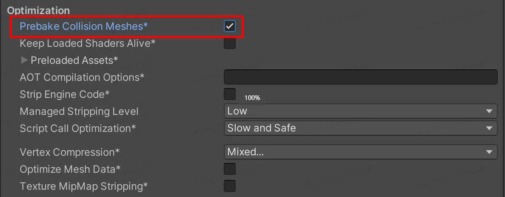

**请务必同时编辑 Physics 设置 (Project Settings > Physics)。尽可能简化 Layer Collision Matrix。**

**禁用 Auto Sync Transforms 并启用 Reuse Collision Callbacks。**

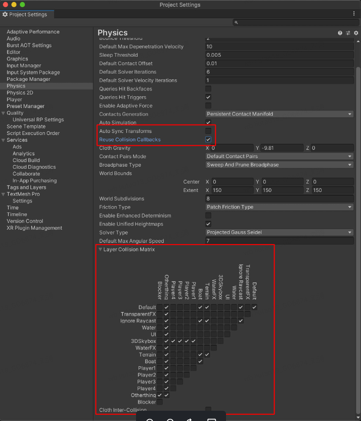

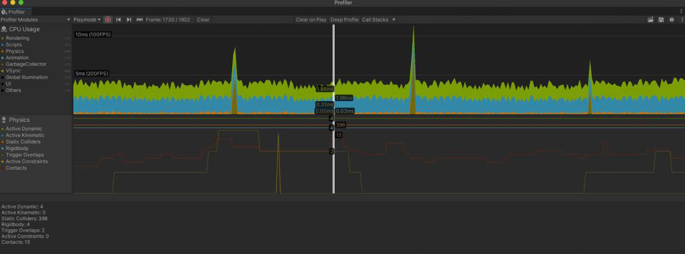

#### 简化碰撞体

网格碰撞体开销较大。用简单的原始碰撞体或网格碰撞体代替更复杂的网格碰撞体来近似原始形状。

 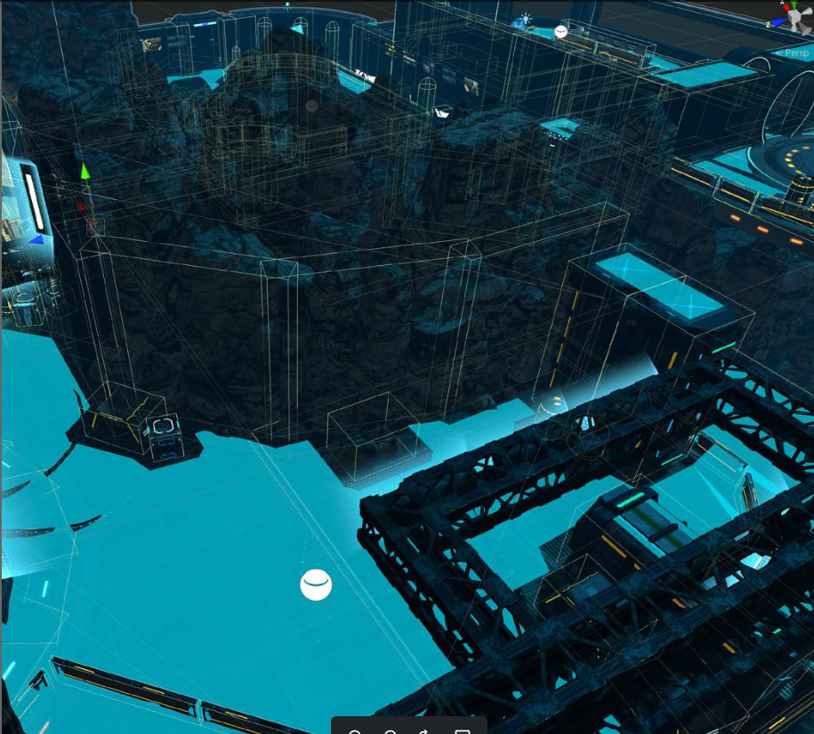

#### 使用物理方法移动刚体

使用类方法（如 MovePosition 或 AddForce）来移动 Rigidbody 对象。直接转换其 Transform 组件可能导致重新计算物理世界，在复杂场景中，这样需要较大开销。 在 FixedUpdate 中而不是 Update 中移动物理体。

#### 修改固定时间间隔

Project Settings 中的默认 Fixed Timestep 是 0.02 (50 Hz)。根据目标帧率对此进行更改（例如，对 30 fps 设置为 0.03）。 否则，如果帧率在运行时下降，也就是说 Unity 每帧都多次调用 FixedUpdate，可能会因物理内容过多而造成 CPU 性能问题。

Maximum Allowed Timestep 对帧率下降时物理计算和 FixedUpdate 事件可以使用的时间进行限制。降低该值意味着在性能顿挫过程中，物理系统和动画会缓慢下来，但也会减小其对帧率的影响。

 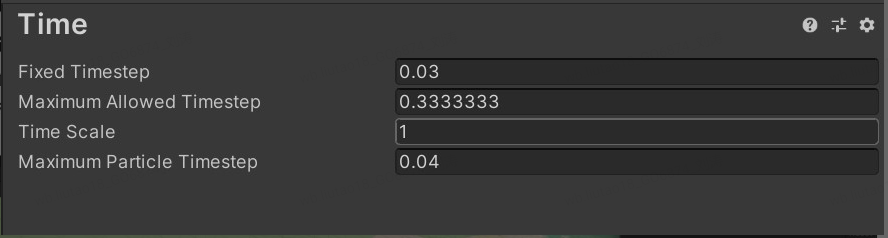

#### 通过 Physics Debugger 实现可视化

使用 Physics Debug 窗口 (Window > Analysis > Physics Debugger) 可帮助故障检查有问题的碰撞体或者出现差异的情况。下面是一个颜色编码的指示器，指示哪些游戏对象可以相互碰撞。

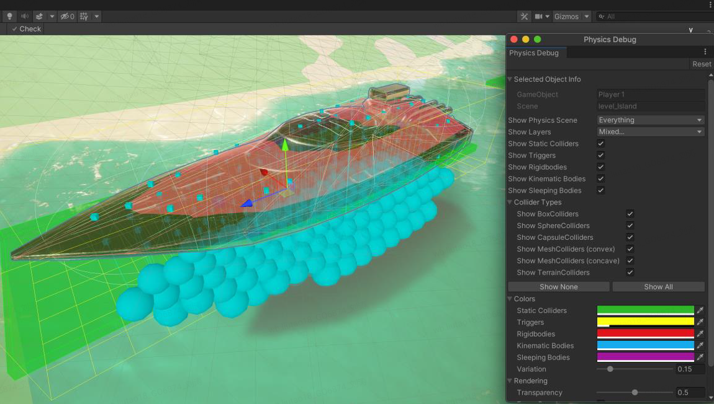

## 十三、工作流程和协作

在 Unity 中构建应用程序是一件常常需要很多开发者参与的大型工作。请务必将项目设置为最适合团队协作。

#### 使用版本控制

每个人都应使用某种版本控制。确保 Editor Settings 的 Asset Serialization Mode 设置为 Force Text。

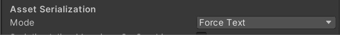

如果要在 Version Control 设置中使用外部版本控制系统（如 Git），请确保将 Mode 设置为 Visible Meta Files。

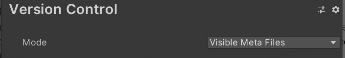

Unity 还有内置 YAML（可读的数据序列化语言）工具，它专用于合并场景和预制件。在团队工作中，版本控制非常重要。它可以帮助您追踪 Bug 和错误修订版。按照较好的做法（如使用分支和标签）来管理重要步骤和发布版本。

#### 分解大型场景

单个的大型 Unity 场景不适合进行协作。将关卡分解为许多较小的场景，美术师和设计师可以更好地进行单个关卡的协作，同时最大程度减小冲突的风险。 在运行时，项目可以以附加方式加载场景，方法是使用 **SceneManager.LoadSceneAsync 并且传递 LoadSceneMode.Additive 参数模式。**

#### 移除未使用的资源

密切注意第三方插件和库所绑定的任何未使用的资源。很多都包含嵌入式测试资源和脚本，如果不将其移除，则会成为构建版本的组成部分。删除从原型制作遗留的所有不需要的资源。

#### 利用Unity Accelerator 加快共享

Unity Accelerator 是 Collaborate 服务的代理和缓存，可更快地共享 Unity 编辑器内容。如果团队在同一本地网络中工作，您无需重新构建项目的某些部分，就可以显著减少下载时间。Accelerator 与 Unity Teams Advanced 配合使用时，还可共享源资源。