# **Unity的资产管理和AssetBundle**

> 本文通过介绍引擎资产管理，引出Unity的AssetBundle的管理，介绍Unity的ab相关原理和加载方式，以及Unity资产管理分组策略和patch方式等，希望对大家在这块的理解有所帮助

## 一、引擎资产管理器

资产管理器专门用于管理游戏资产，包括网格、材质、纹理、着色器程序、动画、音频、配置等。可以提供资产预览，资产查 找，资产组合，资产转换，运行时资产管理的功能，现代引擎把资产管理整合到引擎编辑器中了。

### 1.资产管道

每个资产都通过资产管道才能最终被游戏引擎所使用，每个资产管道的开始都是DCC原生格式的源资产（3Dmxs 的.obj/.max，ps的.psd等）资产经过资产管道的导出器、资产编译器、资产连接器，最终生成了引擎用的数据格式。

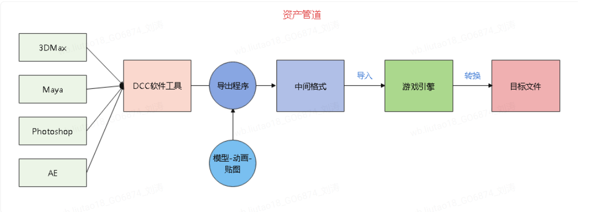

### 2.资产类型

资产经过资产管道后会生成相应的资产相关文件：资产源文件，资产配置文件（元数据文件），资产目标文件。资产也分为内 部和外部资产，DCC导出的资产是外部资产，引擎生成的是内部资产，比如材质球，动画控制器，蓝图，粒子等。资产配置 文件记录了资产在引擎中的配置信息和依赖关系。资产目标文件是引擎根据资产源文件和配置信息生成的符合引擎使用的资产 文件。

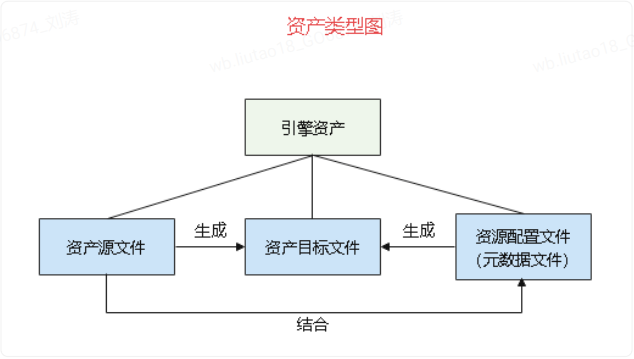

生成资源元数据文件和目标文件是为了引擎能获取每个资产文件的配置和依赖关系，方便统一管理，提供比如建立资产数据 库，查找，同步，打包等功能。 Unity使用meta文件存储资产的配置和依赖关系，UE会把资产配置文件和资产目标文件合并在一个uasset文件中，这样导入 后源文件就不再需要了

### 3.运行时资产管理

资产对象管理 

资产从加载到实例化，在引擎内部必须有一个有效的管理机制，其职责为： 

1.同一份资源只会存在一个副本； 

2.管理资产生命周期，确保不需要时卸载； 

3.处理复合资产，复合资产依赖多个资产组合而成； 

4.维护引用，确保复合资产在内存中的引用关系正确； 

5.资产接口，提供资产载入与卸载接口，包含同步和异步的载入方式。

基于这五个职责，资产在运行时的引擎中必须拥有信息为资产地址，资产对象，资产对象ID（运行时ID）。

部分引擎对每个资源都配备了资产唯一ID（GUID），让资产地址与资产唯一ID有绑定关系，这使得引擎在资产迁移时能发挥更好的作用。

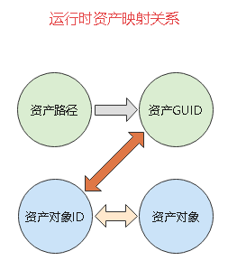

**资产对象映射管理**

资产路径与资产唯一ID的映射关系；

资产唯一ID与资产对象ID的映射关系； 

资产对象ID与资产对象的映射关系。 

有了这些映射关系，引擎就能通过资产路径查找到资产对象，从而保证不重复加载，并维护好各资产之间的引用关系。 在UE4和Unity上也同样做了这种类型的资产映射关系的管理。

### 4.资产加载和卸载

资产加载与卸载接口必不可少，通常引擎都会定制一些依赖数据，例如前面提到的资产配置文件（也可以说是资产元数据）， 多个资产组合达成资源包时，资源包之间的依赖关系也同样需要有数据来维护。

引擎都会有资源加载的统一接口，包括加载和卸载，同步和异步，资源包和非资源包形式

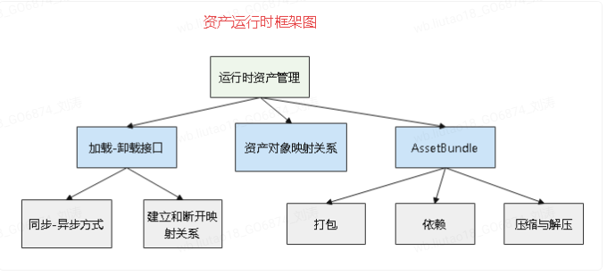


### 5.资源包数据格式

通常引擎都会提供类似AssetBundle的资源组合包，便于外部资源下载和更新。在UE4和Unity上都有相同的功能，只是命名不同，UE4为Pak，Unity为AssetBundle。Pak或AssetBundle中存放着多个复合资产，通过引擎接口加载指定资产。

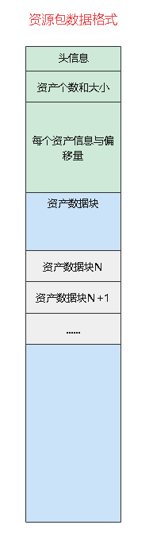

**实际中的Pak和AssetBundle数据格式要倒一下，头信息在最底部，资产数据块在最前头。**

资源包数据格式：

1.文件头信息与数据块拆分

2.可整体压缩或部分压缩

3.通过依赖配置加载外部资源包

资源包可以通俗的认为是一个多文件的组合，它可以自己做压缩，也可以让资产压缩后再组合成文件。

通常资源包的数据格式由文件头和数据块两部分组成。文件头信息中包含了资产信息和偏移量，通过加载文件头，就能知道资产在文件中的位置、类型、名称、大小等。这种资产组织方式使得我们通过差量方式更新资产成为可能。

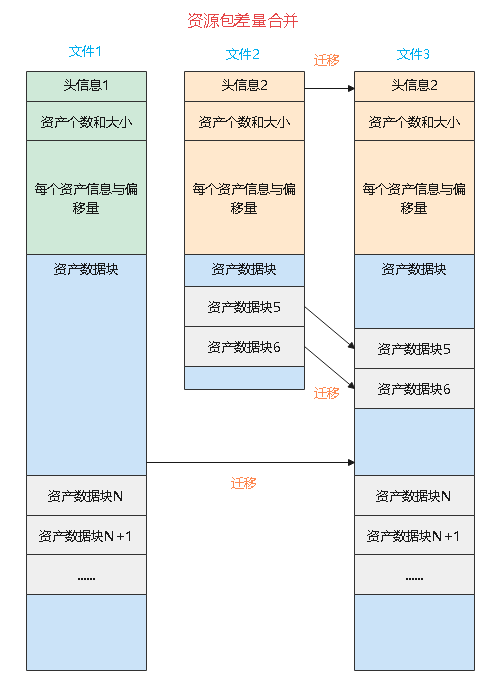

**根据资源包的数据格式特点，可以规划差量更新步骤：**

1.打差量包，包头保持完整，数据块则只加入差量部分

2.下载差量包

3.合并两个资源包文件

4.合并时使用差量包头作为文件头

5.合并时提取原资源包中的不更新部分和差量包中的更新部分放入新的资源包文件中

6.更新完成生成新的资源文件

结合这部分，下文还会介绍一种AssetBundle内部patch的方案。

### **6.资产规范**

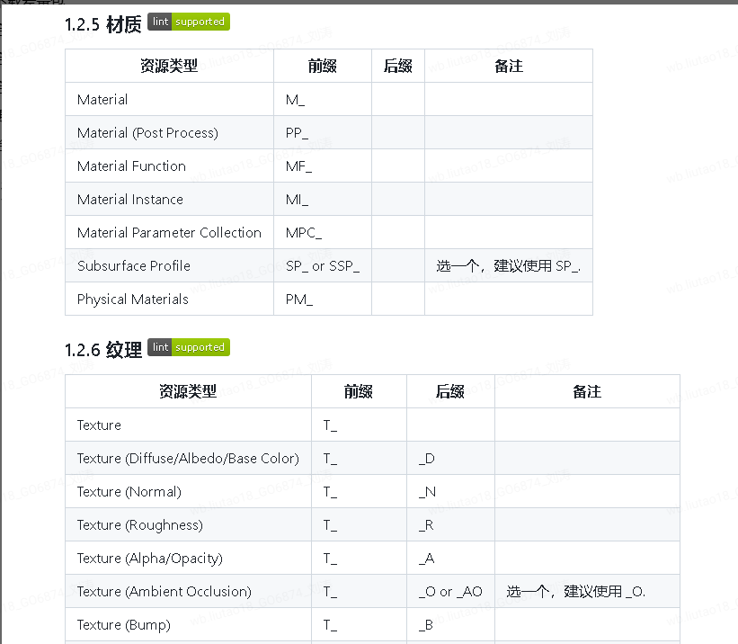

参考《UE工程规范》：

https://github.com/thejinchao/ue5-style-guide

## 二、理解AssetBundle

### **1.资产、对象和序列化**

#### ***1.1 Assets和UnityEngine.Objects***

Asset是磁盘上的文件，存储在Unity 项目的*Assets文件夹中。纹理、3D 模型或音频剪辑是常见的 Assets类型*。某些 Assets 包含 Unity 原生格式的数据，例如材质。其他 Assets 需要处理为原生格式，例如 FBX 文件

UnityEngine.Object （或大写“O”的对象）是一组序列化数据，用于集体描述资源的特定实例。这可以是 Unity 引擎使用的任何类型的资源，例如网格、精灵、音频剪辑或动画剪辑。所有对象都是*UnityEngine.Object基*[类](http://docs.unity3d.com/ScriptReference/Object.html)的子类。

虽然大部分是内置对象类型，但有两种特殊类型：ScriptableObject和MonoBehaviour。ScriptableObject提供了自定义行为的数据类型，MonoBehaviour提供了一个链接到[MonoScript](http://docs.unity3d.com/ScriptReference/MonoScript.html)的包装器，Unity 使用它来保存对特定程序集和命名空间内特定脚本类的引用。

资产和对象之间存在一对多的关系。

#### **1.2 序列化**

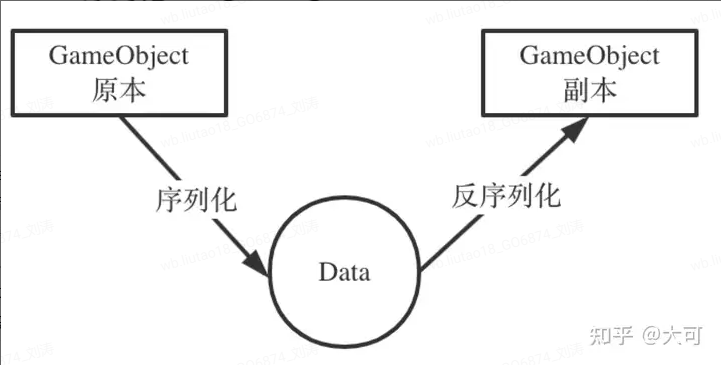

Object.Instantiate<T>（）这个可以将任何Object实例化到场景中，比如预制体的加载，子弹小兵怪物的GameObject的实例化。内部是先将目标序列化，然后再反序列化。

Unity的所有资产保存的过程就是序列化的过程，以一种YAML的方式序列化，加载任何资产的过程就是反序列化，比如Resource.Load、加载AssetBundle里的Object。

Inspector不和C#直接交互，而是通过序列化的机制实现。 如下图，inspector不和class本身打交道，不会通过调用类的API来读取和设置成员的值。而是和序列化后的数据打交道：展示序列化后的数据，以及通过反序列化设置值。

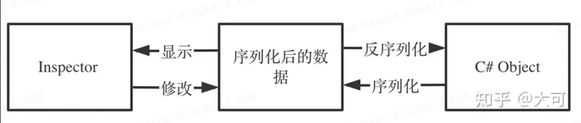

##### **1.2.1 代码层的序列化**

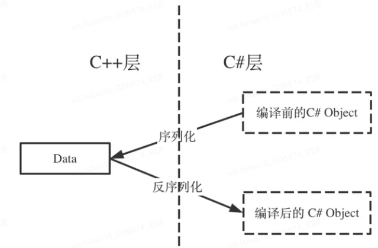

当要重新编译时，unity会先把C#层里继承UnityEngine.Object 的数据序列化，然后放进C++层避难，然后等c#编译好了后，再通过反序列化回去恢复数据。

对于每个UnityEngine.Object，除了C#层有一个实例之外，C++层也有一个对应的实例。C#侧暴露给业务逻辑，可以在C#层调用接口，C++的实例则用来做一些序列化，ID管理等底层核心功能。

自行调用New的在C#层创建实例，如果不调用C++创建实例是会返回Null的。

##### **1.2.2 YAML格式**

数据采用平铺的方式，都放在最外层，不像Json那样有层级关系。这样平铺似乎更容易方便diff和merge。文件头是“--- !u!{CLASS ID} &{FILE ID}”

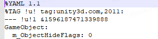

ClassID 是来标识下面这段数据是什么类型，从而采用对于的方式进行序列化和反序列化。常见的入GameObject是1，Transform是4，MonoBehaviour是114。详细的ID对于的类型可以看下面这张表[Unity - Manual: YAML Class ID Reference (unity3d.com)](https://link.zhihu.com/?target=https%3A//docs.unity3d.com/2019.4/Documentation/Manual/ClassIDReference.html)

以知道，资产系统都是有资产ID的，Unity中处理资产引用是通过GUID和LocalID以及InstanceID识别的。序列化后文件 GUID 存储在 .meta 文件中。这些 .meta 文件是在 Unity 首次导入资源时生成的，并存储在与资源相同的目录中。

文件 GUID 提供了文件特定位置的抽象。只要特定文件 GUID 可以与特定文件相关联，该文件在磁盘上的位置就变得无关紧要。可以自由移动该文件，而无需更新引用该文件的所有对象。由于任何给定的资产文件可能包含（或通过导入生成）多个 UnityEngine.Object 资源，因此需要一个本地 ID 来明确区分每个不同的对象。如果在 Unity 编辑器关闭时 .meta 文件丢失，或者资产路径发生变化而 .meta 文件没有随资产一起移动，则对该资产内对象的所有引用都将被破坏。

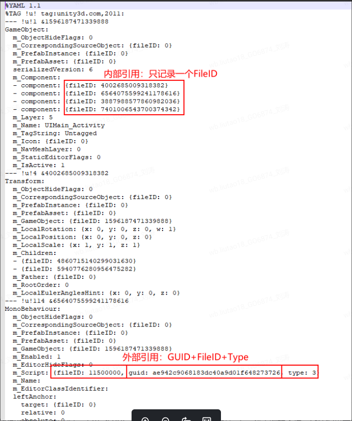

我们的Monobehaviour，都会有一个m_Script, 来定位对于.cs文件。某种程度上，对于编辑来说，cs代码也是一种资源。

对于UnityEngine.Object 继承下来的东西，是以引用的方式序列化，也就是只存一个guidID + fileID来找对应的那个class的实例资源。 而对于自定义的一些C#类，则是以inline的方式直接序列化，也就是当做struct了。比如在runtime的时候，你两个monobehvaiour引用同一个对象实例，序列化之后再反序列化，是各自引用的了两个实例。

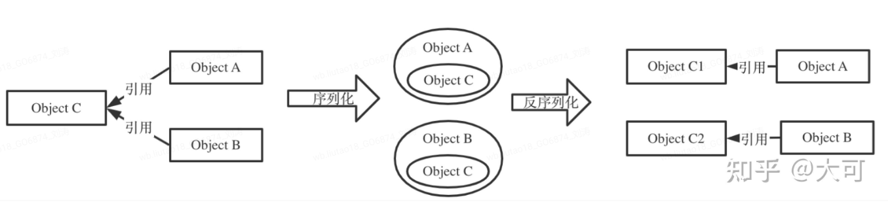

### 2.AssetBundle结构

AssetBundle 本质上是一组组合在一起并序列化为文件的对象。它以数据文件的形式部署，根据是普通 Bundle 还是场景 Bundle，其结构略有不同。AssetBundle 由两部分组成：头和数据段。

标头包含有关 AssetBundle 的信息，例如其标识符、压缩类型和清单。清单是一个以对象名称为键的查找表。每个条目都提供一个字节索引，指示可以在 AssetBundle 的数据段中找到给定对象的位置。在大多数平台上，此查找表都实现为平衡搜索树。具体来说，Windows 和 OSX 衍生平台（包括 iOS）采用红黑树。因此，随着 AssetBundle 中的资产数量的增加，构建清单所需的时间将呈*线性增长*。

数据段包含通过序列化 AssetBundle 中的 Assets 生成的原始数据。如果指定 LZMA 作为压缩方案，则所有序列化 Assets 的完整字节数组都会被压缩。如果指定 LZ4，则单独 Assets 的字节会单独压缩。如果不使用压缩，数据段将保留为原始字节流。

**正常的 AssetBundle 结构**

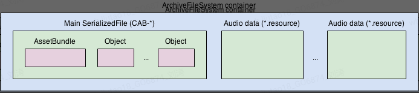

**流场景的 AssetBundle 结构**

 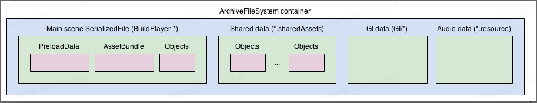

**AssetBundle 压缩**

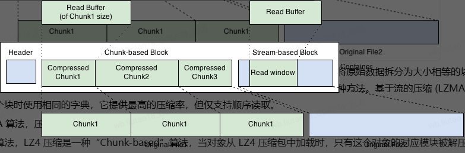

上面显示的压缩块可能具有基于块的压缩或基于流的压缩。基于块的压缩 (LZ4) 意味着将原始数据拆分为大小相等的块（子块），并且块被独立压缩。如果您想要实时解压缩 - 随机读取开销很小，则应该使用这种方法。基于流的压缩 (LZMA) 在处理整个块时使用相同的字典，它提供最高的压缩率，但仅支持顺序读取。

LZMA 算法，压缩体积小，但使用之前需要将整个包体解压，因此加载时间长。

LZ4 算法，LZ4 压缩是一种“Chunk-based”算法，当对象从 LZ4 压缩包中加载时，只有这个对象的对应模块被解压即可，不需要整体解锁，所以 LZ4 压缩包加载更快。LZ4 压缩格式是在 Unity5.3 版本中开始引入的，之前的版本不可用。

鉴于上述特点，建议大型游戏的首包使用 LZMA 算法进行压缩，这样包体大小能够尽可能压缩，提高转化率。在游戏第一次启动时进行解压缩，并用 LZ4 算法进行二次压缩，保证在此后的游戏启动运行时能够做到更快地加载。Patch 内容一般使用 LZ4 算法压缩即可。

## 三、资源加载和依赖

### 1.加载和下载API

AssetBundles 可以通过四种不同的 API 加载。这四个 API 的行为根据两个标准而不同：

AssetBundle 是否采用 LZMA 压缩、LZ4 压缩或未压缩

加载 AssetBundle 的平台

这些 API 包括：

- AssetBundle.LoadFromMemory（异步可选）
- AssetBundle.LoadFromFile（异步可选）
- UnityWebRequest 的 DownloadHandlerAssetBundle
- WWW.LoadFromCacheOrDownload（在 Unity 5.6 或更早版本上）

#### **1.1 AssetBundle.LoadFromMemory（异步）**

*Unity 建议不要使用此 API。*[AssetBundle.LoadFromMemoryAsync](https://docs.unity3d.com/ScriptReference/AssetBundle.LoadFromMemoryAsync.html)*从托管代码字节数组（C# 中的byte[]*加载 AssetBundle。它将始终将托管代码字节数组中的源数据复制到新分配的连续本机内存块中。如果 AssetBundle 是 LZMA 压缩的，它将在复制时解压缩 AssetBundle。未压缩和 LZ4 压缩的 AssetBundle 将逐字复制。

此 API 所消耗的内存峰值至少是 AssetBundle 大小的两倍：一份副本位于 API 创建的本机内存中，另一份副本位于传递给 API 的托管字节数组中。因此，从通过此 API 创建的 AssetBundle 加载的资产将在内存中复制*三次*：一次位于托管代码字节数组中，一次位于 AssetBundle 的本机内存副本中，第三次位于资产本身的 GPU 或系统内存中。

#### **1.2 AssetBundle.LoadFromFile（异步）**

[AssetBundle.LoadFromFile](https://docs.unity3d.com/ScriptReference/AssetBundle.LoadFromFile.html)是一种高效的 API，用于从本地存储（例如硬盘或 SD 卡）加载未压缩或 LZ4 压缩的 AssetBundle。

在桌面独立平台、控制台和移动平台上，API 将仅加载 AssetBundle 的标头，并将剩余数据留在磁盘上。AssetBundle 的对象将在调用加载方法（例如*AssetBundle.Load* ）或取消引用其 InstanceID 时按需加载。在这种情况下不会消耗多余的内存。在 Unity 编辑器中，API 会将整个 AssetBundle 加载到内存中，就像从磁盘读取字节并使用*AssetBundle.LoadFromMemoryAsync*一样。如果在 Unity 编辑器中分析了项目，此 API 可能会导致在 AssetBundle 加载期间出现内存峰值。这不会影响设备上的性能，并且在采取补救措施之前应在设备上重新测试这些峰值。

#### **1.3 AssetBundle下载处理程序**

[UnityWebRequest](http://docs.unity3d.com/ScriptReference/Networking.UnityWebRequest.html) API允许开发人员精确指定 Unity 应如何处理下载的数据，并允许开发人员消除不必要的内存使用。使用 UnityWebRequest 下载 AssetBundle 的最简单方法是调用[UnityWebRequest.GetAssetBundle](http://docs.unity3d.com/ScriptReference/Networking.UnityWebRequest.GetAssetBundle.html)。

[DownloadHandlerAssetBundle](http://docs.unity3d.com/ScriptReference/Networking.DownloadHandlerAssetBundle.html)。它使用工作线程将下载的数据流式传输到固定大小的缓冲区，然后将缓冲的数据假脱机到临时存储或 AssetBundle 缓存中，具体取决于下载处理程序的配置方式。所有这些操作都以本机代码进行，从而消除了扩展托管堆的风险。此外，此下载处理程序不会*保留*所有下载字节的本机代码副本，从而进一步减少了下载 AssetBundle 的内存开销。

LZMA 压缩的 AssetBundles 将在下载期间解压并使用 LZ4 压缩进行缓存。可以通过设置[Caching.CompressionEnabled](https://docs.unity3d.com/ScriptReference/Caching-compressionEnabled.html)来更改此行为。

下载完成后，下载处理程序的[assetBundle](http://docs.unity3d.com/ScriptReference/Networking.DownloadHandlerAssetBundle-assetBundle.html)属性提供对已下载的 AssetBundle 的访问，就像在下载的 AssetBundle 上调用了*AssetBundle.LoadFromFile一样。*

如果向 UnityWebRequest 对象提供了缓存信息，并且请求的 AssetBundle 已经存在于 Unity 的缓存中，则 AssetBundle 将立即可用，并且此 API 的操作与*AssetBundle.LoadFromFile相同*。

#### **1.4 WWW.LoadFromCacheOrDownload**

*WWW.LoadFromCacheOrDownload**将**在未来版本中被弃用。*

#### **1.5 建议**

一般情况下，应尽可能使用 AssetBundle.LoadFromFile。从速度、磁盘使用率和运行时内存使用率来看，此 API 是最高效的。对于必须下载或修补 AssetBundle 的项目，强烈建议使用UnityWebRequest

### **2.从 AssetBundles 加载资源**

UnityEngine.Objects 可以使用三个不同的 API 从 AssetBundles 加载

- [加载资源](https://docs.unity3d.com/ScriptReference/AssetBundle.LoadAsset.html)（ [LoadAssetAsync](https://docs.unity3d.com/ScriptReference/AssetBundle.LoadAssetAsync.html)）[AssetBundle](https://docs.unity3d.com/ScriptReference/AssetBundle.html).LoadAssetAsync
- [加载所有资产](https://docs.unity3d.com/ScriptReference/AssetBundle.LoadAllAssets.html)（ [LoadAllAssetsAsync](https://docs.unity3d.com/ScriptReference/AssetBundle.LoadAllAssetsAsync.html)）[AssetBundle](https://docs.unity3d.com/ScriptReference/AssetBundle.html).LoadAllAssets
- [加载资源和子资源](https://docs.unity3d.com/ScriptReference/AssetBundle.LoadAssetWithSubAssets.html)（[加载资源和子资源Async](https://docs.unity3d.com/ScriptReference/AssetBundle.LoadAssetWithSubAssetsAsync.html)）[AssetBundle](https://docs.unity3d.com/ScriptReference/AssetBundle.html).LoadAssetWithSubAssets

*加载多个独立的 UnityEngine.Object 时应使用LoadAllAssets* 。仅当需要加载 AssetBundle 中的大多数或所有对象时才应使用它。与其他两个 API 相比，*LoadAllAssets*比多次单独调用*LoadAssets稍快*。因此，如果要加载的资源数量很大，但一次需要加载的 AssetBundle 不到 66%，请考虑将 AssetBundle 拆分为多个较小的包并使用*LoadAllAssets* 。

*加载包含多个嵌入对象的复合 Asset 时应使用LoadAssetWithSubAssets* ，例如嵌入动画的 FBX 模型或嵌入多个 Sprite 的 Sprite 图集。如果需要加载的对象都来自同一 Asset，但与许多其他不相关的对象一起存储在 AssetBundle 中，请使用此 API。

对于任何其他情况，请使用*LoadAsset*或*LoadAssetAsync* 。

### **3.AssetBundle 依赖项**

在 Unity 编辑器中，可以通过[AssetDatabase API 查询 AssetBundle 依赖关系。可以通过](http://docs.unity3d.com/ScriptReference/AssetDatabase.html)[AssetImporter](http://docs.unity3d.com/ScriptReference/AssetImporter.html) API访问和更改 AssetBundle 分配和依赖关系。在运行时，Unity 提供了一个可选 API，用于通过基于 ScriptableObject 的[AssetBundleManifest](http://docs.unity3d.com/ScriptReference/AssetBundleManifest.html) API 加载在 AssetBundle 构建期间生成的依赖关系信息。

当父 AssetBundle 的 UnityEngine.Objects 中的一个或多个引用其他 AssetBundle 的 UnityEngine.Objects 时，AssetBundle 依赖于另一个 AssetBundle。

当父 AssetBundle 加载时，Unity 不会尝试自动加载任何子 AssetBundle。在加载对象本身之前加载包含对象依赖项的所有 AssetBundle 很重要。

假设*材质 A*引用*纹理 B* 。材质 A 被打包到 AssetBundle 1 中，纹理 B 被打包到 AssetBundle 2 中。

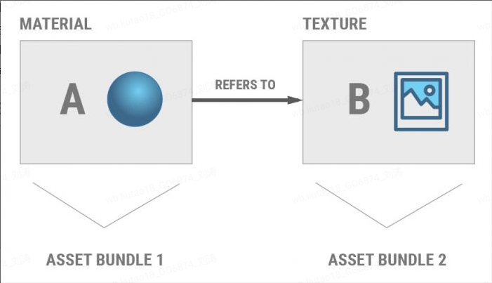

在此用例中，必须在从 AssetBundle 1 中加载材质 A*之前*加载 AssetBundle 2 。值得注意的是，如果一个 AssetBundle 存在依赖性，那些包含了被依赖对象的 AssetBundles，需要在你想要实例化的对象的加载之前加载，Unity 不会自动帮你加载这些依赖。

#### **3.1 依赖打包**

依赖打包是指，如果某个 bundle 依赖某些资源，而这些资源没有指定 bundle，那么 Unity 在打该 bundle 时会自动收集这些依赖资源，并将依赖资源一并打进该 bundle 中。而如果多个 bundles 依赖了相同的资源，且该资源没有指定 bundle，那么该资源则会被同时打进多个 bundles 中，这就造成了资源冗余。

最合理的方案，即公共资源建议设置 bundle，可以根据数量和大小分成多个 bundle。单项引用的资源不需要单独设置 bundle，通过依赖打进引用它的资源所在 bundle 即可。这样可以避免资源冗余。

资源冗余造成的问题：

- 内存中加载多份同样的资源占用内存；
- 同一份资源通过多次 IO 加载，性能消耗；
- 导致包体过大。

但是在处理资源冗余时还是要特别小心的，G100NA 项目曾经在将“废弃”资源从 bundle 中剔除时，导致包体增大 100M。例如多个废弃资源 ABCDE…都引用了废弃资源 Z，如果只是剔除了 Z，那依赖打包会自动将 Z 复制很多分放到 ABCDE…的 bundle 中，反而导致 bundle 增大、包体暴涨。

#### **3.2 循环依赖**

在Unity中，AssetBundle用于打包和加载资源，可以有效地减少应用程序的加载时间和内存占用。然而，循环引用（circular dependency）问题可能会在涉及多个AssetBundle时出现，导致资源加载失败或其他问题。解决循环引用加载的问题通常涉及以下几种策略：

##### 3.2.1 **识别和拆分共享资源**

首先，确保你已经识别出哪些资源是共享资源，并将它们单独打包到一个或多个独立的AssetBundle中。这样可以减少多个AssetBundle之间的直接依赖。

例如：

- shared_assets.bundle 包含所有共享的材质、纹理、脚本等。
- bundle_a 和 bundle_b 引用 shared_assets.bundle 中的资源。

##### 3.2.2 **生成Manifest文件**

打包AssetBundle时，Unity会生成一个包含所有AssetBundle依赖关系的Manifest文件。这个文件可以帮助我们解析并确保按正确顺序加载依赖项。

> // 打包AssetBundle及生成Manifest 
>
> BuildPipeline.BuildAssetBundles("Assets/AssetBundles", BuildAssetBundleOptions.None, 
>
> BuildTarget.StandaloneWindows);

##### 3.2.3 **解析和加载依赖项**

使用Manifest文件解析并按正确顺序加载AssetBundle及其依赖项。下面是一个示例代码，演示如何处理依赖关系并加载AssetBundle：

```C#
IEnumerator LoadAssetBundleWithDependencies(string bundleName)
{
    // 首先加载Manifest文件
    AssetBundle manifestBundle = AssetBundle.LoadFromFile("path/to/AssetBundles");
    AssetBundleManifest manifest = manifestBundle.LoadAsset<AssetBundleManifest>("AssetBundleManifest");

    // 获取该AssetBundle的所有依赖项
    string[] dependencies = manifest.GetAllDependencies(bundleName);
    List<AssetBundle> loadedBundles = new List<AssetBundle>();

    // 加载所有依赖项
    foreach (string dependency in dependencies)
    {
        var dependencyBundle = AssetBundle.LoadFromFileAsync("path/to/AssetBundles/" + dependency);
        yield return dependencyBundle;
        loadedBundles.Add(dependencyBundle.assetBundle);
    }

    // 加载主AssetBundle
    var mainBundleRequest = AssetBundle.LoadFromFileAsync("path/to/AssetBundles/" + bundleName);
    yield return mainBundleRequest;

    AssetBundle mainBundle = mainBundleRequest.assetBundle;

    // 现在可以从mainBundle中加载资源了
    // 例如：var myAsset = mainBundle.LoadAsset<GameObject>("MyAsset");
}
```

##### 3.2.4 **解决循环依赖问题**

为了避免循环依赖，确保每个AssetBundle的依赖关系是单向的。例如，不要让 bundle_a 和 bundle_b 互相引用，而是让它们都引用 shared_assets.bundle。如果不能避免，自己维护资源的引用计数，需要区分是直接加载的资源还是依赖的资源，进行不同的计数管理，引用计数为0时就可以卸载该bundle。

**加载Manifest并构建依赖关系图：**

通过加载Manifest文件，获取每个AssetBundle的依赖关系，并存储在一个字典assetBundleDependencies中。

**递归加载依赖项：**

通过递归调用LoadAssetBundleWithDependencies，确保所有依赖项都被加载。这种递归方式可以有效处理复杂的依赖关系，即便存在循环依赖。

**延迟加载和检查：**

在每次加载AssetBundle时，先检查其依赖项是否已经被加载，如果未被加载，则递归加载依赖项，确保所有依赖项在加载主AssetBundle之前已经被加载。

**使用Addressable Assets System**

Unity的Addressable Assets System可以极大地简化依赖管理，并自动处理复杂的依赖关系，是解决循环依赖问题的推荐工具。使用Addressable Assets，可以方便地标记、打包和加载资源。

### **4.AssetBundle 清单**

*使用BuildPipeline.BuildAssetBundles API*执行 AssetBundle 构建管道时，Unity 会序列化一个包含每个 AssetBundle 依赖项信息的对象。此数据存储在单独的 AssetBundle 中，其中包含一个[AssetBundleManifest](http://docs.unity3d.com/ScriptReference/AssetBundleManifest.html)类型的对象。

此 Asset 将存储在与 AssetBundles 构建的父目录同名的 AssetBundle 中。如果项目将其 AssetBundles 构建到*(projectroot)/build/Client/文件夹中*，则包含清单的 AssetBundle 将保存为*(projectroot)/build/Client/Client.manifest* 。

包含清单的 AssetBundle 可以像任何其他 AssetBundle 一样被加载、缓存和卸载。

AssetBundleManifest 对象本身提供了[GetAllAssetBundles](http://docs.unity3d.com/ScriptReference/AssetBundleManifest.GetAllAssetBundles.html) API 来列出与清单同时构建的所有 AssetBundle，以及两种方法来查询特定 AssetBundle 的依赖项：

- [AssetBundleManifest.GetAllDependencies](http://docs.unity3d.com/ScriptReference/AssetBundleManifest.GetAllDependencies.html)返回 AssetBundle 的所有层次依赖项，其中包括 AssetBundle 的直接子项、子项的子项等的依赖项。
- [AssetBundleManifest.GetDirectDependencies](http://docs.unity3d.com/ScriptReference/AssetBundleManifest.GetDirectDependencies.html)仅返回 AssetBundle 的直接子项

请注意，这两个 API 都会分配字符串数组。因此，应谨慎使用它们，并且不要在应用程序生命周期中对性能敏感的部分使用它们。

生成的每个包都有关联的清单文件，普通AssetBoundle的清单文件如下，其中包括循环冗余校验 (CRC) 数据、Hash、包含的资源和依赖项等信息：

```
ManifestFileVersion: 0
CRC: 2200518381
Hashes:
  AssetFileHash:
    serializedVersion: 2
    Hash: a306d5543107c82866465f9df0d8acbd
  TypeTreeHash:
    serializedVersion: 2
    Hash: 102c4676b3ca353d1dcb28d130e9fb19
HashAppended: 0
ClassTypes:
- Class: 90
  Script: {instanceID: 0}
SerializeReferenceClassIdentifiers: []
Assets:
  - Assets/Art/NonStatic/Effect/Source/world/ETC/PathArrow_03.mat
Dependencies: {}
```

有一个总的清单文件AssetBundleManifest，将显示 AssetBundle 之间的关系以及它们的依赖项

```
ManifestFileVersion: 0
CRC: 451860667
AssetBundleManifest:
  AssetBundleInfos:
    Info_0:
      Name: zh-cn
      Dependencies: {}
    Info_1:
      Name: fx_s_effect
        Dependency_1: res_p_prefabs
```

在Unity的AssetBundle系统中，Manifest文件包含了许多有用的信息，其中包括AssetFileHash和TypeTreeHash

AssetFileHash是针对整个AssetBundle文件内容的哈希值，主要用于检测AssetBundle文件本身是否发生变化。当你生成一个新的AssetBundle时，如果文件内容有任何变化，AssetFileHash也会随之变化。这对于缓存和版本控制非常有用，可以帮助你决定是否需要重新下载或更新某个AssetBundle。

TypeTreeHash是针对AssetBundle中的类型树结构（Type Tree）的哈希值，用于检查AssetBundle中的类型信息是否发生变化。类型树结构包括了类型的字段、字段类型、继承关系等信息。TypeTreeHash的变化通常意味着AssetBundle中资源的类型定义发生了改变。

Type Tree是Unity用来描述资产类型结构的一种数据格式。它定义了每个资源的字段、类型、数据偏移等信息。对于每个资源，Unity生成一个类型树，以确保在不同平台和Unity版本之间正确序列化和反序列化。当Unity加载一个AssetBundle时，类型树信息会确保资源的数据可以正确地被解释和使用。如果类型树发生变化，但TypeTreeHash没有更新，可能会导致加载错误或资源不一致的情况。

通过比较AssetFileHash和TypeTreeHash，可以准确地检测到AssetBundle文件内容和类型结构的变化。这对于增量更新和版本控制非常重要。

可以通过以下代码来加载并读取Manifest文件中的哈希信息

```C#
using UnityEngine;
using System.Collections;

public class ManifestReader : MonoBehaviour
{
    void Start()
    {
        StartCoroutine(LoadManifest());
    }

    IEnumerator LoadManifest()
    {
        string manifestPath = "path/to/AssetBundles";
        AssetBundle manifestBundle = AssetBundle.LoadFromFile(manifestPath);
        if (manifestBundle == null)
        {
            Debug.LogError("Failed to load AssetBundle!");
            yield break;
        }
		#获取总清单文件
        AssetBundleManifest manifest = manifestBundle.LoadAsset<AssetBundleManifest>("AssetBundleManifest");
        if (manifest == null)
        {
            Debug.LogError("Failed to load AssetBundleManifest!");
            yield break;
        }
		#获取包列表
        string[] allAssetBundles = manifest.GetAllAssetBundles();
        foreach (string bundleName in allAssetBundles)
        {
            Hash128 assetFileHash = manifest.GetAssetBundleHash(bundleName);
            Hash128 typeTreeHash = /* 需要通过其他方式获取，Unity API 中未直接暴露 */

            Debug.Log($"AssetBundle: {bundleName}, AssetFileHash: {assetFileHash}, TypeTreeHash: {typeTreeHash}");
        }
    }
}
```

### 5.AssetBoundle加载卸载管理

[AssetBundle.Unload](http://docs.unity3d.com/ScriptReference/AssetBundle.Unload.html)参数true和false是有差异的，此 API 将卸载所调用 AssetBundle 的标头信息。unloadAllLoadedObjects参数确定是否同时卸载从此 AssetBundle 实例化的所有对象。如果设置为*true ，*则所有源自 AssetBundle 的对象也将立即卸载 - 即使它们当前正在活动场景中使用。

例如，假设材质*M*是从 AssetBundle *AB加载的*，并且假设*M*当前位于活动场景中。

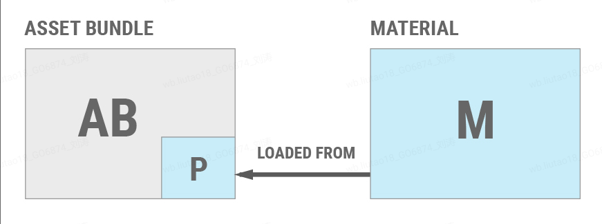

如果调用*AssetBundle.Unload(true) ，则M*将从场景中移除、销毁并卸载。但是，如果调用*AssetBundle.Unload(false) ，则AB*的标头信息将被卸载，但*M*将保留在场景中并仍可运行。调用*AssetBundle.Unload(false)会断开M*和*AB*之间的链接。如果稍后再次加载*AB ，则AB*中包含的对象的新副本将加载到内存中。

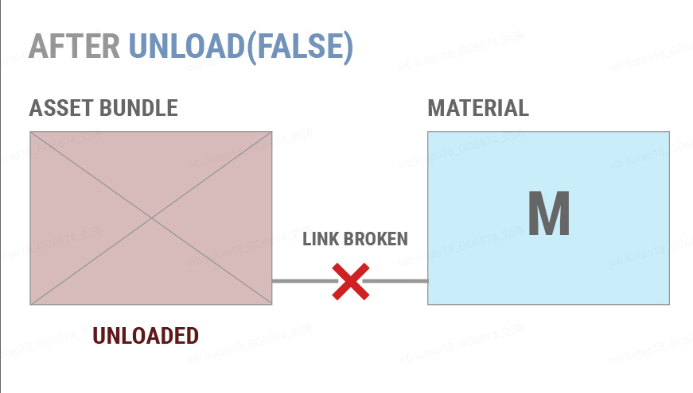

如果*AB*稍后再次加载，则会重新加载 AssetBundle 标头信息的新副本。但是，*M并非从AB*的新副本加载的。Unity 不会在*AB的新副本*和*M之间建立任何链接*。

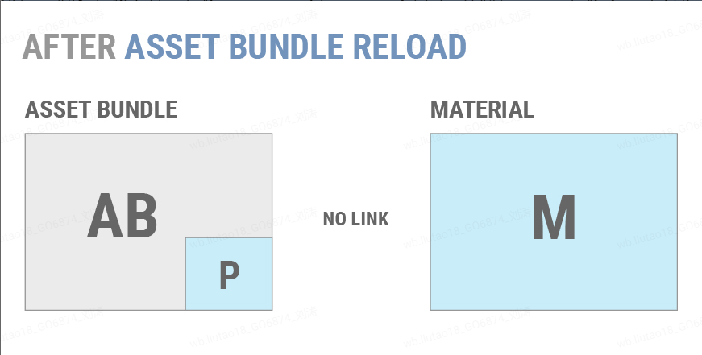

如果调用*AssetBundle.LoadAsset()重新加载M* ，Unity 不会将*M的旧副本解释为AB*中数据的实例。因此，Unity 将加载*M的新副本，并且*场景中将有两个相同的*M*副本。

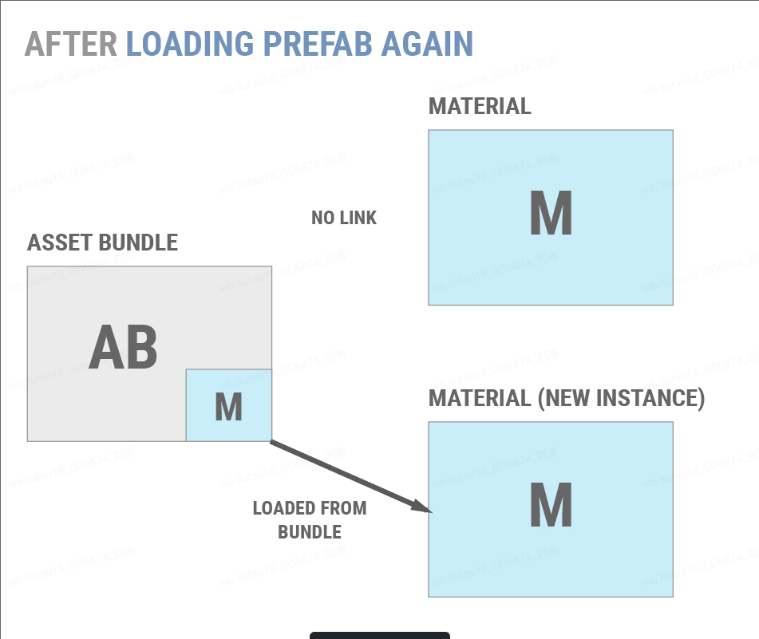

对于大多数项目来说，这种行为是不可取的。大多数项目应该使用*AssetBundle.Unload(true)*并采用一种方法来确保对象不会重复。两种常用方法是：

在应用程序的生命周期中，明确定义卸载临时 AssetBundles 的时间点，例如关卡之间或加载屏幕期间。这是最简单且最常见的选择。

维护单个对象的引用计数，并且仅当所有组成对象都未使用时才卸载 AssetBundle。这样，应用程序就可以卸载并重新加载单个对象，而无需重复内存。

如果应用程序必须使用*AssetBundle.Unload(false)* ，则单个对象只能通过两种方式卸载：

消除场景和代码中对不需要的对象的所有引用。完成此操作后，调用[Resources.UnloadUnusedAsset](http://docs.unity3d.com/ScriptReference/Resources.UnloadUnusedAssets.html)

当前场景中的所有对象并自动调用[Resources.UnloadUnusedAssets 。](http://docs.unity3d.com/ScriptReference/Resources.UnloadUnusedAssets.html)

如果项目具有明确定义的点，用户可以在这些点等待对象的加载和卸载，例如在游戏模式或级别之间，则应该使用这些点来卸载尽可能多的对象并加载新的对象。

最简单的方法是将项目的独立部分打包成场景，然后将这些场景及其所有依赖项构建到 AssetBundle 中。然后，应用程序可以进入“加载”场景，完全卸载包含旧场景的 AssetBundle，然后加载包含新场景的 AssetBundle。

虽然这是最简单的流程，但有些项目需要更复杂的 AssetBundle 管理。由于每个项目都不同，因此没有通用的 AssetBundle 设计模式。

## 四、资源分组策略

### 1.分组策略

Assetbundle 是 patch 下载和资源加载的最小单位，Assetbundle 的划分会影响到 patch 更新、包体大小、运行内存、加载速度等方面。Assetbundle 的粒度也不是一定越小越好，当粒度小带来的bundle就会很多，一次加载大量bundle会带来IO压力，同时解压次数和申请内存次数也较大，进而导致加载时间增长。如果粒度太大又会导致运行时内存较高，单次加载时间过长，单个bundle下载时间过长，patch差量更新冗余变大，浪费很多流量等问题。

有以下分组策略可以参考：

1. 按功能逻辑分组：可以将某一个功能模块的资源放在一个bundle里，比如同一类的系统界面，一个场景等；
2. 按资源类型分组：所有脚本打成一个bundle，按场景划分太大，可以再按资源类型把模型，贴图，shader再分成三个组打到三个不同bundle里；
3. 按使用时机分组：可以把同一时间需要的资源打成一个bundle，
4. 把全局资源打到一个组，这个类还可以再按类型分子类。

将全局用到的资源大类下还可以再按类型划分子类可以预加载资源，降低加载延迟，如果资源被多个不同的prefab使用，可以考虑划分到全局bundle里，减少了内存浪费，放入全局bundle里的资源不会重复出现在多个AB中。另一方面，放在全局bundle中资源也要考虑大小，过大可以再进行拆分，如果共享率不能达到70%以上，则在加载耗时上的收益递减了。

其他划分策略有如下优点

- 提高加载速度, 由于某个功能AB LoadFromFile后, 执行LoadAllAsset, 可将用到的Asset统一加载到内存, 降低去查找其他AB, 使用时候再加载带来的延迟.
- 方便Batch散图, 例如界面使用的纹理, 模型使用的纹理, 都能直接按目录组成Atlas, 能做到依赖的Atlas数量最少.
- 更新Size较小, 更新时, 由于Asset依赖, 天然是高内聚的, 例如要更新一个纹理, 那就把更新的纹理放入一个新AB, 模块的PrefabAB也对应更新. 这样就比更新完整AB更省.

缺点:

- 更新策略要自己控制, 使用增量式更新, 所以更新与加载逻辑更复杂一些
- 可能会出现大小差异很大的bundle，比如按角色换装资源打包，有的资源很多，有的资源很少，可以考虑把多个资源少的角色换装目录打成一个bundle里，但要注意，这几个换装资源尽量是同一季度出现的资源。

还有一些其他的策略：

离散资源可以打进bundle，冗余资源删除以及对应的从bundle中删除。

避免资源重名，比如换装资源使用相同的子目录结构和命名，但重名文件无法打进同一个bundle里，所以每一个皮肤资源都是单独打bundle的，但这样就会导致bundle很多又很小。会有什么问题？bundle过多会导致IO压力大，低端机可能有crash风险，所以可以避免重名，将很多资源整合到一个bundle。

将经常更新的内容与基本不变的内容拆分开，这样差量更新时可以尽量避免下载冗余。

将经常更新的内容再拆分成合理大小的多个 bundle，按经验一般单个 bundle 大小 1M 左右是比较合适的，能较好地平衡 patch 大小、加载性能和冗余。

将其他多个 bundle 里的对象依赖的资源，分离出来放在一个单独的 bundle。

有些资源不可能同时加载，应分离出来，如标准解析度与高解析度的资源。

### 2.分组工具AssetGraph

官方文档：https://docs.google.com/document/d/e/2PACX-1vSG44o2kP9YalCpqd4Kx3Q-WpgS6mzgrF6ZMAh71KFIk2t_PNJCtx7yePvuVnfC0r7H1WyjaXDWL_jo/pub

https://github.com/Unity-Technologies/AssetGraph

AssetGraph是一款可视化管理Asset资源和AssetBundle组织的插件，可以方便的对资源进行分组打包，使用AssetGroup可以分析Asset，设定不同的分组策略

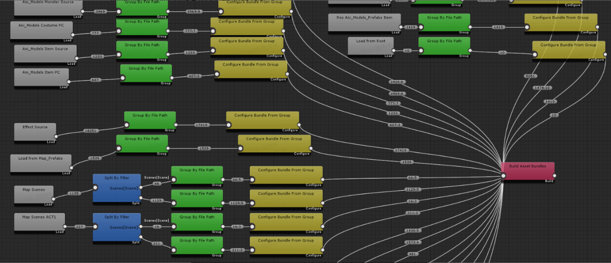

LoadAssets（灰色节点）用来指定打包的资源路径，点击连线处的1195，可以实时看见过滤之后的资源信息，1195表示资源的数量

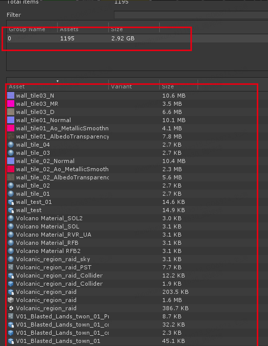

SplitAssets（蓝色节点）用于将获取的资源进行拆分过滤分类。

GroupAssets（绿色节点）用来给资源通过路径进行分组。

PatternType：可以设置为WildCard(通配符)，RegularExpression（正则表达式）俩种。
如这里设置为WildCard，结合下面的GroupingKeyword属性Art/NonStatic/Map/Scenes/*/表示以Scenes路径下子文件夹进行分组命名（分组名可以通过点击数字查看），*是子文件的名称的统配符，会在ConfigureBundle节点中使用，用于命名ab包名。

连线处的66:5，表示一共有66个文件，分成了5组（因为一共有5个子文件），点击可查看具体信息。

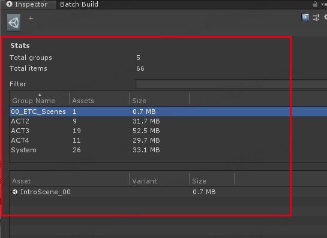

ConfigureBundle（黄色节点）用来对分组进行ab设置命名。
BundeNameTemplate：ab包命名的模板样式，如scene_*这里会将*替换成各个子文件名。

66:5表示66个资源，5个ab包，可以点击查看具体的ab包名和资源

Build（红色）执行ab打包的节点。

OutputOption：输出路径的设置。
OutputDirectory：输出的具体路径。
ManifestName：Manifest文件名字，若为空，则与文件夹同名。
下面的是其他设置，如是否压缩等。

ab包的数据信息保存到了AssetBundleBuildMap文件中

### 3.分析AB工具**AssetBundleBrowser**

资源库https://github.com/Unity-Technologies/AssetBundles-Browser

AssetBundleBrowser 用来分析当前工程的AB，浏览AssetBundle和相互依赖关系插件。

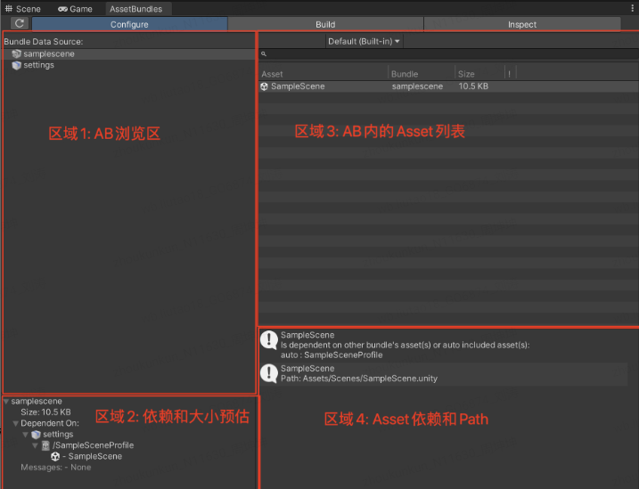

查看重复, 根据以下1,2,3, 即可发现, SharedAssets目录应该单独存放为一个AB, 因为被大量Asset依赖

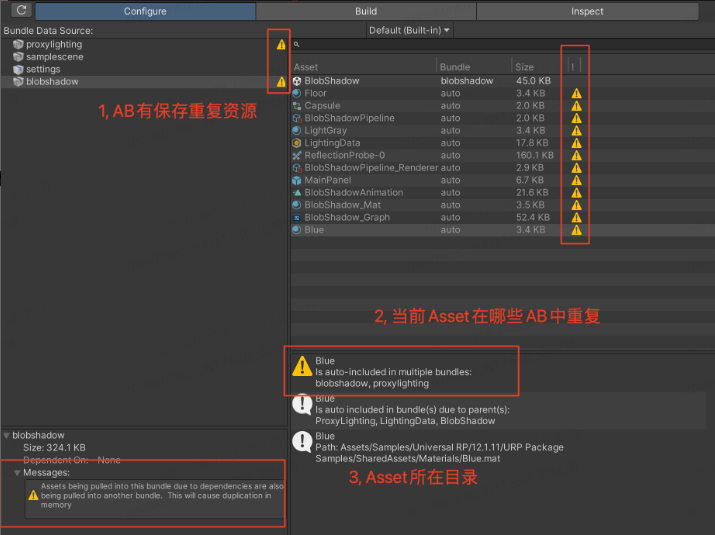

## 五、patch方案

### 1.普通patch更新方案

这是我们项目的大致下载流程图：

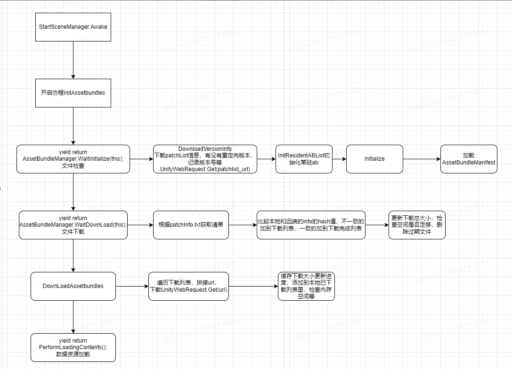

其中用到的API有UnityWebRequest.Get，web.SendWebRequest()，DownloadHandlerFile,获取AssetBundleManifest拿到依赖AssetBundleManifest.GetAllDependencies(assetBundleName)，遍历依赖去加载bundle。比较的是上文说的AssetHash。

以上更新最小单是AssetBundle，就是有可能会有冗余资源的下载，下面介绍一种可以进一步减少更新资源的方式，在AB内只更新块资源，再整合成原AB的方式。

注意点：

下载的线程可以适当增加，每次下载完一个补丁文件不要立即写入本地列表，可以适当缓存改用下载五个左右重写一次本地列表文件，减少IO调用。

### 2.AssetBundle内更新资源

```C#
// BundleFile.cs, from AssetStudio
public class BundleFile
{        
  public BundleFile(FileReader reader)
  {
    m_Header = new Header();
    m_Header.signature = reader.ReadStringToNull();
    m_Header.version = reader.ReadUInt32();
    m_Header.unityVersion = reader.ReadStringToNull();
    m_Header.unityRevision = reader.ReadStringToNull();
    switch (m_Header.signature)
    {
      case "UnityArchive":
        break; //TODO
      case "UnityWeb":
      case "UnityRaw":
        if (m_Header.version == 6)
        {
          goto case "UnityFS";
        }
        ReadHeaderAndBlocksInfo(reader);
        using (var blocksStream = CreateBlocksStream(reader.FullPath))
        {
          ReadBlocksAndDirectory(reader, blocksStream);
          ReadFiles(blocksStream, reader.FullPath);
        }
        break;
      case "UnityFS":
        ReadHeader(reader);
        ReadBlocksInfoAndDirectory(reader);
        using (var blocksStream = CreateBlocksStream(reader.FullPath))
        {
          ReadBlocks(reader, blocksStream);
          ReadFiles(blocksStream, reader.FullPath);
        }
        break;
    }
  }
}
```

通过对AssetStudio源码的阅读，我们可以发现Bundle文件实际上存在多种格式，BlocksInfo可选不压缩，LZ4与LZMA压缩，解压后的数据包含了所有的Block的压缩方式与解压前后的大小，以及Bundle中包含的每个文件的路径，大小，在解压后的数据中的起始偏移。将所有的Blocks解压之后，其最终的数据包含了BlocksInfo中描述的所有文件。

AssetBundle是区分头文件信息和资源信息的，资源信息按块压缩，可以修改AssetStudio的源码，在读取AB时在解压缩出来的数据流中做标记，

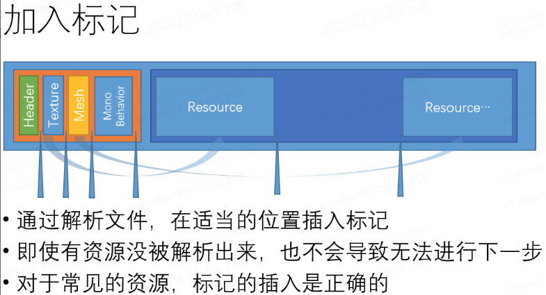

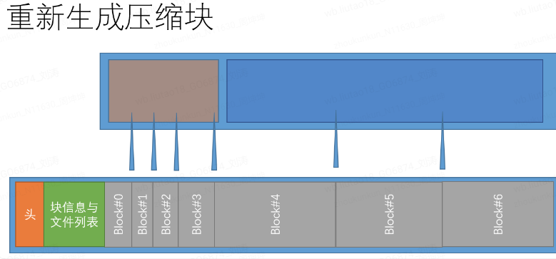

单独压缩了每一个Asset，当某个Asset发生变动时，我们只需要更新对应的Asset即可，而无需更新整个文件了。Bundle文件的分块信息存储在位于其头部的BlocksInfo区域中，通过对这一区域进行修改，我们可以让Unity正确加载我们重新分块之后的AssetBundle文件。这样，我们的AssetBundle仍然是有效的AssetBundle，并且还可以进行高效的Binary Patch。

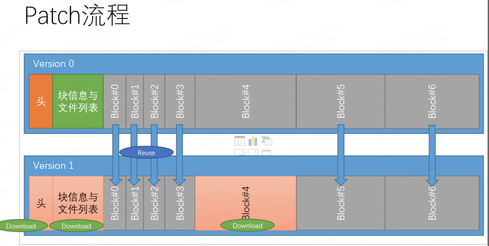

## 六、资源加密

还是以AssetStudio为研究，读取文件开头的特征字符进行对应类型的资源结构解析，还原原始资源。加密可以有两种方式，对字节加密，偏移加密。

**字节加密**

常见的是XOR、RSA等算法加密，bundle对应的字节数组按照加密算法修改上传，在patch阶段下载的bundle进行解密算法，加密后只能按字节的方式加载，有两个：LoadFromMemory和LoadFromStream，这两种方式安全性都比较好，但其中LoadFromMemory读取效率极慢，而且还有双倍内存的消耗，LoadFromStream虽然不会像LoadFromMemory占用更多内存，但限制也很多的，比如必须从0位置开始读，必须从不同于主线程的线程访问，FileStream在Assetbundle加载期间不可被Dispose掉，需要在卸载的时候才能dispose掉对应的FileStream，需要额外管理FileStream的存储等。

**偏移加密**

利用LoadFromFile的参数offset，决定从何处开始读取AB。优点内存占用低，比较简单，缺点就是因为简单安全性低了。