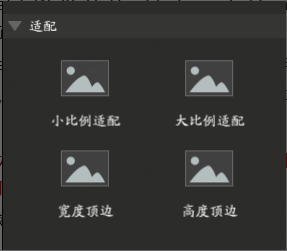

# **Unity UI界面移动端适配办法**

## 一、Canvas：按照设计分辨率适配

在cocos中，我们都会为界面设置一个“设计分辨率”，目前常用的设计分辨率为1334*750。

在Unity中，需要Canvas中进行如下设置，以让该画布按照设计分辨率进行适配。

**“勾选Canvas Scaler(Script)”——“UI Scale Mode选择Scale With Screen Size”——“Reference Resolution填写设计分辨率”**

在设定了设计分辨率后，还需要选择合适的Screen Match Mode。

## 二、Canvas：选择合适的Screen Match Mode进行尺寸适配

Screen Match Mode有三种适配选择：Match Width Or Height、Expand、Shrink。当然了，和Cocomate类似，只需要在根节点（Canvas）选择适配方式就可以了。

Match Width Or Height：对应Cocomate的“高度顶边、宽度定边”，较为不常用，此处不提。

Shrink：将Canvas Size进行高或宽的收缩，让它低于Reference Resolution，较为不常用，此处不提。

 

**Expand：将Canvas Size进行高或宽的扩大，让它高于Reference Resolution，相当于COCOMATE的“小比例适配”，****是最为常用的选择，经过测试一般选它就可以了。**

如下图为弹窗界面在Expand模式下的显示效果。 

除了界面外，全屏图片希望在不同分辨率下获得最佳显示效果时，可以将图片输出为方形（1024*1024），然后在编辑器中拉伸宽度为1.65倍，以保证在方形屏（iPad）和宽屏屏幕上都有较好的显示效果（即在高度较高的屏幕中垂直显示更多内容，宽度较宽的屏幕中水平显示更多内容）。

## 三、Pivot、Anchor：UI控件的挂靠适配

Unity的适配主要要弄清楚Pivot（中心参照点）和Anchor之间的关系，具体的知识点可以参考以下这个知识框架

推荐理解的B站教程传送门：https://www.bilibili.com/video/av67823322/

