**作者：引擎研究组 - 吴文韬**；原KM地址：[基于稀疏八叉树的三维空间寻路_网易KM (netease.com)](https://km.netease.com/article/449635)

## 面临的问题

##  

  三维空间寻路需要对空间场景进行划分，然后在划分好的空间中进行寻路。划分地图的方式有很多种，通过在网上查阅相关资料，三维空间的寻路大多都是基于稀疏八叉树对场景空间进行划分，然后再设计寻路算法计算路径。这其中面临的第一个最大的问题是，当场景非常大时，稀疏八叉树的内存开销很大。其次是寻路的效率。针对第一个问题，可以采用Morton Code对节点进行编码压缩内存空间大小，同时能够保持精度[1]，基于NavBound的方法也可以把内存占用压缩到100MB左右，但是需要额外计算节点连接情况[2]，《天谕》手游也是基于八叉树和JPS+算法的结合给出了三维空间寻路的解决方案，但是JPS+也需要额外烘焙地图信息[3]，目前有一款叫做Mercuna的通用的空间寻路插件，但是不开源且需要付费[4]。本文根据八叉树节点的性质，对八叉树的节点进行编码，能够支持划分4096*4096*4096的场景空间，仅消耗45MB的内存大小，不过只能支持整数且节点的Size大小，必须是2的次幂。第二个问题是寻路算法的效率优化，A*是一个能够快速找到一条通路的方法，本文的实现思路是结合使用的数据结构，基于层级A*的思想设计并实现寻路算法，目前在移动端上测试得到不错的效果，单次寻路时间最高在5ms左右，大多数用例可以在1ms以内。不过还没有在实际项目中进行测试，接下来将会在G115项目中实际测试。

  本文将介绍稀疏八叉树空间划分的方法，针对三维空间寻路做的压缩方法和特殊处理以及八叉树节点编码方式及其优劣，接着会介绍路径平滑算法会用到的射线检测方法。然后介绍寻路算法的调研结果以及最终采取的方案，并简单介绍路径平滑方法。最后介绍地图的流式加载和分段寻路的方案。

## 基于稀疏八叉树的寻路空间划分和压缩

##  

  稀疏八叉树与八叉树不同之处在于，稀疏八叉树在划分子节点的时候，并不需要完全划分。起初稀疏八叉树只有一个根节点来定义需要被包围的空间大小，当往稀疏八叉树中插入一个障碍物的包围盒，会递归地生成与障碍物包围盒相交的子节点，一直生成到节点的`Size`小于给定阈值或者当某个节点完全被障碍物包围盒包含为止。下图是在Unity中对场景划分的示例，其中球体和右下角的胶囊体是障碍物，绿色空间表示划分出来的节点，红色空间表示有障碍物的节点。

  八叉树的节点分布是非常整齐且有规律的。通过递归地计算，可以获得每一层子节点的中心位置和对应子空间的大小。
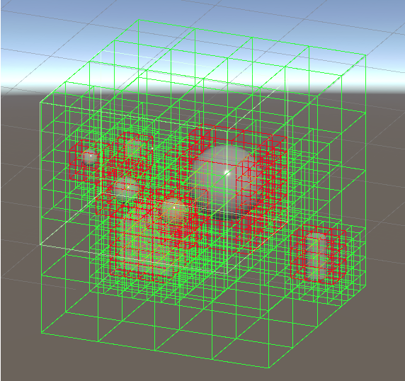

### 自由空间和阻塞节点定义

##  

  往稀疏八叉树中插入障碍物包围盒的过程中，会递归地计算子节点对应的空间包围盒与障碍物包围盒相交的情况，然后生成相交的子节点，一直生成到节点的`Size`小于给定阈值或者当某个节点完全被障碍物包围盒包含为止。所以，在本文给出的寻路方案中，稀疏八叉树的、划分出来的节点都是包含障碍物的节点。划分到最低层次的叶子节点都包含障碍物，这部分空间被认为是不可行走的，称为阻塞节点。而高层次的节点，虽然包含障碍物，但是仍然有部分子空间未被划分，在这部分空间中是可以自由行走的，称为自由空间。如果只把叶子节点定义为阻塞节点，是不够充分的，考虑这样一种情况，当一个节点的所有子节点都是叶子节点的时候，可以认为这个节点也是不可行走的，所以也是阻塞节点。那么阻塞节点是叶子节点或所有子节点都为阻塞节点的节点。

  所以，在本文给出的寻路方案中，稀疏八叉树的节点可以分为三类：

- 一般节点（已划分，但非阻塞）
- 阻塞节点（已划分，且不可再插入障碍物）
- 自由空间（未划分）

  基于这个思路，可以定义节点的数据结构，其中`blockFlag`可以表示子节点是否为阻塞节点，`children`是一个数组，保存子节点实例。`blockFlag`的说明，可以看下面这张图，每个bit对应一个子节点。

```c#
class Node{
    public Vector3 center;			//	3x4 = 12 bytes
    public float   size;			//	4 bytes
    public byte    blockFlag;		//	表示子节点是否被阻塞 1 byte
    public Node[]  children;		//	8 bytes
}
```

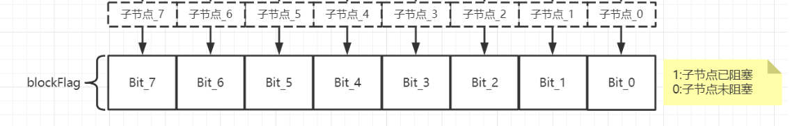

### 八叉树节点空间压缩

##  

  针对上文中给出的节点的初步定义。可以发现每个节点至少需要四个浮点值，一个字节保存子节点是否阻塞，以及一个数组保存子节点。在不考虑内存对齐的情况下，至少需要25个字节。而由于需要内存对齐，所以空间占用更大。

  在此，首先介绍第一个压缩思路，如果给定场景空间大小和叶子节点的尺寸，那么在范围内使用整数代替浮点数是可行的。例如，游戏场景地图的大小可以用4096*4096*4096的包围盒包住，叶子节点的尺寸设置为2m。如果节点尺寸都是2的次幂，只需要使用16位的整数就可以代替浮点数来表示八叉树的节点数据了。那么节点就变成下面这个样子，25个字节压缩到17个字节。

```c#
class Node{
    public Int16   cx;
	public Int16   cy;
	public Int16   cz;				//	3x2 = 6 bytes
    public Int16   size;			//	2 bytes
    public byte    blockFlag;		//	表示子节点是否被阻塞 1 byte
    public Node[]  children;		//	8 bytes
}
```

  如果基于这样的数据结构去划分场景，针对地形和地形之上的障碍物进行划分，在项目中测试能够得到上千万个节点（具体的数值没有保留）。这是非常巨大的，在划分过程中就程序就崩溃了。所以还需要进一步压缩。

  对于空间寻路地图而言，一个显而易见的想法是，对于那些阻塞的节点是可以删掉的，只需要将其父节点`blockFlag`对应比特位设为1即可，表明子节点已经阻塞。在寻路过程中检查标记位即可。所以第二步节省空间的操作就是删除阻塞节点。在项目中实践时，划分过程就已经崩溃，所以需要一边划分，一边删除阻塞节点并做好标记，这一步能够节约大约80%的节点，相当于节省了80%的内存。在实践中，原本需要在内存中生成上千万个节点，删去阻塞节点之后，只有150W个，极大地节省了内存。

  由于删掉了阻塞节点，在需要查询自由空间时，在查询children数组中对应位置的子节点为空且对应`blockFlag`的比特位为0时，该节点属于未划分的节点，即自由空间。

  做了这一步操作后，每个节点要保存空间中心点数据，尺寸数据，一个字节的指示数据，以及子节点的索引。然而这并没有利用好八叉树的性质，对八叉树的节点进行合理地编码，可以把内存占用再进一步压缩^{[5]}[5]。

### 八叉树节点编码

##  

  八叉树的节点分布是非常均匀且有规律的。可以根据一定的规则对每个节点进行编码表示，这样做使用字典来保存所有的编码，便于保存和查询。而且合理的编码，至少需要有以下性质：

- 快速计算出节点的包围盒数据
- 快速计算出节点相对于父亲节点的索引
- 根据输入的查询点和查询层级，计算出相应的节点编码
- 从一个节点编码出发可以快速计算父节点编码
- 从一个节点编码出发可以快速计算子节点编码

  在本文中使用的八叉树节点的包围盒采用的表示方法是(min,size)的表示方法。编码采用的是(坐标,层数)的表示方法，用一个32位的无符号整数就可以表示一个节点的编码。下面会首先介绍子节点索引的表示方式，然后介绍节点包围盒的表示方式及优势，最后介绍节点编码表示方式以及原理。

#### 子节点索引

##  

- 每个节点都会有一个中心坐标
- 每个节点的中心坐标，相对于其父节点的中心坐标，在三个方向上的偏移分别是下面三种情况：
  - 左或右（X轴）
  - 下或上（Y轴）
  - 前或后（Z轴）

  因此，只需要三个比特位就可以对子节点进行编号，编号范围为0~7。如下图所示：

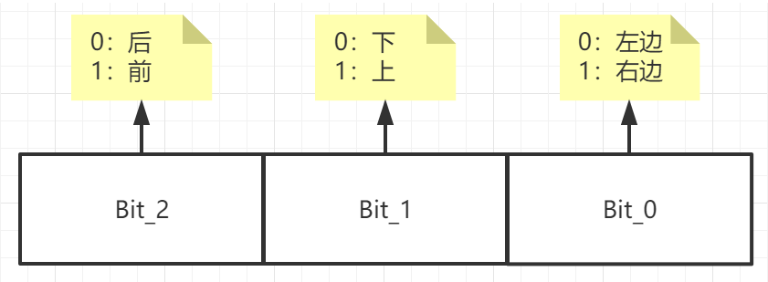

#### 包围盒表示方式

##  

  在本文介绍的例子中，八叉树的节点采用(min,size)的方式来表示一个节点的包围盒。这样做的好处是可以使用一个16位无符号整数来表示min和size。共消耗8个字节，并且可以表示到最小1m的节点，避免引入浮点数（大小为1m的节点，中心坐标小数部分为0.5，而min永远是整数值）。

  这样做的缺点也很明显，就是在需要节点的中心坐标时，需要转换为浮点数计算。

#### 节点编码方式

##  

  节点编码将采用坐标+层数的方式来编码。对于层数，以叶子节点作为第0层，往根节点逐级递增，因此根节点是最高层，叶子节点是最底层。如下图所示，一个三层的八叉树，每一层的节点都是十分规则的包围盒的排列。每一层的所有节点中，都可以把最左下角的节点的坐标记为(0,0,0)，沿着三个轴的方向可以按节点数进行递增。
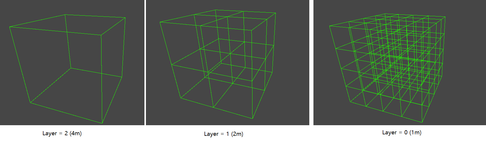

  而且，对于每一层而言，把左下角节点的min统一记为(0,0,0)，当作原点(origin)。其他节点的坐标可以通过以下公式计算得到:

dx = \frac{min.x - origin.x}{size}\\ dy = \frac{min.y - origin.y}{size}\\ dz = \frac{min.z - origin.z}{size}dx=sizemin.x−origin.xdy=sizemin.y−origin.ydz=sizemin.z−origin.z

  对于每一层的size，只要保证size是二的次幂，与层数之间就有如下的关系：

size = 2^{layer}size=2layer

  结合以上两个公式，就有了节点几何数据（min,size）与坐标和层级的转换关系。

  这是一种通用的表示方法。有了这个转换关系，就可以把(dx,dy,dz,layer)编码进一个整数。在本文中，对于每一个坐标都只使用9个比特来表示，这样每个维度可以表示的最大节点数量为256个，层数最高是8层，因此layer需要占用4个比特，总共消耗31个比特，只需要一个4字节的无符号整数就可以保存一个节点的编码。当需要表示更大的节点时，且可以接受更大的内存开销时，可以扩展到64位来表示。在目前支持的项目中，只需要32位整数就足够了。

  最终，本文使用的节点编码使用以下函数进行计算：

```c++
UInt32 Encode(UInt32 dx, UInt32 dy, UInt32 dz, UInt32 layer){
	return dz<<22|dy<<13|dx<<4|layer;
}
```

  通过上面的分析，可以得到基于节点的左下角坐标(min)，原点坐标和节点大小(size)计算出节点坐标索引的方法。然而实际情况中，输入往往是空间中任意一个点的坐标，以及目标层级，然后以此计算出节点的编码。

  我们可以通过下面的公式计算得到任意点坐标在八叉树上任意层级的坐标。

dx = \frac{\lfloor p.x - origin.x \rfloor}{2^{layer}}\\ dy = \frac{\lfloor p.y - origin.y \rfloor}{2^{layer}}\\ dz = \frac{\lfloor p.z - origin.z \rfloor}{2^{layer}}dx=2layer⌊p.x−origin.x⌋dy=2layer⌊p.y−origin.y⌋dz=2layer⌊p.z−origin.z⌋

  然而，我们都知道在程序计算中，整数除以一个2的幂，相当于对该整数进行右移操作。在代码里写成成下面的形式。

```c++
dx = floor(p.x - origin.x) >> layer
dy = floor(p.y - origin.y) >> layer
dz = floor(p.z - origin.z) >> layer
```

  以上的操作，会导致我们计算出来的坐标在layer层级上虽然是正确的，但是会导致我们计算出来的坐标丢失了一些比特位，而这些比特对于计算子节点的编码是有用的。一旦在编码的时候丢失了数据，在解码的时候，就得为还原这些数据做额外的操作。因此这里不进行右移操作，而是改为将计算得到的整数坐标的0~layer-1的比特位置为0。这也是可以基于位运算和预先定义的常量快速完成计算。完整的编码代码如下。

```c#
readonly static UInt32 BASE_DELTA_MASK = 0x000001ff;
readonly static UInt32[] TRUNCAT_DELTA_LAYER_MASKS =
{
     BASE_DELTA_MASK,
    (BASE_DELTA_MASK>>1)<<1,
    (BASE_DELTA_MASK>>2)<<2,
    (BASE_DELTA_MASK>>3)<<3,
    (BASE_DELTA_MASK>>4)<<4,
    (BASE_DELTA_MASK>>5)<<5,
    (BASE_DELTA_MASK>>6)<<6,
    (BASE_DELTA_MASK>>7)<<7,
    (BASE_DELTA_MASK>>8)<<8
};

UInt32 Encode(UInt32 dx, UInt32 dy, UInt32 dz, UInt32 layer){
	return dz<<22|dy<<13|dx<<4|layer;
}

UInt32 EncodeToHashCode(UInt32 dx, UInt32 dy, UInt32 dz, UInt32 layer)
{
    dx &= HashCodeUtil.TRUNCAT_DELTA_LAYER_MASKS[layer];
    dy &= HashCodeUtil.TRUNCAT_DELTA_LAYER_MASKS[layer];
    dz &= HashCodeUtil.TRUNCAT_DELTA_LAYER_MASKS[layer];
    return Encode(dx,dy,dz, layer);
}

UInt32 GetHashCodeFromPoint(Point origin, Point p, UInt32 layer)
{
    UInt32 dx = floor(p.x - origin.x);
    UInt32 dy = floor(p.y - origin.y);
    UInt32 dz = floor(p.z - origin.z);
    return EncodeToHashCode(dx,dy,dz,layer);
}
```

  至于为何要保留那些比特并且置零。首先需要探究这些比特的意义，考虑输入的同一个坐标点，计算不同层级的两个节点的坐标，两个层级只相差一层。计算公式如下：

dx_0 = \frac{\lfloor p.x - origin.x \rfloor}{2^{layer}}\space\space\space\space\space\space\space dx_1=\frac{\lfloor p.x - origin.x \rfloor}{2^{layer+1}}\\ dy_0 = \frac{\lfloor p.y - origin.y \rfloor}{2^{layer}}\space\space\space\space\space\space\space dy_1=\frac{\lfloor p.y - origin.y \rfloor}{2^{layer+1}}\\ dz_0 = \frac{\lfloor p.z - origin.z \rfloor}{2^{layer}}\space\space\space\space\space\space\space dz_1=\frac{\lfloor p.z - origin.z \rfloor}{2^{layer+1}}dx0=2layer⌊p.x−origin.x⌋    dx1=2layer+1⌊p.x−origin.x⌋dy0=2layer⌊p.y−origin.y⌋    dy1=2layer+1⌊p.y−origin.y⌋dz0=2layer⌊p.z−origin.z⌋    dz1=2layer+1⌊p.z−origin.z⌋

  代入上面的代码计算，可以发现dx_1dx1和dx_0dx0只相差一个比特，dydy和dzdz同样如此。如下图所示，从layer+1层出发，当需要计算layer层的子节点坐标时，相差的比特位刚好是子节点的索引（参考上文中子节点索引的定义）。在计算子节点的编码的时候，只需要把对应的比特位设置到坐标上相应的比特位，然后减小layer的值。而同样的，当需要计算父亲节点的编码时，只需要把对应的比特位置0，然后增加layer值。

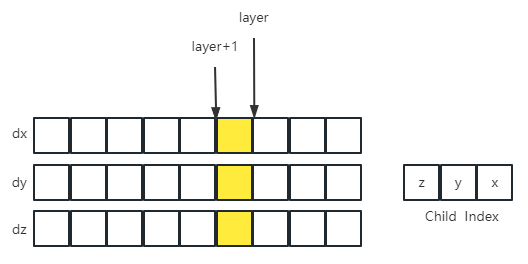

  此外，为了获得某个节点相对于父亲节点的索引值（Child Index），可以通过简单的运算取相应的比特位凑出Child Index。

  综上所述，这套编码可以很好地满足前文提到的五个性质：

- 快速计算出节点的包围盒数据
- 快速计算出节点相对于父亲节点的索引
- 根据输入的查询点和查询层级，计算出相应的节点编码
- 从一个节点编码出发可以快速计算父节点编码
- 从一个节点编码出发可以快速计算子节点编码

  此外，这套编码方式还有一个优点：

- 可以通过简单的运算快速计算出相同层级相邻节点的编码（8方向）

  采用这套编码表示八叉树的节点之后，一棵八叉树的所有节点可以保存在一个字典里。而对于寻路而言，在字典中没有叶子节点，只保留了已经划分的稀疏节点的编码]，对应的value是用于表示子节点是否阻塞的`blockFlag`。

```c#
Dictionary<UInt32,byte> tree;
```

#### 更进一步优化内存的方向

##  

  本文的寻路模块中，使用字典保存树的稀疏编码，字典会引入额外的内存开销。在C#中的字典，使用的是链接法解决冲突，有一个Entry结构体保存Key和Value，且使用一个next整数索引表示下一个节点的在数组中的位置，形成一个单向链表。Entry数组的长度会比插入的数据的长度大，且随着插入数据的增加，会自动扩容。另外，会使用一个名字为buckets的整数数组来保存链表的头节点的在Entry数组上的索引，这个数组和Entry数组一样长。因此会产生额外的开销。

  而对于寻路使用的八叉树来说，节点的总数是固定的，扩容是不必要的。而且，只有在加载的时候需要插入数据，而且是全部的数据。在后续使用过程中，需要频繁地查询这个字典，因此只需要保证查询效率和传统的字典一致即可。目前使用的是一个开源的修改后的字典([Github链接](https://github.com/youshuaixing/FixedDictionary))，这个字典去掉了buckets数组，虽然插入操作会稍慢一点，但是内存和查询效率都比传统的实现好。

#### 优化包体大小

##  

  本文寻路算法使用的八叉树是直接以二进制的形式保存在文件中，保存方法不是直接把Key和Value按遍历顺序保存到文件中，而是按树的先序遍历的方式把Value保存在文件中，除了保存一个字节的`BlockFlag`之外，还额外保存一个字节表示子节点的划分情况，记为`ChildrenFlag`，与`BlockFlag`类似，每一个比特位表示对应的索引是否已经划分，这样做是因为在加载的时候需要基于这个信息来还原节点的编码。这样保存树的文件可以优化\frac{4}{5}54的内存，包体也就可以减小。

### 快速射线检测

##  

  在八叉树上进行射线检测，计算与射线相交的最近的阻塞节点，在平滑路径时会用到。而如果每一次射线检测都需要从根节点逐层向下检测，由于需要判断射线与包围盒相交的最近距离，需要遍历的节点会增多。而本文的实现方案中，采用自底向上的方式进行求交计算，相交的第一个阻塞节点即为最近的点，比从根节点开始检测的方案稍微快一些。总体的算法的流程如下图所示：

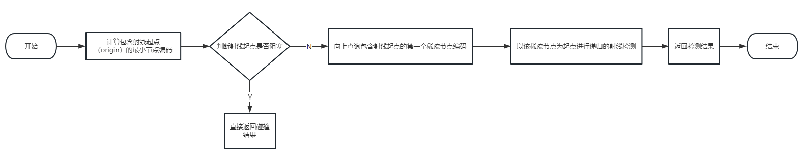

  算法的总体流程首先计算包含射线起点的最小节点的编码，然后判断射线起点是否处于阻塞节点之中。当判断为阻塞时可以直接返回结果，不为阻塞时则射线可以和周围的节点相交。因此就需要计算当前八叉树中包含射线起点的最小稀疏节点，这是通过第一步中计算的最小节点编码逐层往上计算父节点编码来得到的，当计算得到的编码在字典中时，就表示该编码表示的是一个稀疏的节点。最后以该稀疏节点为起点，计算射线在该节点空间内的相交结果，射线检测的过程是递归进行的，首先将计算出射线与该稀疏节点的子节点包围盒的相交结果，记录相交子节点的索引，并根据相交距离按由小到大的顺序进行排序。被记录的子节点有两个约束条件：

- 该节点不是被屏蔽的节点
- 该节点不是自由空间节点

  得到相交子节点的顺序之后，逐个进行遍历并判断：

- 遇到阻塞节点时，直接返回射线检测的结果
- 遇到非阻塞节点时，则检测计算射线与该节点内部子节点的相交情况（向下递归的过程）

  由于进行了排序，这可以保证第一个相交的阻塞节点即为最近的相交结果。由于每一层子节点的数量不是很多，且记录方式是逐个添加到集合里的，因此非常适合用插入排序。

  当向下递归并没有发生相交时，那么射线就可能与更高层级节点中的子节点相交，此时需要向上递归，重复上面的过层，同时屏蔽掉当前节点。最坏情况是向上查询到根节点，退化到从根节点开始向下查询。

  下面这张图是射线与树上的节点求交的示意图

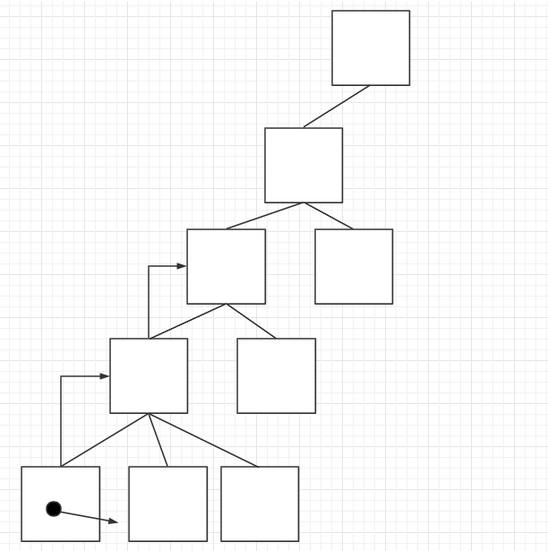

### 总结

##  

  使用稀疏八叉树为场景划分寻路空间会面临内存较大的问题，删除阻塞节点可以节省大部分内存。对八叉树节点进行编码可以更进一步地压缩内存，但是在遍历的时候需要根据编码解算出节点的空间数据。在编码后的八叉树上定位一个坐标点所在的节点，可以通过位运算计算得到，缺点是对于浮点数，会存在1m左右的误差。射线检测采用自底向上的方式进行检测，可以较快地得到相交的阻塞节点。

## 寻路算法设计

##  

  在游戏中，最常用的寻路算法就是A*算法和A*变体。A*算法基于优先队列定义一个OpenSet，把寻路节点插入到集合内。基于下面的公式计算节点的优先级。

f(n) = g(n) + h(n)f(n)=g(n)+h(n)

  其中g(n)g(n)是节点nn距离起点的距离代价，h(n)h(n)是节点nn距离终点的距离代价。f(n)f(n)是节点n的综合优先级。

  A*算法在运行过程中，每次从优先队列(OpenSet)中取出综合优先级f(n)f(n)最小的节点进行扩展。算法的伪代码如下：

```c++
Initialize OpenSet and CloseSet;
OpenSet.Add(StartNode, 0)
while OpenSet is not Empty:
	CurrentNode = OpenSet.Dequeue()
    if CurrentNode.position == TargetPosition:
		TargetNode = CurrentNode
		break
    foreach adjacent node of CurrentNode:
		OpenSet.Add(adjacentNode, f(adjacentNode))
    ClosetSet.Add(CurrentNode)
PathPoints = MakePath(TargetNode)
return PathPoints
```

  代码非常简短，但是对于三维空间寻路，需要做一些改动，同时在改动之前，通过网络搜集了一些A*算法的变体及A*优化的思路，并将它们改造为适合基于稀疏八叉树在三维空间中寻路的算法。

### A*算法的变体

##  

  由于A* 算法自身可能扩展的节点非常多，导致效率降低，且得不到较优的路径，因此有必要根据不同的目的对A*算法进行改进。在介绍本文所实现的A*寻路算法之前，先介绍A*的优化方法和一些变体。在本文实现的寻路算法中，用到了加权A*和层级A*的思路，并在此基础上做了修改。以下介绍的算法中，只测试了Bug寻路算法和IDA*，JPS在考察之后认为不适合用在三维空间寻路中，JPS+可能比较适合，但是需要预计算跳点数据，是JPS的改进版本。BlockA*和ARA*没有进行尝试，只做一般了解。关于算法的介绍，就尽量使用通俗的解释，对其中的核心原理和关键步骤的证明就不做详细的说明了，有兴趣的读者可以自行搜集相关的资料。

#### 加权A*和ARA*(Anytime A*)^{[6]}[6]

##  

  加权A*是指在启发式函数上乘上一个大于1的膨胀因子\epsilonϵ，这样可以更快地找到一条路径，但不一定是最优解。这是将节点优先级计算公式改为下面的形式：

f(n) = g(n) + \epsilon h(n)f(n)=g(n)+ϵh(n)

  而ARA*是基于加权A*提出的算法。算法首先定义一个大于1的膨胀因子\epsilonϵ，然后在进行多次迭代，把膨胀因子减小到1，每减小一次膨胀因子，就重新计算一条新的路径，获得较优的路径。算法还增加了一个INCONS集合，是由于增加了膨胀因子导致节点的优先级的不一致性，有的节点被重复访问，且代价更低，这些节点被认为是不一致的节点，会被加入到INCONS集合里。在每一次迭代过程中，会把膨胀因子\epsilonϵ减少，然后计算INCONS集合中保存的节点的优先级，移动到OpenSet中，然后基于新的膨胀因子计算改进路径。文章还定义了膨胀因子减小的方法，使\epsilonϵ能更合理地减小到1。该算法在重复迭代优化路径时，重复使用了之前的计算结果（INCONS集合），因此在优化路径的过程中，扩展节点更少。与A*综合比较可以更快更好地计算出路径。而根据算法伪代码来理解，该算法可以在任意时刻重复迭代路径，在游戏中可以分帧进行优化和更新。不过本文没有实现ARA*算法进行测试，所以没有对比数据。

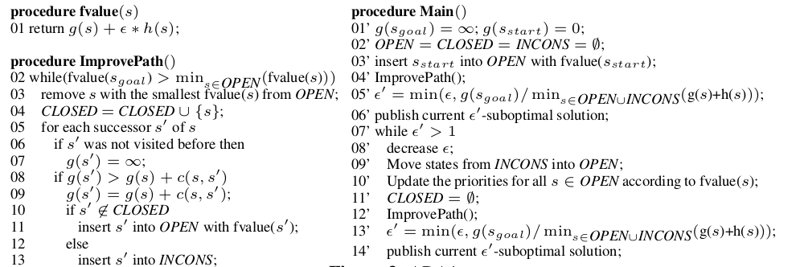

#### BlockA*^{[7]}[7]

##  

  BlockA*算法也是基于二维格子地图提出的路径规划算法。该算法把地图分块，称为Block。每一个地图分块的边界都会有连通点和其他分块相连。算法首先对起点和目标所在的地图分块进行处理。对于起点所在的分块，计算起点到所有连通点的连通距离，对于不可达的连通点，保持距离为一个无限大的值。对于目标点所在的分块，计算连通点到目标点的距离，对于不可达的连通点保持为一个无线大的值。然后基于A*算法进行计算，这里的A*算法扩展的节点为地图块，每一次从OpenSet中取出优先级最小的地图块，然后计算当前地图块到邻接地图块中，每个连通点的最小距离作为代价值(g(n)g(n))。在将邻接地图块加入OpenSet之前，需要计算邻接地图块的优先级。邻接地图块的优先级定义为所有连通点的优先级中的最小值。连通点优先级的计算公式和A*相同，即代价值(g(n)g(n))与启发值(h(n)h(n))之和。一直扩展到目标点所在的地图块，且扩展的连通点与目标点存在通路为止。

  该算法需要定义地图块和连通点，初步扩展需要计算起点到所有连通点的代价，在循环迭代中，还需要计算所有连通点的代价，同时还要查询连通点是否可达。因此该算法的效率受连通点数量和查询效率影响，在本文实现的三维空间寻路算法中，地图是用稀疏八叉树来表示，查询连通点是否可达需要寻路检测，会产生时间消耗。另外，实时计算连通点需要实时查询连通点的合法性（是否存在障碍物和阻挡），这里会产生时间消耗，可以通过预计算连通点解决这个问题，这就会产生内存消耗。对于静态地图而言，只要合理地定义地图块的大小以及控制连通点的数量和分布，应该可以获得较好的结果。本文没有在这个方向上进行尝试，只简单做了理论上的分析，该算法的伪代码如下图所示：

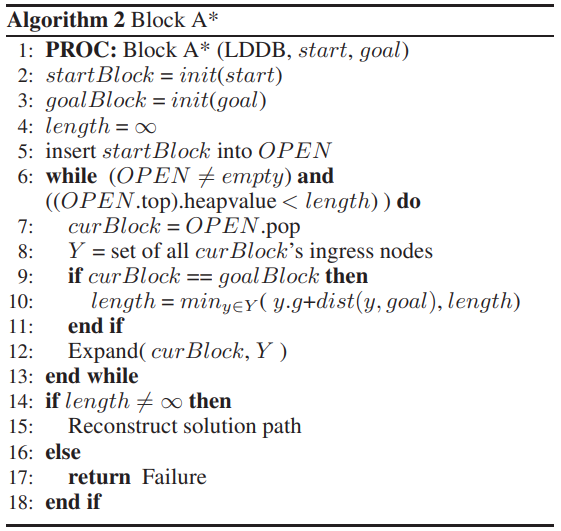

#### JPS和JPS+^{[8]}[8]

##  

  JPS算法也是跳跃点算法，也是A*的一个改进算法。选中的这篇CSDN博客^{[8]}[8]是实现和讲解比较清楚的。KM上也有相关的介绍文章^{[11]}[11]。JPS对A*的改进方法是限制加入OpenSet中的节点类型，在扩展节点时，查找方向总共有八个，分别沿着水平（2个）、竖直（2个）和斜方向（4个）查找下一个节点，找到以下两类节点则将其加入OpenSet，然后结束该方向的查找：

- 沿着水平或竖直方向查找，在障碍物旁边，且按斜方向走能够绕过障碍物的节点
- 沿着斜方向查找，在水平方向或竖直方向上进行检查，能发现第一种类型节点的节点

  这就是算法的总体思路，然而JPS算法虽然能够减少加入OpenSet的节点数量，然而所遍历的格子数量也是十分巨大的，本文的方案是用稀疏八叉树来表示地图，查找第一种类型的节点需要检查连续的障碍物的边界，经过测试，一次查询的时间开销是超过了1ms。在三维空间中扩展节点，就需要往26个方向进行扩展，每次扩展需要往6个方向查询第一类节点，是不可接受的。

  而JPS+就是预先把所有的跳点计算出来，在每个格子上进行标记，寻路过程中就可以省去逐步查询的过程，这一步改进可以极大地提高效率，且可以很好地解决死胡同问题，但是会产生额外的内存开销。本文的方案中，可以考虑实现这样的预计算，但是内存的开销没有进行估计，在考虑不增加额外的内存的前提下，这个方案暂时搁置。


#### Bug寻路算法^{[9]}[9]

##  

  Bug寻路算法是模拟虫子移动的过程，从起点往终点直接移动，遇到障碍物则绕着障碍物移动，直到认为绕开了障碍物再朝着终点移动。这些算法分为Bug1算法、Bug2算法和TangentBug。

  Bug1算法的运行过程为：

  从起点开始朝目标点前进，遇到障碍物则扫描障碍物边界，找到距离目标点最近的点作为绕行离开点，从该点离开后再继续朝障碍物移动，遇到障碍物再次重复这个过程。如下图所示：

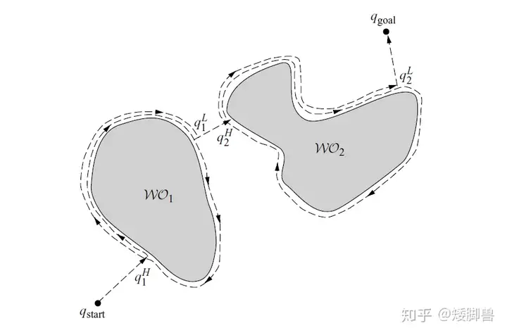

  Bug2算法的运行过程为：

  从起点和终点之间连一条线，然后从起点沿着这条线向终点前进，碰到障碍物之后，沿着障碍物边缘绕行，绕到与线相交的位置，然后再沿着线前进，重复这个过程，直到走到目标点为止。如下图所示：

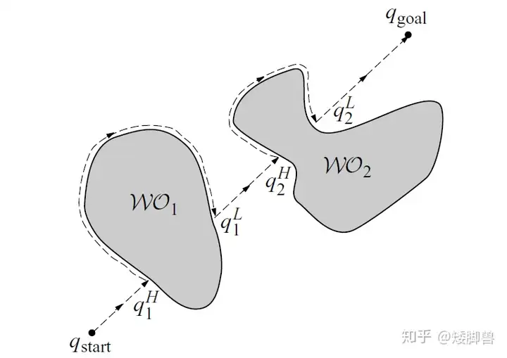

  Tangent Bug算法的运行过程为：

  设置一个探索半径，在朝着终点行进过程中，会探索前方障碍物的边界点，然后朝着距离终点较小的交点前进。绕开障碍物后再朝着终点前进，重复这个过程。如下图所示：


  针对上述三个算法，对于Bug1算法在寻路过程中，需要查询障碍物轮廓，确定绕行出口位置，因此这一步会比较耗时，不过如果设计出能够支持快速查询出口位置的地图数据结构，算法会非常快地找到通路。对于Bug2算法，当地图存在螺旋形的障碍时，可能会出现极端的情况，如下图所示。对于Tangent Bug算法，需要检测障碍物边界完成绕行，因此检测消耗会很大。

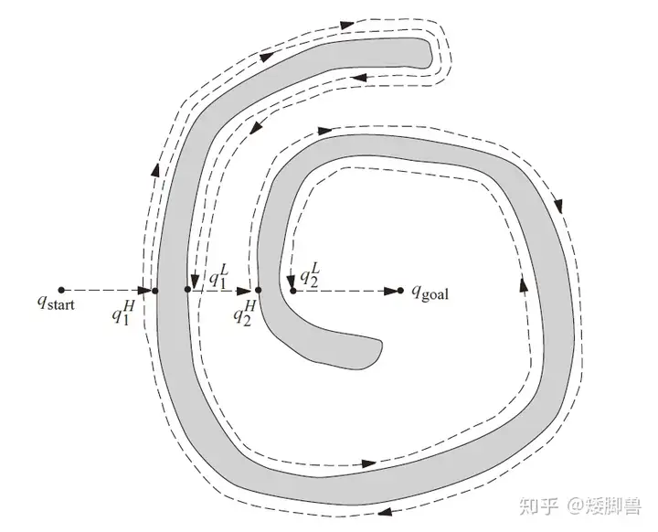

  本文在探索阶段，改进Bug1绕行算法，基于A*框架实现了适用于稀疏八叉树的版本，但是需要依赖射线检测确定绕行节点。如果单方向绕行，可以很快寻到通路，如果往六个方向绕行，耗时和普通A*的实现相当。

#### IDA*^{[10]}[10]

##  

  IDA*算法与传统A*算法不同的是，IDA*算法是基于深度优先搜索进行的，算法设置一个距离阈值，然后基于该阈值进行深度优先搜索，如果找不到路径将阈值增大再重复搜索过程。下面是IDA*的伪代码，本文在探索阶段尝试将深度优先搜索和改进后的Bug1绕行算法结合在一起， 对于远距离寻路可以快速计算出可通行路径，当终点处于障碍物较高且密集的位置，当邻近终点时，射线检测失败的几率增大，耗时会有所增加。
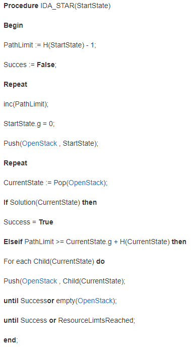

### 三维空间A*寻路算法的实现思路

##  

  本文要实现的三维空间寻路算法，使用稀疏八叉树表示场景地图，然后在基于迭代A*的基础上，进一步修改优先级函数f(n)f(n)引导扩展方向。对加入OpenSet的节点增加限制条件，减少加入OpenSet的节点的数量。在此基础上，对地图进行分块处理，实现层级A* 分段寻路算法。

  寻路模块主要分为两个大部分，一个是烘焙场景地图，另一个是寻路算法。

#### 寻路地图烘焙

##  

  在烘焙地图数据之前，需要策划提前配置烘焙参数。这其中包括要烘焙的地形，大世界地图的范围以及缩放系数，大地图中每个分块在寻路空间的大小，连通点的生成参数，洞窟的范围和缩放系数，烘焙文件输出目录。烘焙流程支持全局重新烘焙和局部烘焙两种方式。局部烘焙指的是单独对大世界地图局部烘焙，重新生成连通点，重新烘焙所有洞窟，局部烘焙的模式是加载已经全局烘焙好的数据，然后删除对应部分再重新添加。

  寻路地图烘焙包括外部大地图的烘焙以及洞窟的烘焙两个大流程。同时还定义了两个空间：寻路空间和世界空间。本节先介绍烘焙的流程，然后介绍流程的每个部分的具体实现。

##### 烘焙流程

##  

  烘焙开始时，根据策划框选的范围，计算最终的烘焙范围和地图分块数量。由于定义了寻路空间和世界空间以及它们之间的缩放系数，可以直接基于策划框选的世界空间范围计算每个分块在世界空间的大小，进而计算出分块数量。

  然后获取场景中所有碰撞器，并对碰撞器进行过滤，烘焙只会保留BoxCollider和MeshCollider。并基于一定的过滤条件将不需要的碰撞器去掉，最终剩下的碰撞器就是场景中的物理碰撞器。

  有了全场景物理碰撞器之后就进行烘焙大世界地图的每个分块的八叉树数据。具体的过程将在后文介绍。

  烘焙大世界地图之后，就是烘焙洞窟相关的八叉树。这将在后文进行介绍。

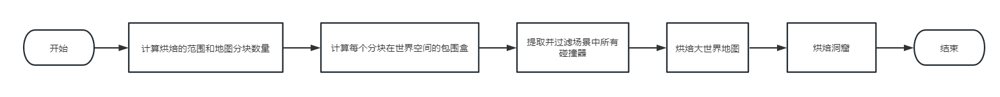

##### 世界空间与寻路空间

##  

  世界空间指的就是平常所说的世界空间，这个很好理解。寻路空间指的是八叉树自身空间，寻路算法是在寻路空间中进行的，输入的世界空间的数据（位置坐标，距离和包围盒数据）需要转换到寻路空间，并计算出路径并对路径进行平滑。寻路算法输出的路径是在寻路空间中的，需要将寻路空间中的数据转换到世界空间。这里就需要定义一个转换方式。


  寻路空间相当于在地图分块中，世界空间的一个局部空间。如下图所示，蓝色区域是地图分块包含的世界空间大小，绿色区域表示是的是寻路空间，两个区域的左下角是重合的，这是寻路空间原点在世界空间的位置。两个区域都是立方体，因此它们之间会存在一个缩放比例系数（Scale）。图中，白色线所指向的点是世界空间的一个点，将其转换到寻路空间指的是计算它相对于寻路空间原点的偏移量，并进行缩放，得到的结果就是寻路空间中的点。从寻路空间到世界空间的转换是一个逆的过程。

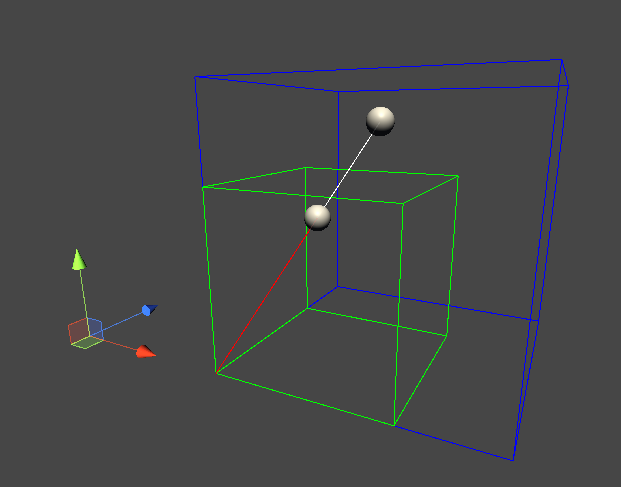

  Scale的计算公式和转换公式如下：

Scale = \frac{World_{size}}{Cell_{size}}\\ P_{cell} = (P_{world} - Origin) / Scale\\ P_{world} = Origin + P_{cell}*ScaleScale=CellsizeWorldsizePcell=(Pworld−Origin)/ScalePworld=Origin+Pcell∗Scale

##### 烘焙范围和地图分块

##  

  烘焙范围是由策划自己手动配置的一个范围，如下图所示，最外层的绿色框是配置的大世界的范围。

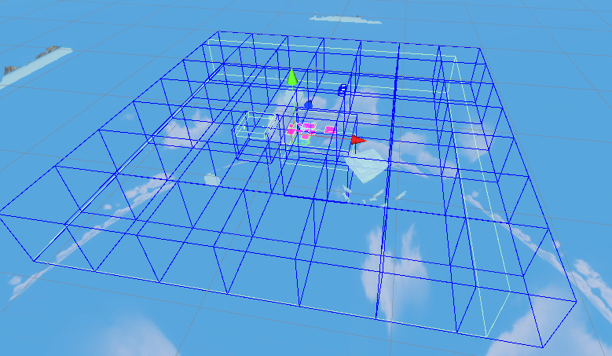

  此外，策划还需要配置一个缩放系数和每个地图分块在寻路空间的大小，由此可以计算出每个地图分块在世界空间的大小。然后基于该尺寸，可以计算出大世界范围在每个方向上的分块数量。策划配置的范围往往是不均匀的，因此需要在此基础上进行膨胀，使每个地图分块成为立方体，膨胀保持顶面不变，往下方向和有方向扩张。

World_{size} = Cell_{size} * ScaleWorldsize=Cellsize∗Scale

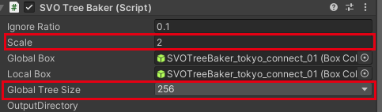

##### 大世界地图的烘焙过程

##  

  大世界地图的烘焙开始之前，首先提取全场景的物理碰撞器。有了全场景物理碰撞器之后，对于BoxCollider，会基于它的世界空间包围盒生成每个面的三角形数据，对于MeshCollider直接从Mesh网格中获取模型空间的三角形数据并转换到世界空间。烘焙大地图的过程就是构建每个地图分块的八叉树，构建过程是将三角形数据逐个插入相交地图分块的八叉树中，计算出稀疏节点，并设置相关的阻塞标记并阻塞节点。三角形与AABB的相交采用分离轴定理判定，并且做了一定的优化。

  有了地图数据之后。就有了生成连通点分块的基础，连通点生成算法需要构建一个全局的连通域，然后根据一定的规则生成连通分块，连通分块包含的是一系列连通点，处在相邻的两个地图分块之间的连通面上。生成算法将在下文介绍。

  随后，在单个地图分块中，计算每个连通分块之间的连通权重。这里可以使用直线距离粗略地表示，也可以使用寻路算法精确地计算出路径长度，这两种方式会影响烘焙时间。


连通点的生成算法 连通点的生成需要构建一个全局的连通区域（Section）。这个连通区域是由一系列附着在地图分块包围盒平面上的自由空间组成。

  计算附着在某个包围盒平面上所有的自由空间，是从八叉树根节点开始，一直往某个方向遍历得到。得到所有的自由空间后，需要对它们进行聚类，生成该平面上的连通区域，聚类的过程从单个自由空间出发，取所有和它相邻的自由空间作为一个连通区域，递归地进行这个过程，直到将所有自由空间归类完成为止。此外，对于每一个连通区域，还需要计算该区域的边界与相邻地图分块的连通点，这些连通点会用来与相邻地图分块的连通区域做连通性测试。这个过程就是平面连通区域的生成算法。下图是连通区域的示意图，图中用不同颜色标注了不同的平面连通区域，这其中还包括在地形内部的连通区域，这部分连通区域是需要剔除的部分。

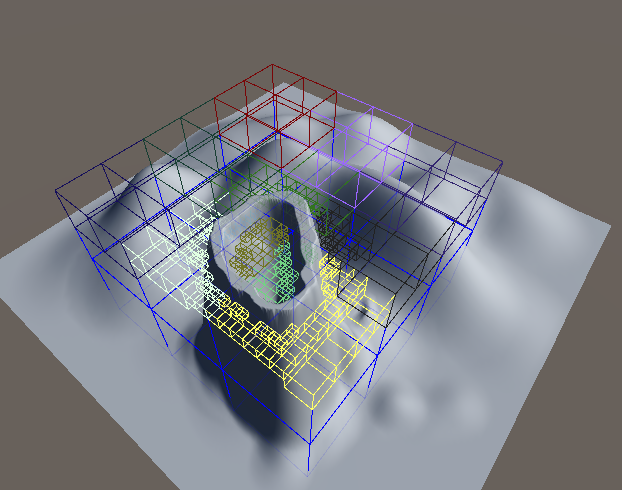
  一个连通区域包含的数据和解释如下图所示：
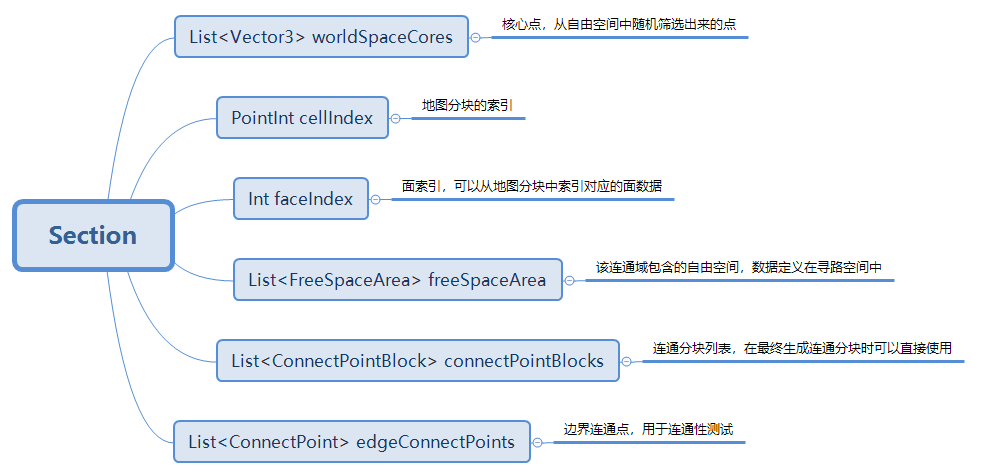

  有了平面连通区域的生成算法，就可以构建一个全局的连通区域（Global Section）了。下图是构建全局连通区域的流程，全局连通区域的构建是自顶向下进行的，首先构建出整个顶部的连通区域并对它们进行合并，然后从中选择一个顶部面积最大的全局连通区域作为寻路地图的全局连通区域。然后以此为基础，自顶向下生成其他面的连通区域并与全局连通区域进行连通测试，测试通过的区域会并入全局连通区域，该过程会遍历所有地图分块，连通性测试是基于寻路算法进行，为了加速这个过程增加了OpenSet节点总数的限制。最后最终全局连通区域中，构建每个地图分块上每个面的连通点，连通点由起点和终点组成，起点直接取连通区域中自由空间的中心点位置，终点是由起点出发，沿着连通面法线延伸计算出在下一个地图分块中的位置，该过程会忽略位于最顶部的连通区域，最后将距离较近的连通点合并成连通分块（Connect Point Block）并估算连通分块之间的寻路权值。


  下面这张图是最终构建出来的全局连通区域中，自由空间的分布情况。


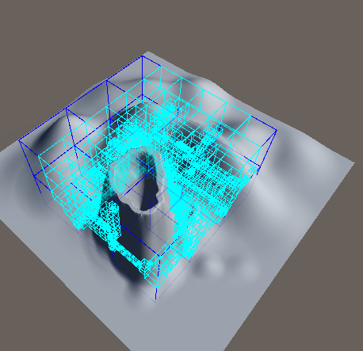

##### 洞的定义及其烘焙过程

##  

  “洞"（Hole）是在大世界地图中被单独拎出来的一个区域。这是有必要的，原因有以下几点：

- 洞窟内的障碍物比较密集，基于外部大世界使用的缩放系数烘焙的结果，无法寻到洞里的路径
- 洞窟跨越地图分块且洞窟内只对一个地图分块有出口，在进行跨地图分块的寻路时会走进死胡同里

  为此，就需要手动地标记地图中哪些部分是“洞”并且设置洞的出入口，然后配置烘焙使用的缩放系数。

  第一个需要手动配置的是洞的范围以及洞的出入口（在代码中，称为 门 door），如下图所示，蓝色框的范围表示的是外部大世界的某个地图分块，绿色框的范围是手动标注的洞的范围，内部黑色部分就是洞的几何构造，红色部分表示的是洞的出入口，在出入口两侧有两个点表示互相连通。

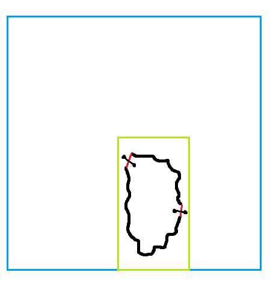

  在寻路算法中，需要判断一个点是否在洞内部，就需要在烘焙时做一些特殊处理。为此，在烘焙时把上图中洞的门口以及洞外部的区域都标记为阻塞的，如下图所示，一个点在洞内的判断条件如下：

- 在绿色框之内的非红色区域中

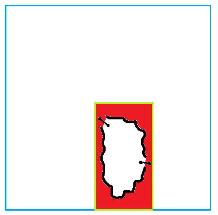

  在洞内的判定会有误差，即如果需要判断的点是在绿色框内，黑色边界的表面，就会误判，因此，寻路的起点和终点都需要避免设置在这些位置。

  对于洞的烘焙系数，提供了多个选项可以选择，如下图所示，策划需要设置世界空间中要支持的最小精度，这个选项是洞在世界空间的范围计算出来的，由策划手动框选。根据这个最小精度会自动地计算出其他参数。配置好之后可以验证配置的是否正确，验证会简单检查洞的每一个门口，对于门外的点，检查是否已经是阻塞状态，对于门内的点，检查是否处于非阻塞状态，这可以检查设置阻塞区域时是否正确。第二个对门的内外两个点进行寻路，这样可以检查是否有镂空的现象。策划配置一个洞区域之后，可以自行检查配置是否正确。
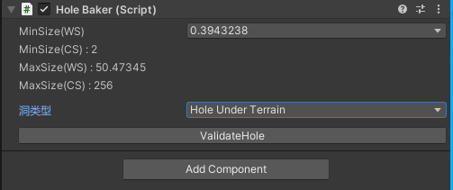

  洞有两种类型：

- Hole Under Terrain
  - 指的是洞是由Mesh模型构成，不需要考虑地形的影响
- Hole Over Terrain
  - 指的是洞的某些部分是由地形封闭的，在烘焙时会把地形考虑进去

  烘焙洞的流程如下图所示，首先从场景中提取出在洞范围内的所有物理碰撞器并转换成洞的寻路空间的三角形列表，然后将三角形插入到表示洞的八叉树中，对八叉树进行划分，接着从门外的连通点出发，将门外的自由空间设置为阻塞区域，紧接着，查询和洞有覆盖的所有地图分块，将洞的索引（整数索引）和门添加到地图分块中，最后针对每一个覆盖到的地图分块上的连通分块，计算连通分块和门之间的连通权值。
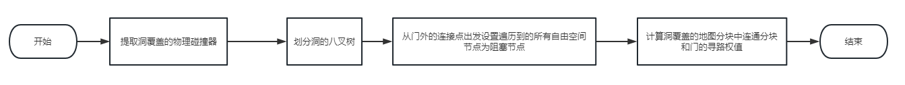

  本文采用稀疏八叉树划分场景，用来表示寻路空间。在稀疏八叉树中，存在着许多空间是没有被障碍物覆盖，这些空间大小不一，且分布不均匀，这些空间称为自由空间。如果空间中两点存在通路，那么这条路径一定穿过一系列彼此相连的自由空间。自由空间属于八叉树上没有被划分的节点，因此不会占用内存，在寻路过程中，可以在树上查找顶点所在的自由空间。如果某个节点的`blockFlag`的第ii位置0且在字典中查不到相应子节点的编码，则表明该节点的第ii个子节点没有划分，该子节点所表示的空间即为自由空间。在自由空间中，任意两点都是可达的。如果有了自由空间的AABB包围盒，可以轻易计算出顶点沿着某个方向移动穿出自由空间的位置，然后查询新的位置所在的自由空间，当新的位置被阻挡时，算法会选择其他方向作为下一个扩展节点。

  另外，自由空间属于未划分的节点，在自由空间附近，很可能存在着障碍物，自由空间的尺寸越小，周围存在障碍物的几率越大，且更密集，绕行节点就会更多，寻路效率降低。同时，沿着某个方向移动的距离受自由空间尺寸直接影响，尺寸越小，移动的距离就越短，寻路效率也会降低。因此，在算法设计中，可以通过两种方式来限制自由空间的大小。一个是增加节点加入OpenSet的条件，忽略小于阈值的自由空间。二个是在估价函数中的计算中，考虑尺寸的影响，本文设计的算法使用下面的估价函数，获得不错的效果。其中，代价值g(n)g(n)取节点n与起点的直线距离，启发值h(n)h(n)取节点n与目标点的直线距离并乘以膨胀系数，最后减去自由空间的长度，表明自由空间越大，优先级越高。这里可以给尺寸再乘以一个系数，例如1.2或1.5，此时函数更能够引导节点往更大尺寸的自由空间前进。

f(n) = g(n) + 2.5*h(n) - freeSpace.sizef(n)=g(n)+2.5∗h(n)−freeSpace.size

  不过仅仅考虑沿着某个方向穿越自由空间是不够的，考虑下面这种情况，上面的白球表示起点，下面的蓝球是目标点，障碍物只在场景下方且白色球正下方有障碍物。场景中的八叉树只在下半部分划分了节点，天蓝色描边的区域是起点所在的自由空间。右图是从X轴负方向观察的结果。如果白色球尝试向下穿越自由空间时，会发现被阻挡，穿越无效。往其他方向穿越当前自由空间之后，所在的位置的正下方仍然是障碍物，在扩展过程中，就永远被阻碍导致找不到通路。

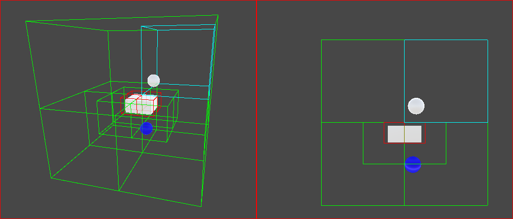

  然而上图中，可以很明显地发现存在可通行路径。那么寻不到路的原因是在扩展自由空间的时候，只考虑直接穿越当前空间，而对自由空间的子空间探索不够充分。因此算法除了要考虑穿越当前自由空间之外，在计算下一个位置时，可以移动到子空间所在的位置。下图可以很好地说明，当前节点应该扩展的方向，这里顺带一提，一个自由空间的子空间仍然是自由空间：

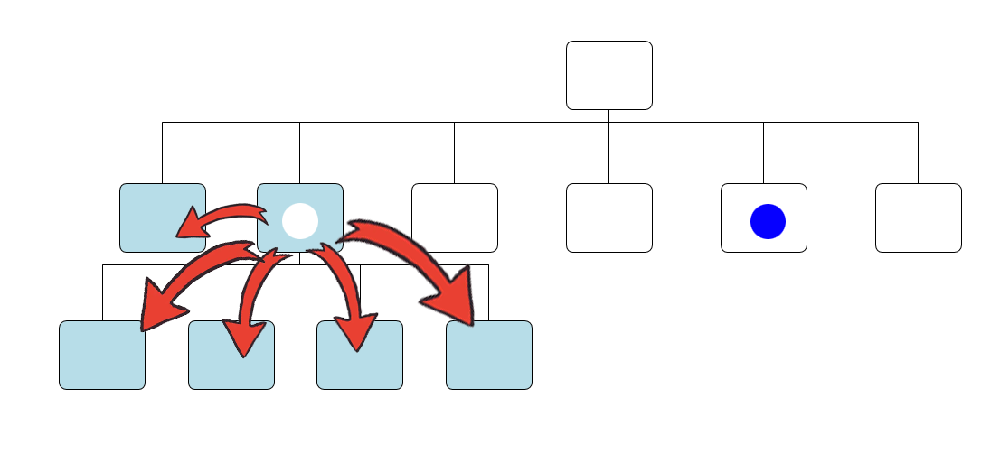

  下面是本文实现的基于稀疏八叉树的三维空间寻路A*算法的实现思路。

```
算法目标：移动一个盒子，直到该盒子与目的地盒子在同一个自由空间。
算法思路：总在树上寻找自由空间。在目的地所在位置也是一个自由空间的前提下，顺着这个思路去总能找到。
自由空间定义:八叉树上没有被划分的子空间
1. 查询起点在八叉树中的自由空间，加入OpenSet，权值为0
2. 查询目标点在八叉树中的自由空间
3. While OpenSet不为空 Then
4.  从OpenSet取出需要扩展的节点，即当前节点
5.  如果当前节点的自由空间包含目标点，则算法结束
6.  从当前节点所在位置往6个方向（上下左右前后）移动，计算邻接的自由空间
7.  	如果当前点位置与目标点的距离 < 距离阈值 or 邻接自由空间的尺寸 > 尺寸阈值
    	则计算新的位置的权值，并将该自由空间加入OpenSet
8.  如果当前点的位置与目标点的距离 < 距离阈值 且 当前自由空间的尺寸>尺寸阈值
    则计算当前自由空间的所有子空间并加入OpenSet，以子空间中心位置为参数计算权值
9. 如果找到了目标点，则计算路径并进行平滑处理，返回最终的路点
```

#### 层级A*的实现思路

##  

  层级A*算法是将大地图进行分块，然后寻路时，首先在高层分块中先寻找分块之间的连通路径，然后再在小分块中寻路，获得最终的路径^{[12]}[12]。在Cell层级的寻路算法中，需要把洞当成一个特殊的区域，当判断目标点在洞内时，Cell层级的寻路方向要往洞的方向扩展。在游戏中，算法每次执行寻路任务时首先会计算Cell层级的寻路结果，然后可以把寻路任务分为多段进行，当Agent移动到下一个地图块时，使用新的八叉树计算新的路径。这样可以把寻路摊销到多帧进行。此外，当玩家介入操作时，可以停止移动，并终止寻路任务。

  另外需要注意的是，Cell层级的寻路是在世界空间进行的，但是判断起点和终点是否在洞内时，需要转换到对应的寻路空间中。在寻路算法中，所有数据都需要转换到寻路空间中，计算出结果后在转换到世界空间。

##### Cell层级寻路算法

##  

  Cell层级的寻路算法同时考虑了大地图的分块（Tile Cell）和表示洞的分块（Hole Cell）。目前实现的算法只支持以下三种情况：

- 外部世界->洞内
- 洞内->外部世界
- 洞内->外部世界->洞内

  因此算法首先判断起点和终点是否在洞内，获得对应的Cell（Tile Cell或Hole Cell）。如果起点和终点在同一个Cell内，则直接在该区域内寻路。否则继续计算Cell的路径。因为数据量不是很大，该路径的计算方法可以有很多种，例如BFS、Dijkstra、A*都行。本文仍然使用A*计算Cell的路径。算法的流程如下图所示，在进行A*寻路之前，首先判断起始点所在的Cell是否洞，根据判断结果来进行一个初始的扩展，初始化OpenSet。然后进行A*寻路的过程，最后寻路结果。

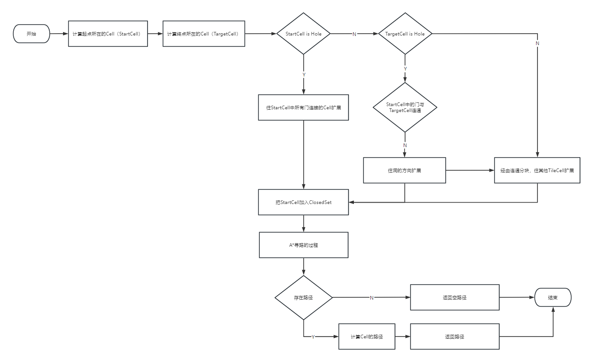

  寻路算法中，OpenSet中保存的节点数据的含义为：前一个Cell经由XX连通点（门或连通分块）进入到当前Cell。然后从当前Cell会选择其他连通点进行扩展。

  对于从OpenSet中取出的节点，有以下两种情况，同时列出扩展方法：

- 前一个Cell是HoleCell
  - 计算获得从HoleCell出来之后的TileCell
  - 如果TileCell是TargetCell表示找到了目标，计算路径并返回，否则继续下面的步骤
  - 如果TileCell已经在ClosedSet中则忽略，否则继续下面的步骤
  - 获取进入TileCell的门
  - 如果TargetCell是HoleCell且TileCell中有门与TargetCell连接，则往这些门的方向扩展，并进行下面的步骤
  - 筛选启发值最小的连通点分块，往其他TileCell扩展
- 前一个Cell是TileCell
  - 判断是从门进入的，则可以直接放回结果（因为往洞方向扩展时，只会走和目标相连的门），否则进行下面的步骤
  - 计算当前TileCell
  - 如果TileCell是TargetCell表示找到了目标，计算路径并返回，否则继续下面的步骤
  - 如果TileCell已经在ClosedSet中则忽略，否则继续下面的步骤
  - 如果TargetCell是HoleCell且TileCell中有门与TargetCell连接，则往这些门的方向扩展，并进行下面的步骤
  - 筛选启发值最小的连通点分块，往其他TileCell扩展

##### 多段寻路

##  

  在Cell层级寻路中，获得Cell的路径之后，路径上的起点是可以确定的，因此首先会计算第一段路径。然后角色沿着路径移动，当角色位置与出口点的距离小于一定阈值之后，会计算出口点到下一个连通点起点的路径。如果下一个目标是门上的连通点或者目标终点，则只计算一条路径即可，如果是连通分块，连通分块上的连接点很多，因此就需要筛选较优的路径作为下一段新的路径。这里对路径的筛选并没有在一帧内完成，而是分帧进行计算，这样可以把每一帧的时间消耗降低。筛选新的一段路径，把路径平滑之后返回给应用层，由应用层根据路径来移动角色，如此循环直到走到目标终点。

### 平滑路径的方法

##  

  在寻路算法中，可以使用漏斗算法对路径进行平滑，然而在本文实现的三维空间寻路算法中，漏斗算法需要修改为适合在三维空间中的形式，这需要在路径上计算连续的三角形网格，然后再从起点开始处理。但是稀疏八叉树是支持射线检测的，因此本文的平滑路径的方法是直接使用射线检测，删除不必要的路径点，把路径拉直。这里有两个优化方向：

- 路径点是有顺序的，在平滑路径时，可以使用二分法进行射线检测，这里就不进行详细介绍了
- 角色可以一边移动，一边平滑，这就需要给应用层提供接口来做这样的操作
- 上面两个方法可以组合使用，具体的实现方法也不做详细的介绍了。

### 寻路地图的流式加载方案

##  

  上面已经介绍了寻路插件的烘焙过程和寻路算法的介绍。下面介绍寻路地图的流式加载方案。由于地图是分块的，并且其中还划分了洞的区域。为了避免同时加载所有数据引起的运行时内存开销，可以根据Agent的位置对相应的八叉树数据进行加载和卸载。主要的思路如下：

- 给每个Tile Cell定义加载距离(load padding)和卸载距离(unload padding)，卸载距离大于加载距离。
- 将Agent注册到流式加载器中
- 根据注册的Agent所在的位置，做如下判断
  - 对于所有已经加载的Tile Cell，判断Agent是否已经在Unload Padding之外的范围且该Tile Cell没有被锁定。如果在则卸载该Tile Cell的八叉树数据
  - 对于Agent周围的Tile Cell，判断Agent是否在Load Padding范围之内，如果在则加载该Tile Cell
  - 对于所有已经加载的洞，判断Agent是否在洞的包围盒之外，如果在则卸载该Hole Cell
  - 对于所有的洞，判断Agent是否在洞的包围盒内且该Hole Cell没有被锁定，如果在则加载该Hole Cell

  除此之外，还提供可以强制加载和卸载Cell的接口。

  以上加载和卸载的流程都是异步进行的。因此，在寻路模块中，要等待数据的加载完成后才能开始进行寻路。寻路开始时，由于要判断起点和终点是否在洞中，因此需要强制加载可能包含起点和目标点所在的洞，判断完成后会通知流式加载器执行卸载操作。在寻路中，会一直占用某个地图数据，因此在寻路开始之前，会通知流式加载器锁定被占用的Cell，当该Cell没有被加载时，则等待加载完成之后才开始寻路，寻路完成后会通知流式加载器，释放被占用的Cell，流式加载去会判断被释放的Cell是否满足卸载条件并进行卸载。


##  参考资料

##  

[[1\] 基于稀疏体素八叉树(SVO)的3D空间寻路方案](https://km.netease.com/article/362935)

[[2\] 3D寻路解决方案——NavBound](https://km.netease.com/topics/topic/5329/item/72928)

[[3\]《天谕》手游的体素方案实践](https://zhuanlan.zhihu.com/p/357242050?utm_id=0)

[[4\] 3D Navigation for Games in UE4 & Unity | Mercuna](https://mercuna.com/3d-navigation/)

[[5\] 光线跟踪加速第二节](https://www.bilibili.com/video/BV13441127CH?p=10&vd_source=3c157a29d0c66319c2089c40c621c2a9)

[[6\] ARA*: Anytime A* with Provable Bounds on Sub-Optimality 翻译](https://zhuanlan.zhihu.com/p/161208717)

[[7\] Block A*: Database-Driven Search with Applications in Any-Angle Path-Planning](https://www.aaai.org/ocs/index.php/AAAI/AAAI11/paper/viewFile/3449/3819)

[[8\] JPS(jump point search)寻路算法 - CSDN](https://blog.csdn.net/LIQIANGEASTSUN/article/details/118766080)

[[9\] Bug算法(Bug Algorithms)简介 - CSDN](https://blog.csdn.net/weixin_43619346/article/details/108080861)

[[10\] IDA*算法 - 百度百科](https://baike.baidu.com/item/IDA*算法/3683332?fr=aladdin)

[[11\] JPS/JPS+/GB三种寻路算法的实现、性能对比及其他_网易KM (netease.com)](https://km.netease.com/article/398252)

[[12\] 大规模寻路算法优化](https://www.cnblogs.com/devilmaycry812839668/p/10525727.html)