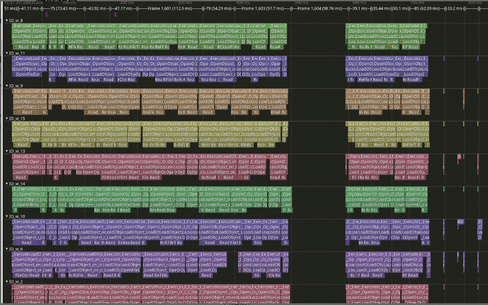
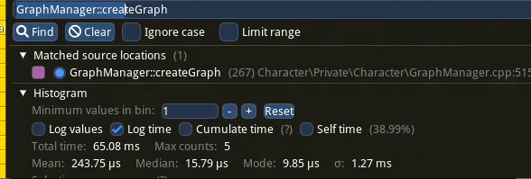
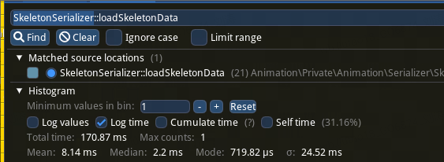
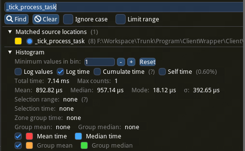
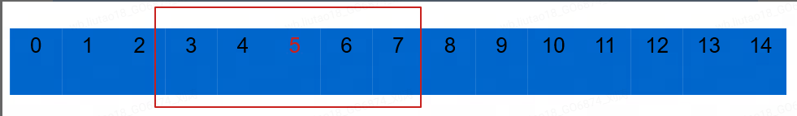

## **复杂模型资源加载卡顿优化**

资源加载优化一直是游戏开发中绕不开的话题。模型的创建伴随着网格、材质、骨骼以及动作等资源的加载，是游戏运行期间比较常见的IO操作。本篇文章结合H74中较为复杂的模型-船只来分享一下复杂模型加载期间IO卡顿的一些优化方向。

## 前言

资源加载优化一直是游戏开发中绕不开的话题。模型的创建伴随着网格、材质、骨骼以及动作等资源的加载，是游戏运行期间比较常见的IO操作。本篇文章结合H74中较为复杂的模型-船只来分享一下复杂模型加载期间IO卡顿的一些优化方向。

## 问题背景

作为航海冒险题材开放世界游戏，船只是整个游戏流程中唯一的载具，也是非常重要的战斗单位。为了保证丰富的视觉效果和动作表现以及需要支持切换船只部件，船只除了船身主模型外，还会包含火炮、桅杆、船帆、船首像、船舵等大量零件模型，一些具有特殊表现的船只还会有一些单独的装饰性模型。这些挂接模型数量在50+，包含了大量高精度网格资源、纹理资源、以及骨骼和Graph资源（每个零件都可能有自己的动作表现）。游戏内动态创建船只时这些资源的加载会导致明显卡顿。

根据游戏玩法设定，玩家在局外选定一艘船只进入局内，在局内不可切换船只。局内的船只创建时机是在局外到局内的Loading过程中，这时由于Loading界面的存在所以卡顿感并不明显。而在局外出航前选择和切换船只的过程中需要实时向玩家展示不同的船只模型，并且由于要近距离展现给玩家所以和局内一样都是高精度模型。所以为了保证玩家在切换展示船只时流畅不卡顿，我们需要一套针对局内展示船只的模型资源加载卡顿优化方案。对于这种同时创建大量模型的操作我们采用的优化方式是：按需加载、异步加载、分帧加载、预加载和缓存、平台设备差异化配置。

## 按需加载

**创建时机：**

关于模型的创建时机常规操作是随场景一同创建。但如果玩家进入场景后并不是一开始就要看到模型，那么创建就可以滞后到模型即将出现在玩家视野时，避免不必要的IO和内存占用。这个时机需要依赖具体游戏设计。比如H74这边设定是船只是停在船坞里，玩家只有在通过电梯进入船坞时才会看到船只模型，其他大部分时间都是在主城其他地方活动。所以可以将加载模型的操作延后到玩家到达船坞电梯时。

**精简结构：**

最初在主城出航前的展示船只是使用局内真实船只的相同结构。由于船只包含了大量战斗相关的逻辑，自身会有很多功能性的组件和成员，通过性能分析工具可以发现这些组件和成员的初始化占据了大量耗时。而在出航之前，船只仅用于给玩家进行展示，所以并不需要携带这些复杂的逻辑和属性，可以将这部分排除掉。做法是单独创建一个只包含模型资源的专用展示船只结构。有点类似于赛车游戏，玩家在真正进入比赛之前看到的赛车其实可以只是一个“没有灵魂的躯壳“。

滞后了创建时机和精简船只结构到只剩模型后，下一步需要做的就是针对于模型资源本身的加载优化。

## 异步加载

H74这边模型的Mesh加载已经开启了异步。除了网格资源以外，骨骼和动画资源的加载也是造成卡顿的主要原因。

所以我们进一步将所有模型开启Skeleton和Graph的异步加载，依赖Messiah引擎提供的LoadSkeletonAndGraphDeferred函数，可以克服主线程加载的IO卡顿。需要注意开启Skeleton和Graph异步加载后需要将一些操作放到异步加载回调之后，比如Attach，否则可能导致表现上看起来没问题但引起引擎额外的开销。这里需要说明的是异步并不是万能操作。如果是网格和骨骼都很简单的模型，异步带来的收益并不高，甚至有可能是负优化。

## 分帧加载

虽然开启异步加载，但仍需同时去加载大量资源，IO压力还是很大。所以自然想到要采取分帧操作，目前的方案是加入零件模型的分帧任务管理器，创建船只模型时将所有零件模型的创建作为Task加入分帧任务管理器，通过配置决定每帧创建的模型数量，用此方法将大量的模型创建操作均匀分布在多帧中。这里更加极致的操作是可以设定每帧创建模型数量的上下限，根据当前帧耗时在上下限范围内实时调整当前帧要创建的模型数量。需要注意的是开启分帧后需要在所有挂接模型Mesh加载完成后再将船只整体显示，否则在帧率较低时可能会出现零件逐步显示的表现。在分帧加载期间可以做一些其他表现作为过渡比如低精度替代模型、特效等，亦或是直接不处理。这个要根据策划和美术设计来决定。参考PUBG在设备较差时，角色和载具展示场景切换载具时载具模型也是要等待一会才会显示出来并且没有任何过度表现。

​														每个帧任务主线程耗时表现

## 预加载和缓存

在玩家想查看可以用于出航的船只时，会有切换展示模型的操作，为了保证操作的流畅性，避免每次切换模型都需要等待一会才会显示出来的情况，所以需要对玩家可能进行操作的船只模型进行预加载和缓存，同时随着切换次数增加也需要有卸载操作来避免加载模型过多占用内存。预加载、缓存以及卸载策略同样要依赖具体游戏规则和玩法设计，也就是要去尽可能猜测玩家最可能以及最不可能要去操作的对象。以H74项目最初的设计为例，玩家要通过手柄摇杆切换或者鼠标点击UI上单行列表两侧的切换按钮来切换展示船只。由于每次只能切换一格，可以认为需要进行预加载和缓存的船只模型就是在UI列表中当前选中船只左右两侧的其他船只。反之不在附近的船只就可以认为是可以卸载的。所以我们采取类似滑动窗口的方式：设定最大缓存数量，每次玩家切换船只时，根据当前选择的船只和列表顺序进行预加载和卸载的检测。

后面随着游戏规则的迭代和操作优化，要求PC玩家可以通过鼠标点击任意船只图标进行切换。加入这种操作方式后玩家的行为就变得不可预测，有可能从当前船只跳过n艘船去查看另外一艘。这种情况下上面的滑动窗口机制因为每次操作预加载了不需要的模型而带来副作用。所以我们加入判断如果操作索引间隔很大的情况就停止预加载。计划是后续船只的设定稳定后根据输入设备不同采取不同预测机制：手柄模式下保留滑动窗口方式；键鼠模式下根据船只品质、等级、稀有度等属性去计算权重，根据权重设定预加载以及卸载优先级。

## 平台设备差异化配置

不可否认多平台游戏是未来中国游戏市场一种趋势。目前很多主流的头部游戏都有对多平台进行支持。由于平台设备的差异性，这对游戏优化工作来说是一个不小的挑战。任何方案都不能适用于所有平台，所以做好针对特定平台的差异化优化方案是非常重要的。

上面我们已经提到针对于主机玩家和PC玩家操作方式来决定使用不同的预测机制做模型的预加载。进一步来说预加载和缓存的数量对预测预加载机制一定是越多越好。缓存数量越多就越能支持玩家切换船只的速度，对于预测机制的容错也越高。但是对于设备来说更大的缓存量带来的内存开销也就越大。同样，我们希望分帧机制中每帧的任务数量越多越好，但事实是更大的任务量对CPU和IO带来的压力也就越大。所以我们将预加载和缓存数量针对不同平台去做配置。比如针对内存比较敏感的移动平台设备但是IO性能比较强，所以我们就降低预加载和缓存数量，然后适当提高每帧的帧任务数量。反之对于PC平台可来说内存可能不那么吃紧，反而IO性能成为了瓶颈。那么我们就适当增加预加载和缓存数量，降低帧任务数量。

需要注意的是上面只是笼统说法。事实是目前市面上即使是同一种平台中的设备配置也是五花八门，移动平台更甚。手游玩家的移动设备芯片代差巨大，即使是同代芯片由于架构不同也可能会产生不同类型的性能瓶颈。所以需要针对市面上大部分主流芯片做测试并且定制化配置。

所谓优化，就是要不断的测试和分析去从中找到平衡点。过程很艰难，但一定是一款优秀游戏走向成功的必经之路。