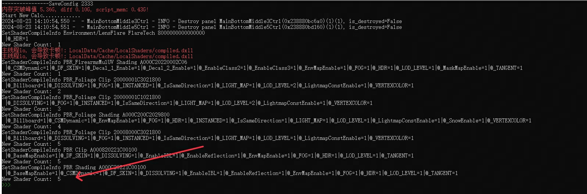
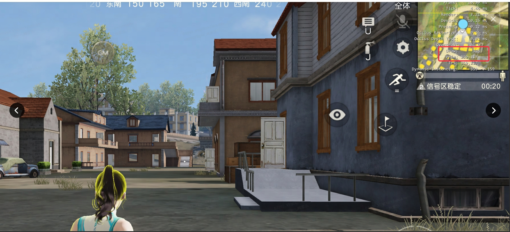

> 【专家作者】在游戏开发领域从业10多年，曾参与开发《英雄三国》、《荒野行动》等多个项目，过去2年带领组员深入性能优化相关的工作，现工作持续集中在性能优化和引擎方面 【导读】作为一款运营7年基于Messiah自研引擎的项目，随着《荒野行动》项目内容的开发和功能的累积，有不少值得关注的优化点。为了项目的长线运营和玩家有更好的体验，我们这2年做了很多优化的工作，卡顿的指标也不断向好，这里作一下总结

## 一 前言

《荒野行动》是一款基于Messiah自研引擎的项目，作为一款运营了7年的项目，随着项目内容的开发和功能的累积，有不少值得关注的优化点。为了项目的长线运营和玩家有更好的体验，我们近2年做了很多优化的工作，卡顿的指标也不断向好，因此，这里作一下总结，挑选一些值得案例进行分享，希望对大家有所帮助和启发。

以下所说的引擎版本解释如下：项目今年2024年准备上的是23引擎，目前线上的是基于21引擎，有各个小版本的更新。

## 二 Shader&PSO

《荒野行动》作为一款主要卖时装、载具皮肤、枪皮肤的游戏，而且游戏中画质设置开放了以下供玩家开关（会生成变种的主要是高动态范围效果hdr、局内阴影、环境反射IBL，抗锯齿（msaa）会生成新的PSO），

还有根据距离设置的三级shader lod，以上因素叠加的结果就是shader变种很多，我们曾经统计外服不同组合的shader变种有10+w。

所以，Shader变种多也是项目的一个特点，我们也无法缓存所有shader变种。我们做性能优化，其中的一个重点工作就是怎么**优化Shader编译和PSO生成的卡顿**。

#### 2.1 锁优化

在优化Shader的过程中，我们发现引擎会有锁的问题：**锁的等待会造成性能的下降**。通过分析，ShaderTechnique是全局共享的，如果对同一个ShaderTechnique发起Shader编译的话，就会有锁等待的问题，如下图所示：

大约在21版本的引擎，我们和引擎组修复了此问题：以前是一个大锁，后来引入更少颗粒度的锁（EnterShaderFeeding、ExitShaderFeeding），机制上只有相同Shader变种编译的情况下才会上锁。

不过，后来我们还发现了，删除ShaderCache的情况下，比较容易出现EnterShaderFeeding、ExitShaderFeeding都等待过长的问题，如下图所示：

通过分析，发现是读写锁在相互等待，特别是EnterShaderFeeding会一直拿着读锁sleep，所以这里需要在yield_thread之前释放读锁。

优化前的ExitShaderFeeding最长会占用50ms：

优化后的ExitShaderFeeding，不会再等EnterShaderFeeding的锁了：

除此之外，ShaderCache也是全局共享的，因此也会有锁的问题，如下图所示：

通过把ShaderCache相关的锁，都改成读写锁，因为有很多时候只是读shadercache，只有真正写的时候才需要写锁，可以减少上锁的概率和等待时长。

#### 2.2 全异步编译

既然我们不能缓存所有的shader变种，那么异步编译shader会是比较好的方案。对于安卓平台，在21引擎一直标榜的是可以全异步生成shader：即开一条新的Shader编译线程，进行编译Shader。但是，我们分析发现还有问题：**编译shader的步骤中还占用了Device线程（@dt），会导致渲染时长变长**。如下图所示，Device线程在编译shader，直接让当前帧消耗约500ms。

后来，大约在23年中，我们和引擎组解决了这个问题，全部塞到Shader新线程上编译Shader了，不会再卡device线程，编译如下图所示：

这个修改外放后，低端机的卡顿减少了很多。如下图所示，低端机在新引擎平均卡顿次数（最后一列）从29降到19：

####  

#### 2.3 异步PSO

**PSO的生成，和编译Shader一样，会使得渲染线程的消耗变长，使得帧率降低。**什么是PSO。PSO是PipelineStateObject的缩写，它是包括了所有渲染状态，包括blend, stencile, shader等。所以，PSO的数量会比shader的数量还要多。对于现代的图形api，如vulkan、metal，都会使用PSO记录渲染状态给底层提供信息进行渲染，所以PSO主要在ios上消耗特别明显，还有switch上使用的vulkan。生成PSO的消耗，如下图所示，消耗挺大的，一个PSO生成能占24ms：

可以看到，有GetRenderPipelineState中消耗的比较大，甚至有的创建时间超过了100ms。可以想像，一队人+一辆车从远处走过来，会创建一波PSO，就会引擎一波卡顿。同理，PSO我们是cache不全的，目前的机制是：动态人物，使用异步创建的方案；静态场景，因为有闪的问题，不能异步。

以下是刚进出生岛，没开异步的表现，可以看到帧率维持在10+fps：

以下是开了异步PSO的表现，可以看到帧率在30fps左右：

以下是某天为了修bug误关了异步PSO一天的对比数据，当天8点半左右的hot。可以看到，开异步PSO 2.7 vs 关异步PSO 4.5，总的来说，**在ios上PSO对我们的影响是非常大的，异步PSO是非常有效的**：

#### 2.4 虚拟命令

**异步，无论是异步编译shader还是异步生成PSO，都会带来一个问题，就是闪**。因为需要的渲染信息没有生成好，所以，虚拟命令就应运而生。虚拟命令的机制是指，从状态A切到状态B，发出虚拟渲染命令让状态B准备好，在B没准备好之前，还是用状态A渲染。这样，就能很好解决闪的问题。

这个机制我们在23引擎上实现了，等我们在23引擎放出后，就可以全异步生成PSO，即包括场景的PSO；编译Shader方面，也可以从FeedShader全切到CompileShader，进行全异步编译。其中，FeedShader和CompileShader是Messiah编译Shader的两条路径，两者的主要区别：FeedShader是跑在compute线程，特别是在读写ShaderCache文件时，还是会阻塞compute线程；而CompileShader，所有操作都在io线程上进行，不会阻塞compute线程，不会让帧变长。

#### 2.5 Global Mask预编译

除了以上异步的机制，**我们还对Shader进行预编译，希望减少游戏过程中生成大量Shader**，毕竟怎么异步同时处理大量的东西也抗不住，特别是在切画质、切天气，都会导致大量的新变种。

为什么呢？因为切画质、切天气会改变变种。Messiah的变种信息是一个64位整型。那么，Global Mask是指什么呢？变种64位信息中，前23位是根据当前的画质和天气的信息确定的，这23位就是全局的Mask。如下图所示，在基础收集的时候可以是任意一种画质和天气，当游戏过程预编译使用实时的画质和天气：

比如切hdr后，在出生岛转一圈：

有Global Mask功能，只额外生成shader5个(注意，这里只统计场景相关的变种，因为变种基础是跑场景来的，角色暂无收集)：

无Global mask功能，生成了shader100+个：

#### 2.6 减Shader变种

除了以上的方案，我们还做了不少工作，**让Shader变种减少，达到减少编译Shader卡顿的目的**。主要的措施有：

- 去掉距离相关的ShaderLod：对于远处的物体的渲染，我们更在意Shader的变种的数量以及其在距离变化带来的编译卡顿，所以我们评估后去掉了ShaderLod，副作用是会带来一点电量和GPU消耗的上涨；
- 去掉了一些变种：CastShadow、Highlight；
- 级联的机制[【1】](https://km.netease.com/v4/detail/blog/125172)：通过制定一些关联规则，让多个key映射到相同的value，减少不必要的变体生成，比如：lod_level>1时把一些值强行设置为0：

这是目前我们项目中变体数量最大的3个shader，从数据上看大概能让变体数量减少2/3左右，分别从**77751->27635,** **125711->35684,** **73654->25928**

## 三 创建&销毁

我们在做性能优化的过程中，总结出来的一个体会就是：**创建&销毁，是一个永恒的经典性能问题**。很早之前，我们对于物品、人物、载具等的创建，都加入到队列进行分帧创建。但是，这样还不够。

#### 3.1 物品的创建&销毁

**问题：在创建队列里，有时会****同一帧内调用了两次ShowModel**, 原因是timer的调用是以时间间隔为基准的，如果中间的逻辑消耗大于timer的间隔，就会使得同一帧又多跑ShowModel, 会加重一帧的消耗，达不到平滑的目的。解决：我们改用AsyncTick，保证一帧只调一次ShowModel。

另外一个问题是：物品销毁。下图是玩家离开物品触发器，消耗达40ms。于是，在物品销毁时，我们也加上了队列分帧处理：

#### 3.2 人物的创建&销毁

avatar人物的创建&销毁也有一些问题，比如**人物属性property初始化消耗非常大**，初始化需要16+ms，如下图所示：

幸好的是，某一个版本的引擎改为C++内执行了，不需要再回调脚本，需要设置engine的classutils.py下INLINE_CUSTOM_TYPE_INIT=True（某些旧版本的py可能还没设置对）：

**对于人物销毁 ，特别是人物集中销毁的消耗也挺大的**：我们发现玩家上飞机，会触发出生岛中的人物avatar离开AOI的事件out_of_sight，消耗如下图所示：

可以看到，对于出生岛的10+个人物avatar都调用一次destroy，总的消耗还是挺大的。遗憾的是，这个问题，我们尝试过加上销毁队列，但会有各种trace，暂时无法解决。好在，这仅是一帧消耗高，不会连续进行，体感不强。

#### 3.3 武器的创建和销毁

严格来说，包括**武器和武器配件的创建和销毁，消耗也挺大的**。这块的问题出自于，Messiah的property机制：简单，服务器的值一改变就会回调给客户端执行回调，所以稍用得不好，也会带来性能问题。

问题：我们的武器可能会带上好几个配件，在换武器的时候，服务器就会设置武器和一堆新配件的值，那么，就会让客户端连续执行一些操作，特别是中间有销毁和创建配件的过程。所以，对于这种情况，我们设置了一个标记，中间过程改变的值不执行，标记结束再全刷枪和配件。

## 四 Tick优化

游戏运行，在CPU端主要是两大块，Tick和渲染。Tick主要做的是游戏的逻辑的运行，**游戏一帧Tick的逻辑消耗越大，当前帧也会变得越大，特别是如果有大量物件都跑Tick逻辑的话，消耗是非常可观的**。对于Tick优化[【2】](https://km.netease.com/v4/detail/blog/19115)，我们优化的工作主要集中在以下几个方面：

4.1 海浪粒子一进地图就加载并一直运行。资源制作问题，美术把海浪资源放在了root level，全局加载了并一直在Tick；

4.2 优化ScriptNotifierComp，使得这个comp不进行Tick。因为其本质是引擎给脚本EnterWorld的回调，所以根本不需要设置Tickable。我们改造了引擎，这个comp下不会设置IsAnimated=True。另外，去掉门上的actorcomp, 最后，省掉了玻璃和门大量的Tick。

4.3 角色优化：对非主角设置AutoFrameLimit，当角色距离镜头一定距离之后，设置EnableSleep=True，这样对于镜头前的角色，帧率能够保持，对于镜头后的角色，帧率降低减少消耗。

结果，对低端安卓机，整体帧率提升了3帧。

**特别提醒的是，设置好IsAnimated，有助于提升Tick的性能，特别是UGC大量静止的物件。我们在做UGC优化的时候，有一个图从7000个tick减少到300, 时间消耗从33ms降到1ms。**

## 五 逻辑优化

游戏每帧的Tick里，脚本逻辑的消耗也是一个消耗点，是性能优化的一个难点，主要难在特别容易改坏原来的逻辑。而对于低端安卓机器，脚本逻辑消耗是性能的一大关键点。另外，每个项目都有各自逻辑层面可以优化的点，本文列举几个经典我们发现的逻辑问题，供参考。然后，其实有些问题，解决起来并不是很难，主要是发现问题，比如hotfix优化，机器人优化，需要不断profile然后遇到了才发现的问题。

#### 5.1 霰弹枪优化

**霰弹枪开一枪，在Vivo Y3(一款MTL评定性能极低的机器上）消耗比较大**。这个问题看起来比较棘手，因为看上去都是必须要做的逻辑。后来，我们尝试把重复的代码抽取出来，避免9次重复计算。结果，优化前9个PlayHitEffect用了20+ms, 优化后只要4.6ms。

#### 5.2 hotfix优化

**hotfix脚本，消耗也挺大的，尤其每个版本处理问题较多的情况下，消耗也就上来了**。我们项目的hotifx, 目前会有wanster、外挂、普通代码等几个tag, 优化前，只要其中一个tag需要hot，都会让这几个tag都执行一次hot, 如下图在战斗内遇到wanster的hot会消耗30ms:

 

 

后来，我们对hotifx进行了优化：1 wanster不在战斗内执行，2 对于同一个tag，没变化的hot不会再执行。

其实除了hotfix, 我们还发现一个网络封包相关的问题：战斗内，客户端会收到一些周边系统发来的消耗，有的消耗还挺大的，比如在战斗内收到好友系统的封包：

#### 5.3 机器人优化

发现问题，解决问题。对于机器人，逻辑也有挺多优化的点，这里主要的问题是，我们曾经发现低端机在火拼街区玩法中，玩几局就会有一局会卡成PPT。最后发现是，**进入温暖局了，1台低端机要带9个肉鸡**（即9个机器人都是在那1台机器上进行运算）。

## 六 加载机制

加载相关的，很多项目应该都会有一套缓存机制，在loading过程中都会提前做预加载之类的，特别是对于UI、对于graph、对于skeleton、声音等都会有一定的加载机制，因为这些资源会占用主线程进行加载，一旦遇到就会特别卡。本文举两个比较经典的例子。

#### 6.1 Graph加载

上图是上飞机的时候的一处tracy截图。从上图可以看到，**跳伞的graph在PushGraph的时候消耗还挺高的**，这种情况缓存没太大的作用。因为，从tracy上可以看出，其消耗不在于io加载，在于connect，在生成当前实例用到的Graph中的node对象。其根本原因是，graph太大了，大小有2M左右。

解决方案：把这个大的graph拆成各种小graph, 刚好这个graph的结构是inputSelector比较多，可以根据inputSelector分拆，现在每个小graph占用50k左右。

#### 6.2 UI加载

**UI的加载会卡主线程，消耗也挺大的**。我们项目进loading都会预加载必要的战斗UI，但是有些情况预加载失效。比如，我们的击杀提示，好点的枪就会有自己的击杀提示，如下图所示：

可以看到，这块数量挺多的，也不可能全部缓存。所以，后来我们对击杀提示加上了异步UI加载，缺点就是会慢一点出现，好处是不会阻塞。

## 七 合批优化

对于优化，合批减DP减面数必然要提及，相信很多项目都做了很多工作。我们在21引擎就引入了动态合批(Dynamic Instancing)的机制，但有些情况下合批还是发现有一些问题，如下图所示，**通过热力图发现某个地方的DP超过400，于是发现以下夸张的资源箱个数**：

因为这些物资箱有动画的功能，所以不能合批。于是，我们对这种简单状态的物体，即只有打开、关闭状态的物体进行合批处理。逻辑上能做的是，打开、关闭状态生成两个物件，中间播放动画生成一个物件，使得打开、关闭这两种情况下的物件能进行合批；另外，我们通过改引擎，让其更方便地进行合批[【3】](https://km.netease.com/v4/detail/blog/100861)。

## 八 资源优化

**资源优化，主要是减面和减DP，使得在面数和DP方面，达到规定的要求**，包括了时装、载具、枪械等皮肤资源，也包括了场景资源。除此之外，我们还做了粒子overdraw的检测。

这块的工作也做得挺多的，包括了标准的制定，对存量资源每版本的优化，新增资源的优化；场景方面，跑热力图工具，并运用上了PVS、SOC等的技术，减面减DP，比如在23引擎上开关SOC：开SOC，DP 262，24w面 vs 关SOC，DP 348，32w面。

开Soc：

关Soc：

## 九 字体卡顿

最后，值得提一下字体卡顿[【4】](https://km.netease.com/v4/detail/blog/81570)。这个是一个隐藏得比较深的问题：**Messiah引擎在获取不到字体信息时，会从系统字库生成字体，这个过程会非常耗，消耗如下图所示，单个字可达26ms**：

目前我们项目使用备用字体来缓解这个问题。对新项目，建议用大而全的字库。

## 十 总结

以上就是我们这2年以来做优化的工作总结，希望其中的例子对各位有所启发。在做优化的过程中，本人最大的启发就是这是一个**发现问题，解决问题**的过程；另外，有新的技术（新状况）产生，旧的方案可能也会随之发生改变，这是一个**与时俱进**的过程；另外，需要有**闭环思维**，有优化前后的对比，才知道优化的成效；最后，借一位大牛说的：**优化是一个长期的过程**，因为我们每天都会产生新的问题，每天也会发现新的问题，共勉。