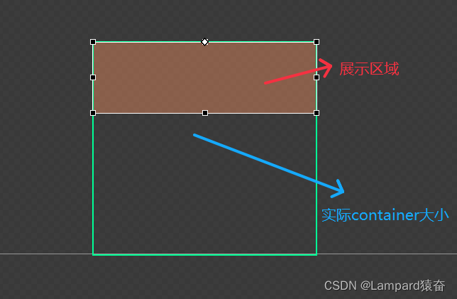
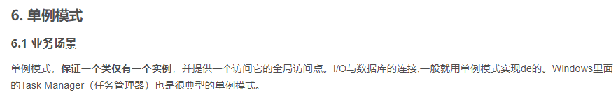

# 聊天&排行榜&朋友圈系统实现机制

> 相信大家在游戏过程中肯定对“聊天”，“排行榜”，“朋友圈”这些系统很熟悉。然而这些个看起来复杂的系统，实现起来和制作一个商业化充值活动其实是没有太大差别的，今天我就和大家从一个制作一个简单的商业化活动，演化到实现“聊天”，“排行榜”，“朋友圈”这些复杂UI系统~~

# 【客户端那些事】聊天&排行榜&朋友圈系统实现机制

   

## （一）实现普通的商业化活动

   **常见的商业化充值活动，无非就是一个滚动列表上面挂载着各种礼包Item。从逻辑上我们可以分为以下的三步：**

- 创建滚动列表以及礼包的基类
- 与服务端交互，获取礼包数据
- 根据获得的数据创建礼包Item，并挂载到滚动列表中

   

   **而实现“聊天”，“排行榜”，“朋友圈”这些系统时，第一步同样是需要创建一个滚动列表，以及创建挂载的子类。在编码的过程中，由于这两个类是基础且重要的，建议大家要做好注释方便日后的拓展和维护（真的有同事能够把注释写得像诗一样，简洁易懂且规范。每每看到都觉得异常敬佩）**

## （二）与服务端商定数据交互方式

   **到了第二步，在实现商业化活动时由于****礼包数据量很少****，服务端往往****一次性把数据下发**

***\*\****

   **对于这些数据量巨大的系统来说，我们需要和服务端商定数据交互方式，采取分批请求的方式来减轻传输压力**

***\*\****

### （1）商定每次下发的数量

   **比如在实现排行榜的时候，我们首批数据可以下发20个，这样****既能满足首页的展示数量****，同时也****不会引起协议交互的卡顿**

### （2）商定标志的参数

   **由于采取分批交互的方式，所以我们****需要一个参数来记录现在申请到了什么地方****，对于排行榜来说，我们可以****采取名次****作为参数，每次请求我们就把已知数据的最后一个排名，作为参数上传。比如上传参数20，那么下一次获得的数据就是21~40**

   **而对于聊天和朋友圈来说，我们可以****采用已知数据的最早时间****作为参数，来请求比该时间戳更早的信息**

 

 

## （三）分批创建子类Item

   **当我们获得数据之后，我们就可以利用得到的数据创建子类的Item，并挂载在滚动列表中了。那么怎么实现在滑动的过程中请求新的数据呢？很简单，我们可以在滚动列表在滑到底部的时候请求协议，如果有新的数据就继续生成并挂载，若无就提示一个“暂无新的消息”就可以了**

***\*\****

   **因此关键是在于判断是否已经滑动到了底部，我们知道滚动列表的实现逻辑就是背后有一个很长很长的container，而展示的区域是固定的。所谓的滑动其实就是调整背后的container的坐标而已.因此判断是否已经到了底部，我们可以通过下面公式来判断**

> **containerHeight() < getScrollY() + getHeight();**
>
> **containerHeight()：伪代码，表container的高度**
>
> **getScrollY()：伪代码，表当前container的Y轴坐标**
>
> **getHeight()：伪代码，表可视的高度（橙色框的高度）**

 

## （四）优化生成Item的过程

   **我有个朋友，做到这里的时候以为就可以提交了，然鹅实际测试的时候只有一个感觉：卡！**

***\*\****

   **审视代码之后，发现卡顿的原因是在于一次性生成20个子类的Item压力还是太大了，排行榜还好，像是朋友圈那些Item里面还带几张图片的，生成三五个其实就有卡顿的感觉了。我们总不能让服务端一次发三个数据，然后让玩家每看三个就请求一次信息，这样体验很差**

   **这时，我们可以采取异步加载的方法，调用一个计时器schedule，每一帧去生成一个控件，这样体验下来异常丝滑，唯一要注意的是，由于采取了异步加载的，所以应该要设定一个标志Flag记录当前的状态，在当前状态下禁止玩家的一些操作，不然的话玩家在这个时候增删改查可能会出bug**

 

## （五）控制滚动列表挂载数量

   **做到第四步时，打开界面也很丝滑，分步请求也很顺畅，满心欢喜去提交然鹅又被打了回来：****过不了压测！**

***\*\****

​    **我们发现，在之前的设计中，我们采取了分步加载的方式，每隔20个就生成一批Item挂载在滚动列表中，若玩家一直下拉，数据量又足够多的话。很容易就造成界面卡死，所以这里必须得改**

 

### （1）先删除后生成

​    **我们有两种做法，****第一种是“先删除后生成”****，你不是说我挂载的子类Item多吗？好，****那我们设定一个上限值（比如50个）****，在滑动到底部的时候判断：当前已有子类Item数量加上生成后的数量是否会超过这个上限，****若是则删除前20个（生成多少删除多少），然后再生成新来的20个****，这样我们就可以避免卡死了**

***\*\****

   **问题又来了，那我们这个时候上拉不就找不到我们之前的Item了吗，比如我上限是50个，我现在生成41~60个子类Item，按照设定我要删除1~20的Item，现在玩家上拉回去不久找不到排前20的数据了吗，这肯定不行呀**

   **因此，我们需要在滚动列表基类中，保存所有我们获得过的数据，子类的Item控件可以删，但是数据不能删，若玩家上拉的时候，我们可以判断是否拉到了顶部，若是我们就根据保存的数据重新生成控件，并插入至滚动列表头部，这样就可以解决了**

   **判断滑动到了头部的方法：**

> **getScrollY() < getHeight();**
>
> **getScrollY()：伪代码，表当前container的Y轴坐标**
>
> **getHeight()：伪代码，表可视的高度（橙色框的高度）**

### （2）不删除控件，只是更新控件状态

   **第一种方法可以解决压测，但并不是最优，因为生成一个控件的消耗远比刷新控件里面的数据开销要大**

   **比如我现在删除1~20的控件，然后生成41~60的控件。做法其实可以改成把1~20的控件位置移动到41~60的位置，然后把数据刷新至41~60的数据，实际操作流程如下：**

- 判断是否需要更新控件状态（生成的控件数量是否到达上限）
- 更新需要更新的控件的数据
- 把需要更新的控件调整container坐标

   **做起来可能稍微麻烦一些，但是效果相当不错~~**

 

## （六）代码设计优化

### （1）单例Manager（对外）

   **由于制作的都是一些比较复杂的UI系统，那么肯定会有与其他系统模块进行交互的可能~这个时候我们为了让其他同事****更容易理解****和****更方便操作****，最好创建一个Manager类，用于提供外部的接口，这样所有接口就可以一目了然，不需要再花时间去读一遍你的代码**

###  （2）工具Util（对内）

   **一开始写代码的时候，我们尝尝会把一****些计算函数，排序函数等等写在界面的逻辑****上，这会造成同一工具方法可能需要写多次，这个时候我们最好创建一个util类，里面****记录我们这个系统的通用方法和常量****，提高效率**

 

 

文章网易互娱游戏技术游戏客户端

